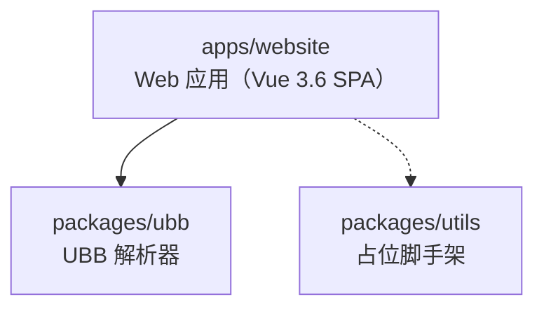
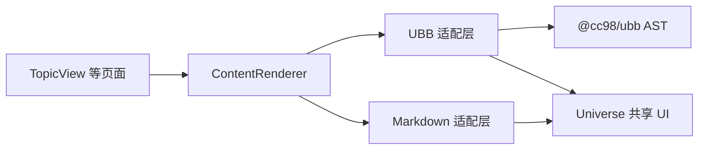
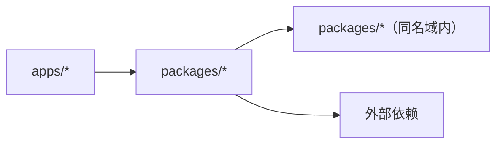

# 架构

本仓库是 Vite+ monorepo（pnpm workspace），复刻浙江大学 CC98 论坛前端

## 模块布局

- `apps/website`：面向用户的 Web 应用（Vue 3.6 SPA）。内部分层见 `docs/frontend.md`
- `packages/ubb`：UBB 解析器，核心产出是 AST（`parseUbb`），附带 HTML 和 Markdown 两个导出器。只读不做编辑器
- `packages/utils`：TypeScript 工具包脚手架，当前仅有占位代码，尚未投入使用

网站的富内容渲染分为语法适配层和共享 UI 层：

`packages/ubb` 只负责解析和标签契约，不依赖 Vue。`apps/website` 解释 AST 和 Markdown token，并集中处理 URL 安全、图片计数、媒体开关等渲染策略。

## 依赖方向

禁止：

- `apps/*` 之间互相 import
- `apps/*` 反向被 `packages/*` 依赖

apps 只依赖 packages 的公共导出（dist），不直接 import 内部源文件路径。

## 技术栈

| 类别          | 选型                                           |
| ------------- | ---------------------------------------------- |
| 包管理        | pnpm 11 + workspace catalog                    |
| 构建          | Vite+（`vp` CLI，底层 Vite + Rolldown）        |
| 框架          | Vue 3.6（beta，vapor opt-in）                  |
| 状态          | Pinia（客户端）+ @tanstack/vue-query（服务端） |
| 路由          | Vue Router 5                                   |
| 组件          | Reka UI（无头）+ UnoCSS                        |
| 语言          | TypeScript strict                              |
| Lint / Format | oxlint（type-aware）+ oxfmt                    |
| 测试          | Vitest                                         |
| Pre-commit    | `.vite-hooks/pre-commit` → `vp staged`         |

选型理由见 `docs/adr/0001-tech-stack.md`，质量门槛见 `docs/quality.md`。
