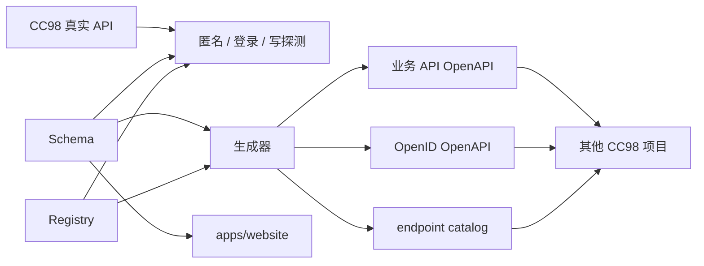
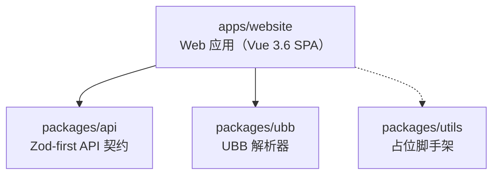
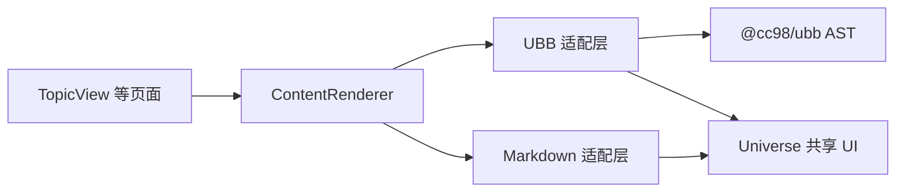
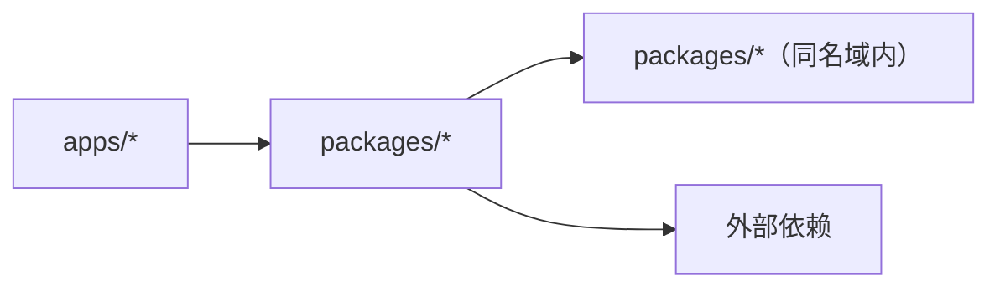

# 架构

本仓库是 Vite+ monorepo（pnpm workspace），复刻浙江大学 CC98 论坛前端

## 公共 API 契约

`packages/api` 是与前端框架无关的公共契约层。`src/schemas/` 中的 Zod schema 和 `src/operations/` 中的 operation registry 是事实源，业务 API OpenAPI、OpenID OpenAPI 与 endpoint catalog 都由它们生成。两份 OpenAPI 分别保留业务 API 和 OpenID 的 server 与认证语义。`apps/website` 只维护请求编排、认证、缓存键和错误映射，不重复定义公共实体 schema。

## 模块布局

- `apps/website`：面向用户的 Web 应用（Vue 3.6 SPA）。内部分层见 `docs/frontend.md`
- `packages/api`：CC98 API 的 Zod schema、operation registry、OpenAPI 和验证工具
- `packages/ubb`：UBB 解析器，核心产出是 AST（`parseUbb`），附带 HTML 和 Markdown 两个导出器。只读不做编辑器
- `packages/utils`：TypeScript 工具包脚手架，当前仅有占位代码，尚未投入使用

网站的富内容渲染分为语法适配层和共享 UI 层：

`packages/ubb` 只负责解析和标签契约，不依赖 Vue。`apps/website` 解释 AST 和 Markdown token，并集中处理 URL 安全、图片计数、媒体开关等渲染策略。

## 依赖方向

禁止：

- `apps/*` 之间互相 import
- `apps/*` 反向被 `packages/*` 依赖

apps 只依赖 packages 的公共导出（dist），不直接 import 内部源文件路径。

## 横切关注点

### 日志与错误诊断

前端日志统一从 `apps/website/src/lib/logger.ts` 创建，业务模块不直接依赖 Pino，也不直接调用 `console`。浏览器控制台中的每条日志同时包含可搜索文本和经过脱敏、截断的结构化对象。查询、写操作、Vue 运行时、路由和未处理的 Promise 异常由基础设施统一记录。

异常日志至少包含 scope、消息、错误类型、堆栈和调用点。数据校验失败还要包含字段路径、期望类型、实际类型和 query key，确保只看日志也能定位到请求与契约。远端上报、采样和持久化尚未接入，后续仍在同一入口扩展。

## 技术栈

| 类别          | 选型                                           |
| ------------- | ---------------------------------------------- |
| 包管理        | pnpm 11 + workspace catalog                    |
| 构建          | Vite+（`vp` CLI，底层 Vite + Rolldown）        |
| 框架          | Vue 3.6（beta，vapor opt-in）                  |
| 状态          | Pinia（客户端）+ @tanstack/vue-query（服务端） |
| 路由          | Vue Router 5                                   |
| 组件          | Reka UI（无头）+ UnoCSS                        |
| 语言          | TypeScript strict                              |
| Lint / Format | oxlint（type-aware）+ oxfmt                    |
| 测试          | Vitest                                         |
| Pre-commit    | `.vite-hooks/pre-commit` → `vp staged`         |

选型理由见 `docs/adr/0001-tech-stack.md`，质量门槛见 `docs/quality.md`。
