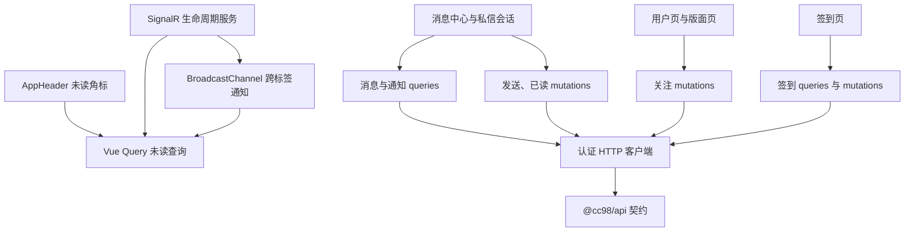

# 第七阶段：实时交互与消息迁移

## 背景

阶段 0 至阶段 6 已完成，网站已经具备认证、阅读、发现、用户中心和 Markdown 写流程。第七阶段补齐私信、通知、公开页关注、签到和实时未读更新，使登录用户不再依赖旧前端处理账户互动。

现有公共 API 已覆盖消息域的大部分读取接口，登录态探测也已保存真实 fixture。不过，私信发送、通知全部已读、签到和补签仍缺少受控写入验证，部分消息 schema 只表达了旧 OpenAPI 的宽松结构。实施时应先收紧契约，再建设页面，不能让页面继续猜测字段。

## 调研结论

### 领域边界

本阶段分成两个相对独立的领域：

- 消息域包括私信、回复通知、@ 通知、系统通知、未读数量和 SignalR。
- 关系与签到域包括关注用户、关注版面、每日签到和月度签到记录。

关注和签到使用普通 HTTP mutation，不进入 SignalR 服务。头部只聚合未读状态和入口，不承担消息数据存储。

### 已确认的接口

下列登录态读取接口已返回 `200`，并通过当前 Zod schema 校验：

- `GET /me/unread-count`：四类未读数量。
- `GET /me/all-message-count`：四类历史总数。
- `GET /message/recent-contact-users`：近期私信联系人。
- `GET /message/user/{userId}`：与指定用户的私信记录。
- `GET /notification/reply`、`GET /notification/at`、`GET /notification/system`：三类通知列表。
- `GET /me/signin`、`GET /me/signin-in-month`：签到状态和月度记录。
- `PUT`、`DELETE /me/followee/{userId}`：关注和取消关注用户。
- `PUT`、`DELETE /me/custom-board/{boardId}`：关注和取消关注版面。

真实 fixture 还表明：

- 近期联系人除 `userId`、`lastContent`、`isRead` 外，还包含 `time` 和 `senderId`。
- 回复与系统通知会携带 `postBasicInfo`，其中有楼层、用户和版面信息，但回复通知没有现成的主题标题。
- 用户详情返回 `isFollowing`，版面详情返回 `isUserCustomBoard`，公开页可以直接用目标资源的关系状态，不需要扫描完整关注列表。
- 私信内容没有 `contentType`，旧前端按 UBB 渲染。新私信不能直接复用只写 Markdown 的帖子编辑器。
- `/me/all-message-count` 表示历史总数，不适合作为头部角标。头部和实时刷新以 `/me/unread-count` 为唯一来源。

### 仍需受控验证的接口

- `POST /message`：确认请求体为 `{ receiverId, content }`，记录成功响应类型和私信内容语法。
- `PUT /notification/read-all-reply`、`PUT /notification/read-all-at`、`PUT /notification/read-all-system`：确认空请求体是否可省略，以及成功后的返回类型。
- `POST /me/signin`：确认空内容、纯文本和 Markdown 字符串的请求形式与成功响应。
- `POST /me/make-up-missed-signin`：只核对契约和错误边界，不在自动测试中消耗真实补签卡。
- `POST /notification/at`：旧前端在发帖成功后提取用户名并单独调用。需要确认当前后端是否仍要求前端触发；若需要，应补入现有 Markdown 发帖流程。

## 目标

- 提供统一的消息中心，支持回复通知、@ 通知、系统通知和私信。
- 头部展示可靠的总未读角标，并可进入消息中心。
- SignalR 事件到达后刷新未读查询，断线后自动重连，登出或认证失效后停止连接。
- 支持私信联系人分页、会话历史加载、发送和发送失败恢复。
- 在公开用户页和版面页提供关注与取消关注入口，并保持详情页和用户中心缓存一致。
- 提供每日签到状态、签到操作和月度记录。
- 使用真实接口、自动测试和浏览器回归验证主要路径。

## 非目标

- 首轮不申请浏览器系统通知权限，不闪烁标题。
- 不迁移旧版“消息设置”。现有 API 没有对应的稳定公共操作。
- 不兼容旧 `/message/*` 路由，不复制旧前端内嵌路由器和本地缓存协议。
- 不实现端到端加密、离线发送队列、输入状态、已读回执或消息撤回。
- 不根据未验证的 SignalR payload 乐观插入消息。实时事件只负责使服务端查询失效。
- 不在自动测试或常规浏览器回归中成功执行补签。
- 不把帖子 Markdown 编辑器直接用于私信。私信先保持紧凑输入和历史 UBB 渲染，待后端内容协议确认后再决定编辑能力。

## 路由与页面

采用新的语义路由：

- `/messages`：消息中心入口，默认进入回复通知。
- `/messages/replies`：回复通知。
- `/messages/mentions`：@ 通知。
- `/messages/system`：系统通知。
- `/messages/private`：私信联系人和空会话状态。
- `/messages/private/:userId`：指定用户的私信会话。
- `/signin`：签到状态和月度记录。

以上路由均要求登录，并复用现有来源页保存和登录后恢复。消息中心使用一个受限父布局承载导航、分类未读数量和“全部标为已读”操作，不在页面内创建第二套路由器。

公开用户页增加“关注／取消关注”和“发私信”入口。本人主页不显示关注自己的按钮。版面页增加“关注版面／取消关注”入口，发主题入口保持不变。

## 分层与数据流

Vue Query 继续持有服务端状态。Pinia 只保存登录用户摘要和主题偏好，不新增未读数量、联系人或签到 store。SignalR 服务只管理连接和事件订阅，不保存业务数据。

## API 契约

实施开始时先根据 fixture 和受控写入结果修正 `packages/api`：

- 将消息计数字段收紧为必填非负整数。
- 补齐近期联系人的 `time`、`senderId`，并确认 `userId` 的语义。
- 根据非空真实会话收紧私信消息字段。
- 为通知建立真实 `postBasicInfo` schema，不把旧前端补出来的 `topicTitle`、`boardName` 伪装成接口原始字段。
- 在用户 schema 中显式加入 `isFollowing`，保留版面的 `isUserCustomBoard`。
- 为私信发送、全部已读和签到写入登记准确的请求体、响应 schema 与验证状态。
- 修改事实源后运行生成器，同步 OpenAPI 和 endpoint catalog。

通知展示层按 `topicId` 批量查询主题基本信息，再从已有版面查询或批量版面接口补名称。批次内去重，禁止逐条请求主题或版面形成 N+1。

## 未读状态与 SignalR

### 查询和角标

- 登录后启用 `/me/unread-count` 查询，登出时移除账户相关缓存。
- 总角标由四个分类相加，分类导航分别展示各自数量。
- 数量以服务端响应为准，不因 SignalR 事件直接加一，避免重复事件、跨标签页和已读操作造成漂移。
- 打开私信会话可能由读取接口隐式标记已读。会话请求完成后重新获取未读数量和联系人列表。
- 通知不会因查看列表自动视为全部已读。只有用户明确点击“全部标为已读”后才执行对应 mutation。

### 连接生命周期

- 使用 `@microsoft/signalr` 连接 `/signalr/notification`，通过 `accessTokenFactory` 每次获取当前有效 token。
- 监听 `NotifyMessageReceive` 和 `NotifyNotificationReceive`。事件到达后使未读查询失效，必要时同步联系人或当前通知列表。
- 使用 `withAutomaticReconnect()`，记录重连中、已恢复和关闭状态，避免重复注册监听器或并发启动连接。
- 只在已登录时连接；登出、认证失效和应用卸载时停止连接并清理监听。
- 首轮允许每个活跃标签页各自连接。使用 `BroadcastChannel` 同步“有新消息”和“未读已变化”事件，暂不实现脆弱的本地时间戳抢锁。若实测连接数对服务端有明显影响，再增加带过期租约的单连接选主。
- SignalR 不可用时保留 HTTP 查询和窗口重新聚焦刷新，页面仍可完整使用。

## 私信

- 联系人列表按 `from`、`size` 增量加载，并批量获取联系人头像和名称。
- 会话路由以 `userId` 为事实源，支持从用户页直接发起新会话，即使该用户不在近期联系人列表中也可打开。
- 会话记录按接口返回顺序核对后统一成页面时间顺序。加载更早消息时保持滚动位置，发送成功后滚动到最新消息。
- 输入框支持纯文本和后端已经支持的 UBB 内容。历史内容通过现有安全 UBB 渲染器展示，不执行原始 HTML。
- 发送 mutation 不自动重试，提交期间禁用重复发送，失败时保留原文。
- 成功后立即使当前会话、联系人列表和未读数量失效，不复制旧前端固定等待 200 毫秒的时序补丁。
- 首轮不集成帖子 Markdown 工具栏和普通附件上传。只有确认私信后端支持当前文件链接与 UBB 图片语法后，才加入最小图片上传入口。

## 通知

- 回复、@ 和系统通知共用分页、加载、空状态、错误状态和未读样式。
- 回复与 @ 通知通过 `postBasicInfo.floor` 建立帖子定位，使用新前端稳定的一基楼层换算，不兼容旧站分页边界副作用。
- 主题或帖子已删除、无权限或批量详情缺失时，保留通知文字和时间，但禁用失效跳转。
- 系统通知内容按历史 UBB 处理，并使用消息场景的受限渲染配置。外链、图片和媒体继续经过统一安全策略。
- “全部标为已读”仅作用于当前通知分类。成功后更新当前列表的 `isRead`，将对应未读数设为零，并后台重新校准服务端数量。
- 私信不显示虚假的“全部已读”按钮。读取会话后的真实接口行为由查询刷新反映。

若验证确认发帖后仍需调用 `POST /notification/at`，则补充 Markdown 提及提取：忽略代码块和行内代码，用户名去重并限制为十个，只在帖子创建成功并取得 `topicId`、`postId` 后发送。通知发送失败不能把已经成功的帖子伪装成发帖失败，应单独提示并记录。

## 关注入口

- 用户详情的 `isFollowing` 作为当前页面按钮状态；登录用户不能关注自己。
- 版面详情的 `isUserCustomBoard` 作为版面关注状态。
- 新增关注 mutation，与现有取消关注 mutation 对称。
- 用户关注成功或取消后，同步用户详情的 `isFollowing`、粉丝数、当前用户关注数和用户中心关系列表。
- 版面关注成功或取消后，同步 `isUserCustomBoard`、当前用户 `customBoards` 和用户中心版面列表。
- 未登录点击时保存当前来源页并进入登录页。

## 签到

- 页面首先展示今日是否已签到、连续签到次数、上次奖励和可用补签卡数量。
- 今日未签到时提供一个明确的签到按钮。是否提供可选签到文本，取决于 `POST /me/signin` 的实测请求体；不为了旧前端编辑器保留空洞的复杂 UI。
- 月度记录使用日历展示签到日、补签日和奖励，月份参数同步到 URL，范围以服务端可查询结果为准。
- 时间判断优先使用服务端时间配置，避免本地时区跨日造成按钮状态错误。
- 签到成功后刷新签到状态、当月记录、当前用户摘要和相关奖励信息，不刷新整个页面。
- 补签属于消耗账户资产的不可逆操作。可以展示卡片数量和规则，但成功操作及成功回归必须得到用户明确许可。

## 缓存一致性

- 所有消息、通知、签到和关系 query key 均包含登录用户 ID，避免切换账号复用旧数据。
- 登出和认证失效时停止 SignalR，并移除消息、通知、签到、当前用户和关系缓存。
- 已读、发送私信、关注和签到 mutation 以成功后局部更新加后台失效查询为主。
- SignalR 和 `BroadcastChannel` 只发送“需要刷新”的信号，不跨标签复制完整敏感消息内容。
- 查询批量补充用户、主题和版面信息时复用现有批量查询与缓存键。

## 实施步骤

- [x] 完成消息、通知、私信、未读、SignalR、关注和签到的实现。
- [x] 完成消息与签到 query key、queries、mutations 和缓存清理边界。
- [x] 完成受限消息布局、通知列表、批量信息补充和分类全部已读。
- [x] 完成私信联系人、会话路由、历史加载、发送和失败恢复。
- [x] 完成头部未读入口、SignalR 生命周期服务和跨标签失效通知。
- [x] 在公开用户页和版面页接入关注与取消关注。
- [x] 完成签到状态、今日签到和月度日历；补签成功路径不执行。
- [x] 根据当前后端行为保留私信历史内容协议，暂不加入私信图片上传和未经确认的 Markdown @ 通知提取。
- [x] 补充自动测试，修复 benchmark 类型检查问题，并通过 `vp run ready`。
- [x] 用户已人工验证通知等主要消息功能；补签等有账户影响的路径不纳入自动回归。
- [x] 更新路线图并进入阶段 8。

## 验证

### 自动测试

- schema 和合成用例覆盖联系人、私信、三类通知、未读数量和签到记录；非空私信 fixture 留待后续补充。
- 测试未读总数计算、分类已读缓存更新、账号切换缓存隔离和事件去重。
- 测试 SignalR 的登录启动、重复启动保护、事件失效查询、断线重连和登出停止。
- 测试会话分页合并、消息顺序、发送失败保留原文和加载旧消息后的滚动锚定逻辑。
- 测试通知批量补充去重、缺失主题降级和楼层链接换算。
- 测试关注 mutation 的乐观状态与回滚，以及签到成功后的查询失效范围。
- 若实现 Markdown @ 提取，覆盖代码块忽略、去重、十人上限和帖子成功但通知失败的分离错误状态。

### 浏览器回归

- 登录后头部出现消息入口，数量与消息中心分类一致。
- 回复、@、系统通知可分页、跳转和分类全部已读。
- 可从联系人列表和公开用户页打开会话，发送私信后双方列表状态正确更新。
- 通过受控的第二账号或既有测试消息触发 SignalR，验证当前页和另一标签页的未读刷新。
- 用户关注、版面关注、取消关注和用户中心列表保持一致。
- 今日签到成功后按钮、连续次数和日历同步更新。已签到账号只验证只读状态，不重复操作。
- SignalR 断线或服务不可用时，HTTP 刷新和页面导航仍可使用。

浏览器证据写入 `.artifacts/browser/2026-07-12-realtime-message-migration/`，不提交仓库。收尾执行 `vp run ready`，任一检查失败都不标记阶段完成。

## 风险与待确认事项

- 当前仓库没有非空私信 fixture，私信仍缺少基于真实会话的契约回归样本，后续可补充。
- 私信使用历史 UBB 语义，但是否允许 Markdown 链接、文件链接和图片仍未知。
- 通知全部已读和读取私信可能改变真实账户状态，人工验证应继续限定测试账号与测试消息范围。
- SignalR 服务可能限制同一账号的连接数。首轮先追求正确恢复，再根据实测决定是否建设跨标签页单连接选主。
- 旧前端负责发送 @ 通知，当前后端是否自动处理尚未确认。这一结果可能要求回补阶段 6 的发帖 mutation。
- 签到请求体仍不明确；补签会消耗真实卡片，不能通过自动探针验证成功路径。

## 进展与调整

- [x] 2026-07-12：完成公共 API、登录态 fixture、旧 React 前端和当前 Vue 基础设施调研。
- [x] 2026-07-12：确认消息域与关系、签到域分离，未读服务端状态继续由 Vue Query 持有。
- [x] 2026-07-12：确认用户和版面详情已有目标关系状态，关注入口不需要扫描完整关系列表。
- [x] 2026-07-12：确认旧私信按 UBB 渲染，不直接复用帖子 Markdown 编辑器。
- [x] 写接口受控验证与契约收紧，补签成功路径除外。
- [x] 消息中心、私信和未读查询。
- [x] SignalR 与跨标签刷新。
- [x] 公开页关注与签到。
- [x] 自动测试、人工回归和文档收尾。

阶段 7 已完成。非空私信 fixture、补签成功验证和前端主动发送 @ 通知属于后续增强或待确认事项，不阻塞阶段 8。

## 决策记录

- 未读数量以 `/me/unread-count` 为唯一事实源。SignalR 只触发查询失效，不直接修改计数。
- 消息、通知和签到属于服务端状态，继续使用 Vue Query，不扩大 Pinia 职责。
- 首轮不复制旧前端基于 `localStorage` 时间戳的 SignalR 抢锁。多标签页先用 `BroadcastChannel` 同步失效事件。
- 通知已读必须由用户明确触发，不因打开列表自动清空。
- 私信保持历史内容协议，不为了界面统一强行写入 Markdown。
- 补签成功测试需要用户单独授权，普通自动化不得消耗真实补签卡。
- 浏览器系统通知、消息设置和旧路由兼容不进入第七阶段首轮。
