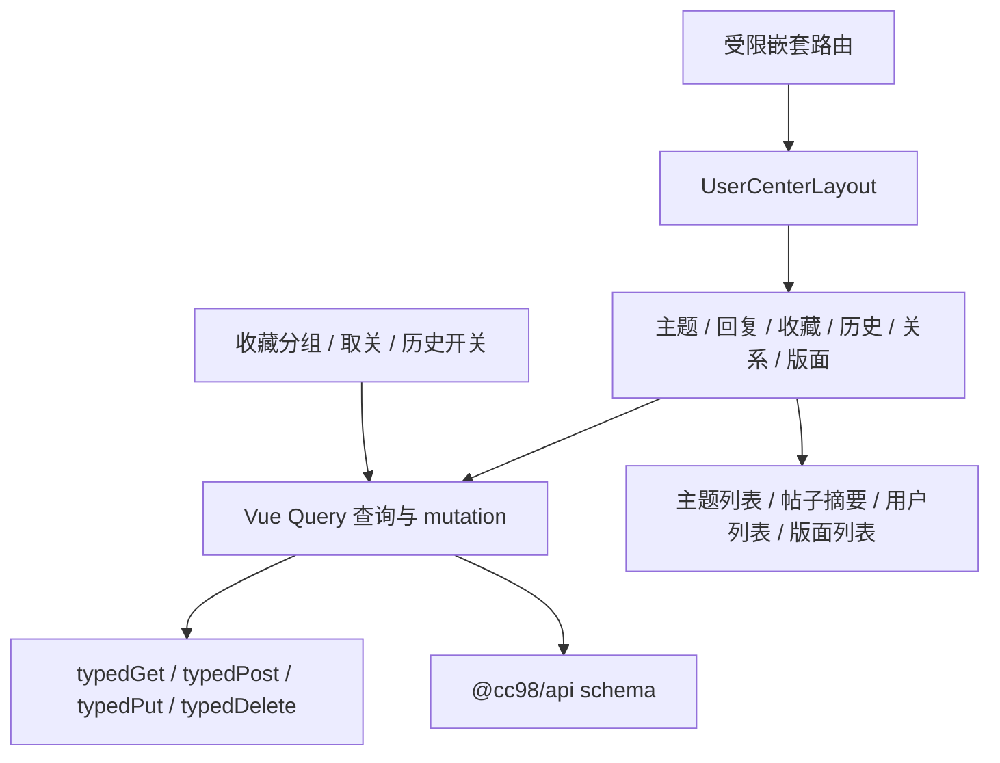

# 第五阶段：用户中心迁移

## 背景

阶段 0 至阶段 4 已完成，当前网站已经具备认证、登录来源页恢复、Vue Query 查询层、共享主题列表、分页、加载更多和页面状态组件。第五阶段在这些能力上迁移登录用户的个人内容与关系数据。

公共 API 层已经登记用户中心所需的大部分接口，包括 `/me/recent-topic`、`/me/recent-post`、`/topic/me/favorite`、收藏分组、关注用户、关注版面和浏览历史。网站层目前只有 `/me` 当前用户查询，还没有用户中心路由、页面和 mutation。

现有 `probe-authenticated.json` 中相关请求均返回 `401`，与 operation registry 中的已验证标记不一致。实施时必须使用有效测试账号重新探测，不能直接把旧探针或旧 React 前端的行为当作当前契约。

本计划对照以下项目整理：

- 当前项目 `/Users/shellraining/Documents/cc98`：Vue 3 SPA，作为实现目标。
- 旧项目 `/Users/shellraining/Documents/Forum`：用于核对入口、分页和管理语义，不迁移 Redux、类组件或旧路由状态管理。

## 目标

- 提供用户中心首页，以及我的主题、我的回复、我的收藏、浏览历史、关注用户、粉丝和关注版面页面。
- 所有用户中心入口都要求登录，直接访问时保存完整来源页，登录成功后返回原页面。
- 我的主题、收藏和历史复用 `TopicList`；我的回复使用适合帖子摘要的共享列表项，不把不完整数据强塞给楼层组件。
- 收藏支持筛选、搜索、移出收藏、移动分组，以及收藏分组的新建、重命名和删除。
- 关注用户、粉丝和关注版面支持查看；已有关注关系可以在用户中心取消。
- 浏览历史支持查看，并能开启或关闭记录功能。
- mutation 成功后只刷新受影响的查询和当前用户摘要，页面不会显示过期的计数或关系状态。

## 非目标

- 不迁移资料编辑、头像修改、财富转账、论坛皮肤和主题切换规则。这些能力不在路线图对阶段 5 的完成定义中，后续单独安排。
- 不迁移私信、通知、未读数、签到和 SignalR，这些属于阶段 7。
- 不在主题页新增收藏入口。阶段 5 只管理已有收藏，主题与楼层互动仍属于阶段 6。
- 不在公开用户页和版面页新增关注入口。阶段 5 只管理已有关系，面向全站的关注操作入口属于阶段 7。
- 不保留旧用户中心路径、参数格式或重定向，只实现本阶段定义的新路由。
- 不引入新的全局状态容器。服务端数据继续由 Vue Query 管理，Pinia 只保留认证身份。
- 不照搬旧前端的 jQuery 滚动、Redux 分页缓存、手写加载标记和逐条补请求。

## 路由与页面

以 `/usercenter` 作为用户中心根路径，使用嵌套路由和共享布局。筛选、页码和分组写入 query，刷新、前进后退和复制链接后都能恢复。

| 页面         | 规范路由                                                | 主要数据                                          |
| ------------ | ------------------------------------------------------- | ------------------------------------------------- |
| 用户中心首页 | `/usercenter`                                           | `/me` 与各入口摘要                                |
| 我的主题     | `/usercenter/topics?page=1`                             | `/me/recent-topic`                                |
| 我的回复     | `/usercenter/posts?kind=recent&page=1`                  | `/me/recent-post`、`/me/hot-post`                 |
| 我的收藏     | `/usercenter/favorites?group=0&order=0&page=1&keyword=` | `/topic/me/favorite`、`/topic/me/search-favorite` |
| 浏览历史     | `/usercenter/history?page=1`                            | `/me/browsing-record`、`/me/browsing-history`     |
| 关注用户     | `/usercenter/following?page=1`                          | `/me/followee`、`/user/basic`                     |
| 我的粉丝     | `/usercenter/followers?page=1`                          | `/me/follower`、`/user/basic`                     |
| 关注版面     | `/usercenter/boards`                                    | `/me` 中的 `customBoards`、`/board/`              |

## 方案

### 页面分层

`UserCenterLayout` 只负责用户摘要、侧栏或页签导航和子路由出口。页面负责读取 URL 状态并组合查询。API 路径、schema 解析、query key 和 mutation 后的失效规则集中放在 `api/`，不散落在视图组件中。

### 登录保护

为用户中心父路由增加 `meta.requiresAuth`，在路由守卫中统一处理未登录访问：

1. 保存 `to.fullPath`。
2. 跳转 `/logon`。
3. 登录成功后读取并删除来源页。
4. token 在页面内失效时，仍通过现有认证失效回调清理用户状态，再次登录可以返回原路径。

守卫只覆盖明确标记的受限路由，不改变热门、版面搜索等匿名页面。页面仍需处理请求过程中的 `401`，因为本地 token 可能在进入路由后失效。

### 查询与分页

先在现有 `apps/website/src/api/queries.ts` 中补充认证身份参与的 query key 和查询，功能验证完成后再按下文的收尾任务拆分文件：

- `meRecentTopics(page, size, authScope)`。
- `mePosts(kind, page, size, authScope)`。
- `meFavorites(group, order, keyword, page, size, authScope)`。
- `meFavoriteGroups(authScope)`。
- `meBrowsingRecords(page, size, authScope)`。
- `meFolloweeIds(page, size, authScope)`、`meFollowerIds(page, size, authScope)`。
- `usersByIds(ids)`、`boardsByIds(ids)`，批量补齐关系列表展示信息。

分页规则按真实响应区分：

- `/me/recent-post`、`/me/hot-post` 和 `/me/browsing-record` 使用返回的 `count` 计算总页数。
- `/me/recent-topic` 和 `/topic/me/favorite` 没有稳定总数时，每页请求 `PAGE_SIZE + 1` 条，只展示前 `PAGE_SIZE` 条，用多出的一条判断下一页。
- 关注用户和粉丝优先使用 `/me` 中的 `followCount`、`fanCount` 展示总页数，同时以当前页返回空数组作为越界保护。
- 批量查询用户和版面后按原 ID 顺序重排，接口漏项时保留可识别的降级项，不让列表错位。

### 共享展示

- 我的主题、收藏和历史继续使用 `TopicList`、`TopicListItem`、`Pagination` 和 `PageState`。
- 我的回复新增 `PostSummaryList` 和 `PostSummaryListItem`，展示回复摘要、时间、所在主题和版面，并链接到 `/topic/{topicId}#floor-{floor}`。只有接口字段足够时才显示楼层，不猜测位置。
- 关注用户和粉丝共用 `UserRelationList`，通过批量用户接口补齐用户名和头像。
- 关注版面使用轻量 `BoardSubscriptionList`，复用现有版面链接和公开版面数据。
- 确认操作使用项目现有的 Reka UI 能力实现对话框，不使用浏览器原生 `confirm`。

### mutation 与缓存一致性

使用 `useMutation` 集中实现：

- 收藏分组新建、重命名和删除。
- 收藏移除和移动分组。
- 取消关注用户。
- 取消关注版面。
- 开启或关闭浏览历史。

首版采用提交成功后更新或失效查询的方式，不对尚未重新验证的写接口做激进乐观更新。按钮提交期间禁用，失败时保留原数据并显示可恢复的错误信息。

缓存失效按影响范围处理：

- 收藏变更刷新当前收藏列表和收藏分组。
- 关注用户变更刷新关注列表、当前用户摘要和相关用户缓存。
- 关注版面变更刷新关注版面列表与当前用户摘要。
- 浏览历史开关刷新 `/me`；关闭历史不擅自清空已返回的记录，是否保留由真实接口行为决定。

删除收藏分组前必须确认以下语义：默认分组能否删除、非空分组删除后主题如何处理、接口成功响应是否包含新状态。没有确认前不开放删除按钮。

### 查询层收尾拆分

当前 `apps/website/src/api/queries.ts` 有 265 行，已经同时承载站点配置、核心阅读、发现、公开用户和当前用户查询。现有规模还能维护，但阶段 5 会继续加入个人内容、关系数据和 mutation，完成后再保留单文件会让职责和缓存失效规则混在一起。

拆分安排在阶段 5 功能实现、浏览器验证、`vp run ready` 和功能提交之后，使用单独的重构提交完成。功能开发期间不移动现有查询，避免行为改动与目录调整出现在同一个提交中。

建议结构：

- `api/queries/keys.ts`：`AuthScope` 和 query key。
- `api/queries/core.ts`：站点配置、版面和主题阅读查询。
- `api/queries/discovery.ts`：热门、新帖、推荐和搜索查询。
- `api/queries/user.ts`：公开用户资料和近期主题查询。
- `api/queries/me.ts`：当前用户与用户中心查询。
- `api/queries/index.ts`：保留统一导出，页面仍从 `api/queries` 引入。
- `api/mutations/me.ts`：用户中心写操作及其缓存失效规则。

拆分时保持 query key、请求参数、缓存时间和导出名称不变，不顺手修改业务行为。完成后更新 `docs/frontend.md` 的查询层结构说明，再次运行 `vp run ready`，使用 `refactor(website): 按领域拆分查询层` 单独提交。

### 公共 API 契约

实施前重新探测阶段 5 的读接口与低风险写接口，修正 schema 和 operation registry：

- 确认 `recent-post`、`hot-post`、`browsing-record` 的分页包装字段和帖子定位字段。
- 确认收藏 `order`、`groupid`、搜索和分页终止规则。
- 确认收藏分组返回的默认组、计数和删除行为。
- 确认关注用户、粉丝返回 ID 的顺序和最大页大小。
- 确认 `/me` 中 `customBoards`、`followCount`、`fanCount` 和 `browsingHistoryEnabled` 的当前语义。

写接口验证使用专用测试数据并恢复现场：创建临时收藏分组后删除；对专用测试主题执行收藏、移动和取消收藏；关注测试用户或版面后恢复原状态；切换浏览历史后恢复原设置。探测记录脱敏，不把 token、用户名或个人内容写入仓库。

登录凭据只在当前会话中临时使用，不写入仓库、执行计划、shell history、环境文件或探测产物。

## 实施步骤

### 0. 固定范围与依赖

- [x] 确认阶段 0 至阶段 4 已完成。
- [x] 确认阶段 5 复用现有认证、登录回跳、主题列表、分页、加载更多和页面状态。
- [x] 明确收藏和关注在阶段 5、6、7 之间的交付边界。

### 1. 重新探测接口并收紧契约

- [x] 使用有效测试账号探测阶段 5 全部读接口，记录状态码、响应形状和分页语义。
- [x] 使用可回滚的测试数据验证收藏分组、收藏移动、取关和浏览历史开关。
- [x] 修正 `@cc98/api` schema、operation registry 与生成产物，并补 schema 回归测试。

### 2. 建立受限路由和用户中心骨架

- [x] 增加 `meta.requiresAuth` 与统一路由守卫，补来源页安全测试。
- [x] 实现 `UserCenterLayout`、导航和用户中心首页。
- [x] 增加本阶段定义的用户中心路由，不添加旧路径兼容。
- [x] 在 Header 的登录用户区域增加明确的用户中心入口。

### 3. 完成个人内容只读页面

- [x] 实现我的主题，复用主题列表和 URL 分页。
- [x] 实现我的回复与热门回复切换，新增帖子摘要列表。
- [x] 实现浏览历史列表和开启、关闭状态展示。
- [x] 实现收藏列表、分组筛选、排序和关键词搜索。

### 4. 完成关系与版面页面

- [x] 实现关注用户和粉丝 ID 分页查询。
- [x] 使用批量用户接口补齐关系列表，并保持原始 ID 顺序。
- [x] 从 `/me.customBoards` 批量加载关注版面详情。
- [x] 处理用户或版面已删除、无权限、空列表和部分批量结果缺失。

### 5. 完成管理操作

- [x] 实现收藏分组的新建、重命名和安全删除。
- [x] 实现收藏移除和移动分组。
- [x] 实现取消关注用户和取消关注版面。
- [x] 实现浏览历史开关，并在成功后同步当前用户数据。
- [x] 为所有 mutation 增加提交中、成功、失败和重复点击保护。

### 6. 测试、浏览器回归与文档收尾

- [x] 补路由、分页、筛选序列化、批量结果重排和 mutation 缓存失效测试。
- [x] 用匿名和登录状态完成用户中心浏览器回归，并验证登录后来源页恢复。
- [x] 验证用户中心路由的前进后退、刷新和复制链接。
- [x] 每批改动后运行 `vp check`，阶段收尾运行 `vp run ready`。
- [x] 把探测结论、范围变化和验证结果写回本计划。
- [x] 阶段完成后更新 `docs/roadmap.md`，将阶段 5 标记为完成，并提交功能改动。

### 7. 查询层收尾清理

- [x] 在功能提交之后，把 `api/queries.ts` 按领域拆到 `api/queries/`。
- [x] 把用户中心 mutation 移入 `api/mutations/me.ts`，集中维护缓存失效规则。
- [x] 保持现有导出名称、query key 和运行行为不变。
- [x] 更新 `docs/frontend.md` 中的查询层结构。
- [x] 再次运行 `vp run ready`，使用独立的 `refactor(website): 按领域拆分查询层` 提交收尾。

## 验证

### 自动测试

- 未登录访问任意用户中心子页会保存完整来源页，并跳转登录。
- 登录成功返回原页，外链、协议相对路径和非法来源页被拒绝。
- 页码、回复类型、收藏分组、排序和关键词可以从 URL 恢复。
- 有总数和无总数两类分页都能正确判断首页、末页和越界页。
- 批量用户、版面响应乱序或缺项时，最终列表顺序稳定。
- 收藏、关系和历史 mutation 只失效必要 query，不清空无关页面缓存。
- mutation 失败不会提前移除列表项，也不会让按钮永久停留在提交状态。
- 默认收藏分组和非空分组遵循实测后的删除约束。

### 浏览器验证

按 `docs/quality.md` 先探测 5173，复用已有开发服务器：

- 匿名直接打开每个用户中心 URL，登录后回到原页面和原筛选状态。
- 登录后从 Header 进入用户中心，浏览主题、回复、收藏、历史、关注用户、粉丝和关注版面。
- 切换页码、回复类型、收藏分组和排序后刷新、前进后退，页面状态保持一致。
- 新建、重命名和删除临时收藏分组；移动和移除测试收藏后列表与计数立即一致。
- 取消测试用户和测试版面关注后列表更新，刷新页面结果不反弹。
- 切换浏览历史开关后 `/me` 状态同步，并恢复测试前设置。
- 空数据、401、403、404、网络错误和 schema 校验失败都有明确状态与恢复入口。
- 深色和浅色主题下，导航、列表、对话框、表单和焦点状态可读。
- 键盘可以操作用户中心导航、分页、筛选、管理菜单和确认对话框。

### 质量门槛

- API schema 与真实响应一致，生成的 OpenAPI 和 endpoint catalog 已更新。
- 关键 URL 状态、分页和 mutation 行为有自动测试覆盖。
- `vp run ready` 通过。
- 不包含测试账号、token、个人浏览记录或其他敏感数据。

## 已确认事项

- 阶段 0 至阶段 4 已完成，第五阶段可以直接开始。
- 规范页面路径使用 `/usercenter`，不提供旧路径或历史参数兼容。
- 阶段 5 管理已有收藏与关系；全站新增收藏入口属于阶段 6，新增关注入口属于阶段 7。
- 资料编辑、头像、财富、皮肤、消息和签到不进入本阶段。
- 已使用有效登录态重跑受限 GET 探针，阶段 5 读接口与更新后的 schema 一致。
- `api/queries.ts` 在功能验证和功能提交之后按领域拆分，使用独立重构提交。

## 进展与调整

- 2026-07-12：完成当前 Vue 项目、公共 API 契约和旧 React 用户中心的静态调研，建立第五阶段执行计划。
- 2026-07-12：登录态探测确认个人主题和收藏返回数组，回复与浏览历史返回带 `count/from/size/extra/errorCode` 的分页对象；关注用户和粉丝返回用户 ID 数组。
- 2026-07-12：使用可回滚测试数据验证收藏分组增删改、收藏移动与移除、用户与版面取关、浏览历史开关，所有账号状态已恢复。
- 2026-07-12：完成用户中心受限路由、概览、主题、回复、收藏、历史、关注用户、粉丝和关注版面页面。
- 2026-07-12：浏览器回归发现并修复登录来源页未稳定跳转、删除当前收藏分组后 URL 未复位、空高页码缺少返回入口和可空版面海报导致批量校验失败的问题。
- 2026-07-12：API 契约测试、网站测试、明暗主题视觉检查和真实 mutation 回归通过；测试收藏、关注用户、关注版面、收藏分组和浏览历史设置均已恢复。
- 2026-07-12：功能提交后将 411 行的 `api/queries.ts` 拆为 keys、core、discovery、user 和 me 五个领域模块，mutation 移入独立目录；重启开发服务器后浏览器冒烟通过。

## 决策记录

- 2026-07-12：用户中心使用受限父路由统一处理登录跳转，页面继续兜底运行时 `401`。
- 2026-07-12：筛选和分页以 URL 为事实源，不保留旧站路由兼容。
- 2026-07-12：关系 ID 和自定义版面 ID 使用批量接口补齐，不产生逐条 N+1 请求。
- 2026-07-12：未重新验证的写接口首版采用成功后刷新，不做激进乐观更新。
- 2026-07-12：关系与收藏列表存在短暂缓存，mutation 成功后先移除当前页目标项，再失效相关查询。
- 2026-07-12：查询层拆分放在阶段功能验证和提交之后，作为不改变行为的独立收尾提交。
