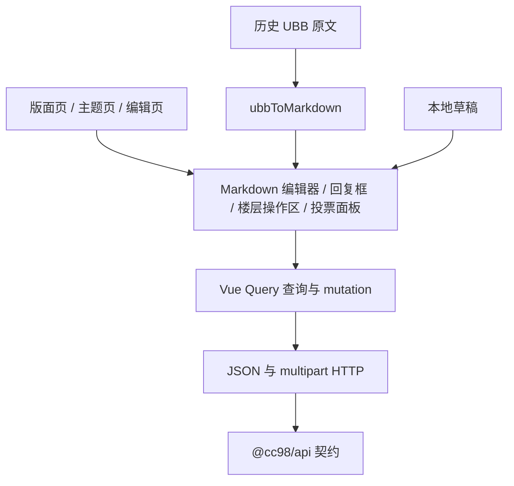

# 第六阶段：写流程迁移

## 背景

阶段 0 至阶段 5 已完成，网站已经具备认证、阅读闭环、富内容渲染、用户中心和 mutation 基础。第六阶段在这些能力上补齐发主题、回帖、编辑、上传和楼层互动。

公共 API 已登记相关 operation，但部分写接口仍标记为 `unknown`、`conflicted` 或 `permission-denied`。旧前端只作为行为参考，实施前必须使用当前测试账号和限定资源重新核对真实接口。

## 目标

- 提供 Markdown 发主题、回帖和编辑流程，新内容统一写入 `contentType=1`。
- 编辑历史 UBB 内容时，通过 `ubbToMarkdown` 转换后继续编辑。
- 支持图片与附件上传、本地草稿、失败恢复和防重复提交。
- 支持点赞、评分、主题收藏和投票，并保持主题页、帖子列表和用户中心缓存一致。
- 使用真实接口和浏览器完成主要写入路径回归。

## 非目标

- 不建设 UBB 编辑器，不支持 Markdown 转 UBB。
- 不迁移私信、通知、签到、公开页关注和 SignalR。
- 不迁移删除、财富、版主管理等破坏性或高风险操作。
- 不为旧前端路径和参数增加兼容重定向。
- 不做移动端专项适配和视觉还原。

## 测试资源与安全边界

- 创建主题只在「似水流年」进行，使用用户已确认的求助文案。
- 回帖接口先在主题 `4759491` 中验证。提交前读取主题和相邻回复，按正常讨论语气组织内容，并自然加入无副作用的 UBB 标签。
- UBB 回帖探测显式使用 `contentType=0`，只用于验证历史协议。产品编辑器和正式新内容仍固定使用 Markdown 与 `contentType=1`。
- 后续编辑、上传、点赞、评分、收藏和投票优先集中在自己创建的主题及回复中。
- 所有公开写入在执行前确认内容和操作对象，不批量发送，不编辑或删除他人内容，不执行管理类接口。
- 认证信息只从环境变量或浏览器认证存储读取，不写入仓库、脚本和测试产物。

## 方案

### 分层

`apps/website` 负责请求编排、认证、缓存键、错误映射和界面状态。公共请求与响应 schema 继续由 `packages/api` 提供，不在页面中重复定义。

### 编辑与草稿

- 封装 `md-editor-v3`，集中处理主题、禁用状态、字数限制、图片上传和附件链接。
- 草稿按操作类型和目标 ID 隔离。提交失败保留内容，提交成功后才清理。
- mutation 提交期间禁用重复操作，写请求不自动重试。
- 图片与附件使用 `FormData`，由浏览器设置 multipart boundary。

### 缓存一致性

- 发主题成功后刷新版面主题列表，并跳转到真实主题 ID。
- 回帖和编辑成功后刷新主题摘要、帖子分页及相关用户中心列表。
- 点赞、评分、收藏和投票在确认接口语义后使用可回滚的乐观更新；未确认前以成功后失效查询为准。
- 收藏操作同时刷新主题收藏状态、收藏分组和用户中心收藏列表。

## 实施步骤

- [ ] 使用限定资源重新验证阶段 6 所需接口，记录响应类型、状态码、错误码和权限边界。
- [ ] 按实测结果修正 operation registry、schema、fixture 和探测记录。
- [ ] 实现 multipart 请求、上传、草稿、错误映射和共享 Markdown 编辑器。
- [ ] 实现发主题入口、页面和 mutation。
- [ ] 实现主题页回帖、引用和提交后定位。
- [ ] 实现历史帖子读取、UBB 转换、编辑和返回楼层。
- [ ] 实现点赞、评分、主题收藏和投票。
- [ ] 补充自动测试，执行增量检查和 `vp run ready`。
- [ ] 完成真实浏览器回归，记录截图、录屏和未解决差异。
- [ ] 更新路线图、前端规范及必要的安全文档。

## 验证

- 自动测试覆盖 payload 构造、草稿恢复、错误映射、UBB 转换、点赞状态和投票校验等有分支逻辑。
- 真实浏览器覆盖发主题、上传、回帖、失败恢复、编辑自有帖子、点赞、评分、收藏和投票。
- 认证、权限、真实接口和用户交互变更均保留浏览器证据。
- 收尾执行 `vp run ready`，任一检查失败都不标记阶段完成。

## 进展与调整

- [x] 2026-07-12：确认阶段范围、测试资源、发主题文案和 UBB 回帖探测策略。
- [x] 2026-07-12：删除主题和帖子按管理员能力记录，普通用户接口状态统一为 `permission-denied`。
- [x] 2026-07-12：编辑器支持一次上传多个普通附件，并插入带文件名的 Markdown 链接。
- [x] 2026-07-12：楼层分页使用一基编号换算，移除第 10、20 楼等边界处的跳页错误。
- [x] 2026-07-12：点赞状态复用帖子列表响应，不再为每个楼层单独请求 `/post/{postId}/like`。
- [ ] 写接口重新探测。
- [ ] 编辑与上传基础设施。
- [ ] 发主题、回帖和编辑闭环。
- [ ] 楼层互动。
- [ ] 回归与文档收尾。

## 决策记录

- 产品写入统一使用 Markdown。UBB 写入只作为一次性协议探测，不进入产品界面。
- 不使用通用探针自动执行写操作。每个公开写入都使用明确请求体和限定资源，避免误写主站数据。
- 历史 UBB 编辑存在转换损失时向用户提示，不尝试回写 UBB。
- 删除主题和帖子按管理员能力处理。普通用户真实调用均以权限拒绝记录，不在产品界面提供删除入口。
- 新前端只保留稳定的楼层锚点，不兼容旧站分页边界的历史副作用。楼层和页码统一按一基编号换算。
- 普通附件与图片复用 `/file` 上传。图片插入 Markdown 图片语法，其他文件插入带文件名的 Markdown 链接。
