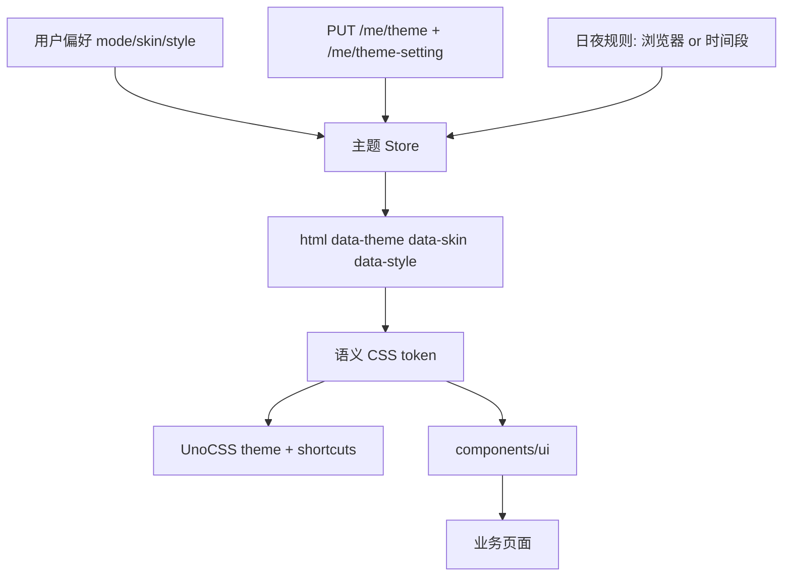

# 第八阶段：设计系统与换肤地基

## 背景

阶段 0 至阶段 7 已完成，功能页面形成完整闭环，但视觉一直按路线图约定往后放。当前网站只有一份最小的明暗 CSS 变量（`styles/global.css` 七个颜色），UnoCSS 里手写了 `cc98-primary` 等少量 token 和三个 shortcut，主题状态只有 `mode + season` 两个维度，season 还没有任何实际皮肤对应。

老论坛（`Forum`，React + SCSS）的换肤方式已经调研清楚：

- 每套皮肤是一个 SCSS 文件，只声明 `$theme_color_main`、`$theme_color_sub`、`$theme_color_topbar`、`$background_image`、`$background_image_card`、`$background_color_page`、`$background_color_textarea`、`$font_color_text` 八个变量，然后 `@import Site.scss`。皮肤之间的差异就是这几个颜色和两张背景图，信息架构和交互完全一致。
- 构建期把每套皮肤编译成独立 CSS 文件，运行时通过替换 `#mainStylesheet` 的 `href` 切换（`changeTheme` / `changeThemeCore`）。
- 皮肤是编号（`themeList` 共 30 项，0 号是「系统默认」），大量皮肤成对提供亮暗两版，`themeDayNightGroups` 记录配对关系。
- 用户可开启日夜自动切换（`ThemeSetting`：`enableDayNightSwitch`、`syncWithBrowserDayNightMode`、`dayStartTime`、`nightStartTime`），按浏览器 `prefers-color-scheme` 或时间段在亮暗之间轮换。
- 主题选择持久化在服务端用户资料上，对应 `PUT /me/theme`（皮肤编号）和 `PUT /me/theme-setting`（日夜规则），两个 operation 在 `packages/api` 已就位。
- 视觉主体是 CC98 蔚蓝（rgb(51,153,255)）、固定版心（1140px 居中）、头部横幅（12rem，承载皮肤背景图）加叠在其上的顶栏，卡片白底配主色描边。

老方案的问题是皮肤和一整份 5000 行 Site.scss 强耦合、编译成多份全量 CSS、切换靠换整张样式表。新前端不复制这套做法，改成语义 token + 运行时数据属性驱动，皮肤只提供一层变量覆盖。

## 目标

- 产出根目录 `DESIGN.md`（遵循 Google DESIGN.md 规范：YAML token 前置 + 分节 prose），作为人和 agent 共用的视觉事实源。已完成。
- 把主题状态从 `mode + season` 升级为 `mode + skin + style` 三个正交维度，兼容读取旧的本地存储。
- 建立语义 CSS token 分层，UnoCSS theme 和 shortcuts 改为纯消费语义 token 的层。
- 基于 Reka UI 建立实际渲染的 `components/ui` 基础组件层（Button、Input、Textarea、Card、Badge、Dialog、AlertDialog、Tabs）。
- 保留 CC98 的季节和节日换肤能力，接入 `PUT /me/theme` 和 `/me/theme-setting`，支持日夜自动切换。
- 先打通首页、版面页、主题页三条核心路径，再扩展到其余页面。

## 非目标

- 第一轮不实现全部皮肤，也不实现全部风格方向。先出默认亮、默认暗，加一套节日皮肤验证换肤链路。
- 不让皮肤改变信息架构和交互，皮肤只换颜色、背景图和亮暗配对。
- 不在帖子正文上使用 Acrylic 或高透明背景。
- 不在本阶段重写业务数据层、路由和富内容协议。
- 不做移动端适配，仍按路线图放到后续单独规划。

## 方案

### 三层主题模型

主题拆成三个正交维度，都落在根节点的 data 属性上，CSS 按属性覆盖语义 token：

- **mode**：`light` / `dark`，决定明暗底色和文字。
- **skin**：`default` 加各季节节日皮肤，决定标识主色、头部背景图和点睛色。对应老论坛的皮肤编号。
- **style**：`solid` / `elegant` / `fluent`，决定整体气质（圆角、阴影、密度、表面处理）。三者是同层的风格方向，不预设材质组合，首发只做 `solid`。

### token 分层

分成两层，避免皮肤直接改业务颜色：

- **原始层**：品牌蓝、中性灰阶、状态色等具体取值，按 mode 和 skin 覆盖。
- **语义层**：`--cc98-color-surface`、`--cc98-color-text-muted`、`--cc98-color-primary` 等，业务只用语义名。`DESIGN.md` 前置的 token 就是语义层的规范值。

皮肤只覆盖原始层里的主色和背景图变量，语义层从原始层派生，业务组件和页面永远不碰具体十六进制。

### 换肤运行时

不沿用老论坛换整张样式表的做法。全部皮肤的变量覆盖打进一份 CSS，用 `[data-skin="..."]` 选择器区分，切换只改根节点属性，不重新加载样式表，因此无刷新、无闪烁。皮肤编号到 `skin` 名的映射维护成类型安全的本地注册表，同时负责和服务端 `PUT /me/theme` 的编号互转。

日夜切换复用老论坛逻辑：`ThemeSetting` 开启后，按 `syncWithBrowserDayNightMode` 走 `prefers-color-scheme`，否则按 `dayStartTime` / `nightStartTime` 时间段判定，在皮肤的亮暗配对间选当前生效的一版。

## 实施步骤

- [x] 调研老论坛皮肤机制、主题 API 和视觉主体，冻结三层主题模型。
- [x] 编写根目录 `DESIGN.md`，覆盖颜色、字体、布局、层级、形状、组件和 Do/Don't，并通过官方 linter（0 error）。
- [x] 把 `styles/global.css` 扩成原始层加语义层两级 token，补齐 light/dark 取值。
- [x] UnoCSS theme 和 shortcuts 改为消费语义 token，收敛现有 `cc98-*` 命名到 `DESIGN.md` 的语义名。
- [x] 主题 Store 从 `mode + season` 升级为 `mode + skin + style`，接入 `PUT /me/theme` 和 `/me/theme-setting` 与日夜切换。
- [ ] 建立 `components/ui`：Button、Input、Textarea、Card、Badge、Dialog、AlertDialog、Tabs。
- [ ] 迁移 Header、DefaultLayout、PageState、TopicList、PostItem 到语义 token 和基础组件。
- [ ] 实现默认亮、默认暗、一套节日皮肤，完成首页、版面页、主题页回归。
- [ ] 按首发 `solid` 风格迁移其余页面，再逐步补齐老论坛皮肤和 `elegant`、`fluent` 方向。
- [ ] 完成无障碍、对比度、主题切换、刷新恢复和浏览器回归。

## 验证

- 每套主题至少检查正文、链接、按钮、输入框、弹窗、通知、错误态、禁用态。
- 核心页面在默认亮、默认暗和节日皮肤下做浏览器验证。
- 切换皮肤和明暗不刷新页面，刷新后偏好恢复，登录用户的服务端偏好能回填，不产生明显闪烁。
- 对比度守 WCAG AA，正文和元信息都不低于 4.5:1；红色徽标白字、皮肤主色顶栏白字等按 UI 元素 3:1 判定，已在 `DESIGN.md` 标注。
- `vp check`、`vp run ready` 和浏览器回归全部通过。

## 进展与调整

- 2026-07-13：完成旧 CC98、CC98 Desktop、V2EX、NGA、Discourse、Flarum、Reka UI、UnoCSS 和 Google DESIGN.md 调研，确认 `solid`、`elegant`、`fluent` 属于同层的整体风格方向。
- 2026-07-16：深入拆解老论坛 SCSS 换肤机制（八个皮肤变量 + Site.scss、换样式表切换、皮肤编号与日夜配对、`ThemeSetting`、`PUT /me/theme` 与 `/me/theme-setting`），确定新前端改用语义 token + 数据属性覆盖，不复制换整张样式表的做法。
- 2026-07-16：产出根目录 `DESIGN.md` 并通过官方 linter，主题模型定为 `mode + skin + style` 三维。
- 2026-07-16：完成主题 Store 三维升级。新增 `stores/skins.ts` 作为老论坛皮肤编号与 skin 名的类型安全注册表，把 30 个编号归约到 21 个 skin（9 对亮暗配对皮肤合并，明暗交给 mode 维度），内置双向互转与日夜规则推断（`resolveAutoMode` 复刻老论坛的浏览器优先、时间段回退、跨夜区间处理）。`stores/theme.ts` 重写为三维状态，pinia persist 只存 `mode/skin/style`；`effectiveMode` 在日夜规则开启时覆盖手动 mode，根节点 data 属性由 watch 自动同步。`App.vue` 接入 `currentUserQuery`，登录后从服务端 `theme`/`themeSetting` 回填。配对皮肤的 setMode 会连带写回 `/me/theme`。`skins.ts` 由子 agent 补了 99 个单元测试（编号互转对称性、日夜判定的跨夜边界、非法时间回退）。顺手修复了 `renovate.json` 一处 `]` 应为 `}` 的预存 JSON 语法错误（阻断 dprint）。
- 2026-07-16：完成 token 分层和 UnoCSS shortcut 收敛。全仓扫描后清除了全部旧兼容命名（`cc98-bg` 42 处按语义分流到 `cc98-background`/`cc98-surface-subtle`、`cc98-bg-elevated` 11 处归并到 `cc98-surface`），删除了 `global.css` 和 `uno.config.ts` 的旧兼容层。重写 `cc98-btn`（padding 对齐实际使用、`text-white` 改 `text-cc98-on-primary`、补 `disabled:opacity-50`），新增 `cc98-input`（输入框 26 处）、`cc98-overlay`+`--cc98-color-overlay` token（遮罩层 3 处）、`cc98-modal`（模态面板 3 处）。Tailwind 原始调色板直写全部收敛：`text-red-500`→`text-cc98-error`、`bg-red-600`→`bg-cc98-error`、`amber-*` 整族→`cc98-warning` 语义 token + 透明度修饰符（去掉手写 dark 变体）。保留代码块和图片工具条的 `bg-black/text-white`（组件自有深色浮层，独立于主题）。

## 决策记录

- 先固定设计语言和 token，再批量迁移页面，避免每个页面重复讨论颜色和圆角。
- 换肤不复制老论坛的多份全量 CSS + 换样式表方案，改成一份 CSS 内用 `data-skin` 覆盖变量，运行时只改根属性，换取无刷新、无闪烁。
- 皮肤只负责颜色、背景图和亮暗配对，风格负责整体气质，两者不强制组合成笛卡尔积。
- 标识色 `brand`（#3399ff，取自老论坛板块色 `$color-board`）做 Logo 和装饰，可操作蓝 `primary`（#1668dc）做按钮、链接和顶栏，保证白字和链接在浅色背景下达到 AA。
- Acrylic 只作为 `fluent` 风格的可选表现，必须有不透明回退，且不铺在正文上。
- 皮肤编号沿用老论坛服务端约定，本地维护编号到 `skin` 名的类型安全映射做互转，不改后端。
