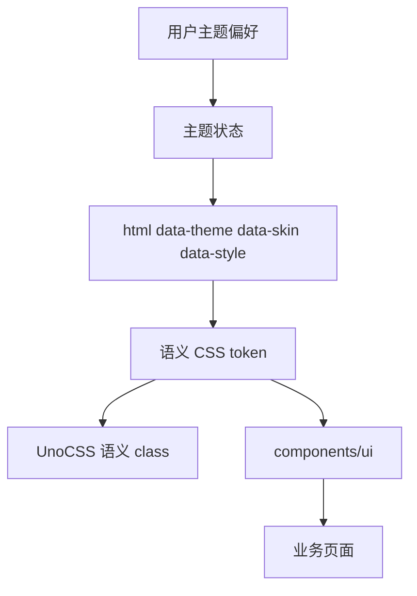

# 第八阶段：设计系统与样式收尾

## 背景

阶段 0 至阶段 7 已完成，功能页面已经形成完整闭环。现有网站只有基础的明暗 CSS 变量，旧 CC98 前端拥有多套节日皮肤，项目还没有统一的设计 token、基础组件和样式开发规范。

本阶段先处理样式基础设施，再迁移页面视觉。`solid`、`elegant`、`fluent` 是同一层面的整体风格方向，不预设它们是材质组合；后续可以在确认设计方向后分别实现。

## 目标

- 建立可被 agent 和开发者共同使用的 CC98 `DESIGN.md` 规范。
- 建立语义化 CSS token、主题注册表和可持久化的换肤状态。
- 基于 Reka UI 建立实际渲染的 `components/ui` 基础组件层。
- 使用 UnoCSS 消费语义 token，减少页面直接书写颜色和结构样式。
- 保留旧 CC98 的季节和节日皮肤能力。
- 先完成首页、版面页和主题页三条核心路径，再扩展到其他页面。

## 非目标

- 第一轮不同时实现全部皮肤和全部风格方向。
- 不让节日皮肤改变页面信息架构和交互行为。
- 不在所有帖子正文上使用 Acrylic 或高透明度背景。
- 不在本阶段重写业务数据层、路由和富内容协议。

## 方案

主题运行时使用根节点数据属性区分显示模式、皮肤和整体风格：

主题内容来自本地类型安全注册表。皮肤可以提供颜色、背景图和亮暗配对，整体风格提供统一的圆角、阴影、密度和表面规则。业务组件只使用语义 token，不判断具体皮肤名称。

## 实施步骤

- [ ] 冻结一页式风格决策，明确 `solid`、`elegant`、`fluent` 的视觉关键词、反例和首发方向。
- [ ] 编写根目录 `DESIGN.md`，包括颜色、字体、布局、层级、形状、组件和 Do/Don't。
- [ ] 将现有主题状态升级为 `mode + skin + style`，保留旧本地存储的兼容读取。
- [ ] 扩展全局语义 token，并将 UnoCSS theme 和 shortcuts 改为 token 消费层。
- [ ] 建立 Button、Input、Textarea、Card、Badge、Dialog、AlertDialog、Tabs 等基础组件。
- [ ] 先迁移 Header、Layout、PageState、TopicList 和 PostItem。
- [ ] 实现默认浅色、默认深色和一套节日主题，完成首页、版面页和主题页回归。
- [ ] 根据首发风格迁移其余页面，再逐步补齐旧论坛皮肤。
- [ ] 完成无障碍、对比度、主题切换、刷新恢复和浏览器回归。

## 验证

- 每个主题至少检查正文、链接、按钮、输入框、弹窗、通知、错误和禁用状态。
- 核心页面在浅色、深色和首发节日主题下完成浏览器验证。
- 主题切换不刷新页面，刷新后偏好恢复，不产生明显闪烁。
- `vp check`、`vp run ready` 和浏览器回归全部通过。

## 进展与调整

- 2026-07-13：完成旧 CC98、CC98 Desktop、V2EX、NGA、Discourse、Flarum、Reka UI、UnoCSS 和 Google DESIGN.md 调研。
- 2026-07-13：确认 `solid`、`elegant`、`fluent` 属于同一层面的整体风格方向。

## 决策记录

- 先固定设计语言和 token，再批量迁移页面，避免在每个页面重复讨论颜色和圆角。
- 皮肤负责保留 CC98 的季节与节日视觉，风格负责定义整体界面气质，两者不强制组合成笛卡尔积。
- Acrylic 只作为某些风格的可选表现，必须提供不透明回退并保持正文可读性。
