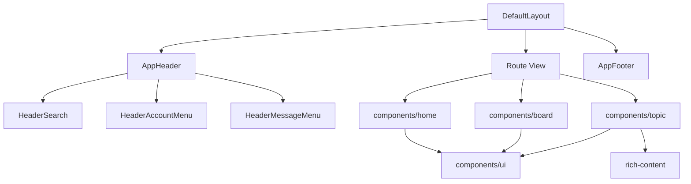

# CC98 全站高保真迁移指南

## 背景

阶段 0 至阶段 7 先完成了数据、路由、认证、阅读、写入和消息闭环，阶段 8 目前完成的是设计 token、主题状态和基础 UI 组件。这个顺序符合原路线图，但也留下了一个明显结果：功能已经能用，页面仍像一套通用论坛模板，旧 CC98 的信息密度、首页栏目、头部横幅、版面识别和用户中心入口没有迁过来。

本计划以 2026-07-16 的线上 CC98、同级 `Forum` 仓库和当前 `apps/website` 为基线，记录全站差异、迁移顺序和验收方式。后续改动应持续更新这份文档，不再把“样式收尾”当成一次批量换颜色任务。

调研基线：

- 原站：`https://www.cc98.org/`，桌面视口 1440×1000，线上默认使用夏季皮肤。
- 旧前端源码：同级 `Forum`，重点参考 `Components/MainPage.tsx`、`Components/Header.tsx`、`Components/Board/`、`Components/Topic/`、`Components/UserCenter/`、`Styles/MainPage.scss` 和 `Styles/Site.scss`。
- 当前实现：`main` 分支 `5ac2eba`，本地 `http://localhost:5173/`。
- 浏览器证据：`.artifacts/browser/2026-07-16-full-fidelity-migration/`，该目录只存本地截图和临时报告，不提交。

## 当前差异不是一层 CSS 能解决的

旧站首页直接消费 `/config/index`，页面包含全站公告、推荐阅读、热门话题、校园活动、学术通知、学习园地、感性情感、跳蚤市场、求职广场、实习兼职、推荐功能、广告、校园意见箱、福利优惠、论坛统计和三个二维码。当前首页只消费 `/config/global`、本月热门和全部版面，实际呈现为公告、一张热门卡片和一张版面导航卡片。

页面壳也没有接完整。旧站首页头部高 192px，其中顶栏高 48px，横幅使用当前皮肤背景图；内页头部收成 48px。当前所有页面都使用 56px 白色导航条，`--cc98-banner-image` 和 `--cc98-banner-height` 已定义，但没有组件消费。皮肤注册表覆盖 30 个旧编号并归约成 21 个 `skin`，CSS 只实现默认和一套节日皮肤，匿名默认也没有沿用旧站的夏季主题。

设计规范和高保真目标还有几处冲突。`DESIGN.md` 当前把卡片圆角定为 12px、操作蓝定为 `#1668dc`，首页截图里的旧站面板接近直角，栏目用 8px 顶部色条区分，夏季主色是 `#5198d8`。迁移不能继续把“旧站身份”和“通用现代卡片”混成一套规则，后续需要同步修订 `DESIGN.md`。

## 浏览器对比快照

| 项目         | 原站首页                                           | 当前首页                                            | 影响                               |
| ------------ | -------------------------------------------------- | --------------------------------------------------- | ---------------------------------- |
| 首页头部     | 192px 皮肤横幅，48px 半透明顶栏                    | 56px 白色导航                                       | 站点身份和换肤效果基本消失         |
| 内容版心     | 1140px                                             | 外层 1152px，实际卡片 1120px                        | 与设计 token 和旧站网格都没有对齐  |
| 首页列宽     | 左 820px、间隔 20px、右 300px                      | 公告通栏，下面 548px、间隔 24px、548px              | 原站主内容和运营侧栏关系丢失       |
| 首页内容高度 | 主内容约 2033px                                    | 主内容约 844px                                      | 大量栏目和入口缺失                 |
| 面板语言     | 8px 顶色条、紧凑列表、弱圆角                       | 1px 灰边、12px 圆角、留白偏大                       | 信息密度和 CC98 识别度下降         |
| 顶栏能力     | Logo、版面、新帖、关注、精选、场景化搜索、登录注册 | 文本 Logo、首页、版面、热门、新帖、精选、搜索、登录 | 搜索上下文、关注入口和原站布局缺失 |
| 页脚         | 运营链接、友情链接、版本、邮箱                     | 统计数字和“复刻版”                                  | 站点归属、外部服务和帮助入口缺失   |

基线取证时，浏览器控制台还有一条独立回归：`AppHeader.vue` 使用了 `UiButton`，但没有导入组件。该问题已随 M0 修复，后续截图不再受无关告警干扰。

## 迁移原则

### 保留用户已经形成的页面认知

首页栏目顺序、版面列表的分区方式、主题列表的信息密度、楼层左右分栏、关注入口、用户中心导航和消息分类都属于用户认知，不应继续用通用卡片替代。组件和数据层可以重写，用户看到的信息层级和主要操作位置要接近原站。

### 以线上页面为行为事实源，以旧仓库解释实现细节

旧仓库里有失效代码、注释掉的功能和重复路由。比如 `/index` 对应的页面基本为空，校园新闻组件已注释，旧移动端跳转也已停用。迁移时先看线上是否仍有入口，再用旧源码确认接口、字段和交互，不能按文件数量机械搬运。

### 继续使用语义 token，不复制 5000 行旧 SCSS

旧站的色条、版心、密度和皮肤背景要保留，但实现仍走 `mode + skin + style`、语义 token 和 `components/ui`。业务页面不读取具体皮肤名，不恢复多份全量 CSS，也不引入 jQuery 式 DOM 操作。

### 每个纵向切片同时完成数据、布局、状态和验证

首页迁移不能只画静态卡片，必须同时补 `/config/index` schema、query、加载状态、空状态、链接行为和截图验证。后续版面、主题、用户中心也遵循同一方式，避免再出现“接口已迁，页面仍是占位”的状态。

### 桌面高保真先完成，移动端另开计划

本轮按 1140px 桌面版心验收。小于版心的视口可以保证不崩溃，但不把移动端重排纳入完成定义，保持与路线图现有边界一致。

## 功能与页面差异矩阵

| 页面或能力       | 原站行为                                                                                           | 当前状态                                                               | 迁移结论                                   |
| ---------------- | -------------------------------------------------------------------------------------------------- | ---------------------------------------------------------------------- | ------------------------------------------ |
| 全局头部         | 首页横幅、内页细顶栏、Logo、关注、精选、场景化搜索、用户与消息下拉                                 | 统一白色 56px 顶栏，搜索为独立页面                                     | 重做页面壳，保留新路由和认证实现           |
| 首页             | `/config/index` 聚合出十余个栏目和右侧运营区                                                       | 公告、本月热门、版面导航                                               | 第一优先级恢复                             |
| 版面列表         | 分区色条、主管、展开收起、版面图标、今日/总帖数、右侧跳转导航                                      | 分组卡片加纯文字三列                                                   | 恢复层级、图标、统计和快速导航             |
| 版面页           | 版面信息、标签、精华、保留、版务记录、置顶、搜索、发帖、关注、管理入口                             | 基础信息、关注、发帖、置顶和普通列表                                   | 补齐筛选、标签、记录、管理和视觉密度       |
| 主题列表项       | 状态图标、标题高亮、作者、时间、回复/浏览、最后回复、分页快捷入口                                  | 核心文字字段已齐                                                       | 调整成原站密度，补状态图标和标签语义       |
| 主题阅读         | 主题信息区、用户侧栏、头像相框、等级资料、楼层、签名、奖励、赞踩、引用、只看、评分、管理、热门回复 | 已恢复主题信息区、用户侧栏、楼层网格、签名、奖励、只看、追踪和热门回复 | 阅读骨架已完成，版主管理操作归入 M8        |
| 新帖             | 经典、卡片、仅媒体三种视图                                                                         | 三种视图、媒体预览、服务端偏好和增量加载均已恢复                       | 已完成，后续与关注、精选和搜索统一视觉     |
| 关注             | 关注版面、关注用户、收藏更新三页                                                                   | `/focus` 三类聚合、版面筛选和增量加载已恢复                            | 已完成，关注关系管理继续留在用户中心       |
| 精选             | 随机推荐和刷新历史                                                                                 | 旧站行式布局、换一换和上一批均已恢复                                   | 已完成，推荐历史按当前用户隔离             |
| 搜索             | 顶栏内按主题、用户、版面、版内切换                                                                 | 场景化顶栏搜索、主题增量列表、用户直达和版面标签结果均已恢复           | 已完成，后续随各业务页回归搜索上下文       |
| 公开用户页       | 资料、签名、近期主题、关注、私信和管理入口                                                         | 资料、签名、关注、私信和主题增量加载均已恢复                           | 阅读与关系入口已完成，管理入口归入 M8      |
| 用户中心首页     | 头像、完整资料、签名和近期主题                                                                     | 200px 导航、资料页、签名和近期主题均已恢复                             | 首页已完成，设置与其余子页继续分片迁移     |
| 资料设置         | 头像、签名、个人资料、其他偏好                                                                     | 头像、签名、生日、头衔和资料表单均已恢复                               | 已完成，隐私扩展随真实入口再补             |
| 主题设置         | 30 个皮肤、日夜自动切换、时间设置                                                                  | Store 和接口已有，没有设置 UI，只有明暗按钮                            | 补主题中心，展示已实现和待实现皮肤状态     |
| 财富转移         | 用户中心入口                                                                                       | 缺失，API 已登记                                                       | 低频但仍在旧站公开入口，后期迁移           |
| 收藏与自定义版面 | 分组、排序、搜索、关注版面                                                                         | 主要管理能力已迁                                                       | 视觉重排，补与关注页的联动                 |
| 消息             | 回复、@、系统、私信、设置                                                                          | 回复、@、系统、私信已迁，没有消息设置                                  | 补设置并调整下拉和列表密度                 |
| 签到             | 月历、补签、统计                                                                                   | 签到和月历已迁                                                         | 对齐旧站视觉，补补签入口的权限与反馈       |
| 站点管理         | 公告、首页栏目和广告管理                                                                           | 无页面，相关 operation 已登记                                          | 管理员阶段迁移，所有写操作重新核对权限     |
| 版主管理         | 置顶、锁定、精华、移动、高亮、批量操作、禁言、版务记录                                             | API 契约较全，页面入口不足                                             | 在核心阅读稳定后单独迁移                   |
| IP 查询          | 主题 IP 查询和独立工具                                                                             | 无页面，`/topic/{id}/look-ip` 已登记                                   | 仅对有权限用户显示                         |
| 年度总结         | 2025 年度总结页                                                                                    | 无页面，年度 API 已登记                                                | 活动页独立切片，按当年线上入口决定是否保留 |
| 错误页           | 多种状态页和明确返回入口                                                                           | 通用 `PageState` 与简短 404                                            | 补 401、403、404、500 和维护状态的完整页面 |
| 页脚             | 运营服务、友情链接、版本、邮箱                                                                     | 论坛统计和复刻说明                                                     | 恢复有效链接，删除失效链接需有记录         |

## 首页要按原站信息架构重新实现

### 数据契约先修完整

新增 `indexQuery`，直接请求 `/config/index` 并使用 `indexSchema`。当前 schema 会丢弃真实响应里的 `todayTopicCount`、`specialOffer` 和 `manualHotTopic`，实施首页前要补齐字段并用 `packages/api/fixtures/anonymous/getConfigIndex.json` 做回归。

首页不要再用月热门接口代替热门话题。`/config/index.hotTopic` 是首页十大，包含版面名和版面 ID；周热门、月热门和历史上的今天只作为栏目标题右侧的三个入口。

建议的 query 边界：

- `indexQuery`：首页聚合数据，60 秒 `staleTime`，与旧站缓存周期接近。
- `/config/global`：不再承担首页主体数据。后续页面确有消费方时再建立独立 query，避免保留没有调用方的导出。
- `homepageAdvertisementQuery`：广告轮播单独请求 `/config/global/advertisement`，独立设置缓存和可见性过滤。
- 登录用户的福利优惠按字段和可见性展示，匿名状态不渲染空壳。

### 首页组件按栏目职责拆分

建议放在 `components/home/`：

- `HomeAnnouncement.vue`：渲染 UBB 公告，保留多行结构和链接。
- `HomeRecommendedReading.vue`：图片、标题、摘要、圆点切换，支持键盘和自动轮播暂停。
- `HomeTopicPanel.vue`：热门、校园活动、学术通知等共用的紧凑主题列表，支持主色和次色两种标题条。
- `HomeRecommendedFunctions.vue`：推荐功能图标和外链。
- `HomeAdvertisement.vue`：广告轮播，图片尺寸固定，失败时不留空白占位。
- `HomeForumStats.vue`：今日帖数、今日主题数、总主题数、总回复数、在线用户、总用户和最新用户。
- `HomeQrCard.vue`：小程序和公众号二维码。

`HomeView.vue` 只负责 query、左右栏编排和页面标题，不把所有栏目继续堆在一个文件里。

### 首页桌面布局规格

- 外层固定 1140px 居中。
- 左栏 820px，右栏 300px，中间 20px。
- 公告和推荐阅读占满左栏。
- 左栏下面每行两块 400px 栏目，中间 20px。
- 右栏按推荐功能、广告、校园意见箱、福利优惠、统计、二维码排序。
- 栏目列表默认 10 条，标题和版面名单行省略，悬停可看到完整标题。
- 页面底色、面板底色、主色条和次色条全部来自语义 token。

### 首页验收

- 匿名访问时，线上当前存在的首页栏目均有对应区域，没有数据的栏目不渲染空卡片。
- 热门话题显示版面名，标题链接进入主题，版面名进入对应版面。
- 推荐阅读能在鼠标、键盘和触摸板场景切换，自动轮播不会抢夺焦点。
- 原站和新站都在 1440×1000、默认夏季皮肤下截图，栏目顺序、列宽和首屏信息量一致。
- UBB 公告、外链图片和空标题均有降级处理。

## 视觉系统要从“通用卡片”回到 CC98

### 页面壳

`AppHeader` 需要区分首页和内页。首页渲染 192px 的皮肤横幅，顶栏叠在横幅上；内页只渲染 48px 主色顶栏。横幅消费 `--cc98-banner-image` 和 `--cc98-banner-height`，不能在组件里判断皮肤名称。

顶栏恢复 1140px 内部网格，左侧依次是图形 Logo、CC98 论坛、版面列表、新帖、关注、精选和搜索，右侧是登录注册或头像、用户名、消息和用户菜单。当前独立搜索页继续保留，顶栏输入框只是统一入口。

### 默认皮肤

旧站的“系统默认”编号 0 会读取部署配置，当前线上配置指向夏季编号 4。新实现需要保留这个语义：

- `default` 表示跟随站点默认，不代表无皮肤。
- 匿名用户和没有保存偏好的用户解析为当前站点默认皮肤。
- 第一版可以把站点默认配置为 `summer`，同时保留以后更换默认皮肤的单一配置入口。
- `summer` 必须在高保真首页开始前实现，因为它是当前线上视觉基线。

### 密度、圆角和层级

修订 `DESIGN.md` 时，应把首发 `solid` 定义成 CC98 的紧凑桌面风格：

- 正文和列表默认 14px，元信息 12px。
- 面板圆角优先 0 至 4px，弹窗和独立工具卡可以保留 8px。
- 首页和版面区块使用顶部色条，普通列表依靠分隔线，不给每一行套大圆角卡片。
- 页面主要层级靠底色、描边和色条，阴影只给浮层。
- 主色跟随皮肤，操作态可以使用经过对比度修正的深色变体。

`elegant` 和 `fluent` 继续留作后续风格，不在高保真迁移中展开。先把 `solid` 做成可识别的 CC98。

### 版心和间距 token

把 `DefaultLayout` 和 `AppHeader` 的 `max-w-6xl` 改为消费 `--cc98-content-width`。UnoCSS 需要提供明确的内容宽度 shortcut，页面不再各写一套 `max-w-*`。现有 `--cc98-space-*` 和 `--cc98-radius-*` 也要进入 UnoCSS theme 或组件变体，否则这些 token 只是声明，没有约束力。

## 核心页面迁移顺序

### M0：修复基线，冻结对比口径

- 修复 `AppHeader.vue` 的 `UiButton` 导入告警。
- 让 header 实际消费 banner token。
- 统一 1140px 版心。
- 明确 `default` 皮肤如何解析为站点默认，先实现夏季皮肤。
- 补 `/config/index` schema 缺失字段和 query。
- 建立页面差异台账，记录“保留、重做、废弃、待确认”四种状态。

验收：`vp run ready` 通过；首页、版面列表、登录页没有控制台错误；默认主题截图可稳定复现。

### M1：首页完整迁移

- 按上一节拆出首页组件。
- 恢复左右栏和全部线上栏目。
- 恢复推荐阅读、广告轮播、统计和二维码。
- 外部链接补 `rel="noopener noreferrer"`，图片补替代文本和失败占位。

验收：首页数据只发起必要请求；首屏结构、栏目顺序和线上原站一致；匿名和登录态分别验证。

### M2：头部、页脚和版面列表

- 恢复首页与内页两种头部。
- 恢复场景化搜索和关注入口。
- 页脚恢复仍有效的运营链接、友情链接、版本和邮箱。
- 版面列表恢复分区主管、展开收起、版面图标、统计和右侧跳转导航。
- 版面图标缺失时使用统一 fallback，不依赖每次手工更新静态 board info。

验收：在 1140px 版心下与原站同屏对比；键盘可以操作搜索、展开收起和快速导航。

### M3：版面页和主题列表

- 把版面标题、简介、统计、关注、发主题和搜索整理成紧凑头区。
- 补标签筛选、精华、保留、版务记录等入口，URL 与筛选状态同步。
- 置顶主题与普通主题使用同一列表结构，通过状态图标和分隔表达层级。
- 补标题高亮、匿名、投票、锁定、精华、内部可见等状态标识。
- 版主可见的批量操作放在独立工具条，普通用户不渲染空入口。

验收：普通用户和版主权限分别验证；筛选、翻页、返回和深链接保持状态；20 条主题的首屏密度接近原站。

### M4：主题阅读和楼层

- 楼层恢复左侧用户栏和右侧正文区，宽度、头像、用户名、等级、资料、楼层号和时间形成稳定网格。
- 正文继续使用现有 `ContentRenderer`，不要把皮肤背景铺到正文里。
- 补签名、奖励、赞踩状态、只看此人、楼层追踪、热门回复和私信入口。
- 收藏、投票、评分、引用、编辑和回复沿用现有 mutation 与草稿恢复逻辑。
- 管理操作按权限加载，包含删除、锁定、置顶、精华、移动、高亮和 IP 查询。

验收：历史 UBB、Markdown、图片、附件、投票和长主题分别抽样；页码、楼层锚点、引用后跳转和回复后定位通过浏览器回归。

### M5：发现、关注和搜索

- 恢复 `/focus` 聚合页，包含关注版面、关注用户和收藏更新；版面筛选写入 URL，保留双击进入版面的操作。
- 新帖页保留经典、卡片和仅媒体三种视图，视图写入 URL，并同步保存服务端偏好。
- 精选页保留随机刷新历史和上一次结果，当前批次与上一批按登录用户隔离保存。
- 顶栏搜索支持主题、用户、版面和版内搜索，复用现有搜索页展示结果。

搜索入口根据当前路由切换上下文：普通页面提供主题、用户和版面；版面页、主题页与版内搜索结果页提供版内、全站、用户和版面。主题搜索每次读取 20 条，版内与全站请求分别使用 `/topic/search/board/{boardId}` 和 `/topic/search`；用户搜索按用户名进入公开用户页，版面搜索使用紧凑标签集合展示结果。

验收：搜索条件写入 URL；刷新和返回不丢状态；未登录访问受限入口时能登录并回到原位置。

### M6：用户中心和主题设置

- 重做用户中心导航和首页摘要。
- 补个人资料、头像、签名和其他设置。
- 建立主题中心，展示全部皮肤预览、已实现状态、日夜自动切换、浏览器同步和时间设置。
- 完成剩余皮肤时按旧站八个变量逐套转换，只覆盖原始 token 和两张背景图。
- 补财富转移和仍有效的低频设置。

用户中心首页恢复原站左右页面壳：左侧 200px 导航，右侧展示 160px 头像、账号身份、收到的赞、两列资料、UBB 签名和最近发表的主题。近期主题使用 `/me/recent-topic`，版面信息通过 `/board/` 批量补齐，不恢复旧站的逐条版面请求和滚动缓存。

公开用户页复用同一资料组件，恢复用户详情导航、账号状态、关注和私信入口。用户名路径查询成功后规范为 `/user/id/{id}`；登录用户的近期主题每次读取 10 条并滚动加载，最多保留 200 条，匿名用户仍可查看公开资料。

资料设置页使用 `/usercenter/settings`，恢复头像、UBB 签名、性别、生日、头衔、QQ、邮箱和个人简介。头像上传继续使用 `/file/portrait` 与 `/me/portrait`，不迁移旧站手写 Canvas 裁剪器；资料提交使用 `/me`，并在客户端校验邮箱、QQ 和真实日期。

验收：服务端主题编号与本地 `skin + mode` 双向一致；自动日夜切换跨午夜可用；刷新无明显闪烁；未实现皮肤不能显示成可选成功状态。

### M7：消息、签到和实时入口

- 头部恢复消息下拉和分类未读数。
- 消息页补设置入口，统一回复、@、系统和私信的列表骨架。
- 签到页对齐旧月历、连续签到和补签反馈。
- SignalR 事件到达后，同步更新头部、消息页和用户中心摘要。

验收：实时事件、已读、全部已读、私信发送和补签分别验证；重复事件不会重复累加未读数。

### M8：管理、活动和边缘功能

- 迁移公告和首页栏目管理。
- 迁移版主管理、用户管理、版务记录和 IP 查询。
- 按线上入口迁移年度总结和节日活动页。
- 完成 401、403、404、500、维护中和网络错误页面。
- 对每个旧路由给出迁移、替代或废弃结论。

验收：高风险接口只用有权限的测试账号和专用测试数据验证；删除、封禁、财富和站点配置不在真实生产数据上做试探性操作。

### M9：全皮肤和全站回归

- 逐套实现剩余皮肤的主色、次色、顶栏色、页面底色、正文底色、横幅和卡片背景。
- 默认亮、默认暗、夏季和一套节日皮肤覆盖全部核心页面。
- 对比度、键盘操作、焦点、加载、错误、空状态和长文本全部检查。
- 更新路线图，把未迁移项明确标为废弃或后续项目。

验收：计划范围内没有“接口已完成但页面仍是占位”的入口；`vp run ready` 和浏览器回归全部通过。

## 组件边界建议

高保真迁移会增加页面结构，但不要把旧站的每个小类都照搬成组件。建议围绕稳定视觉和行为边界拆分：

基础 UI 负责按钮、输入、弹窗、菜单、标签和可访问性。业务组件负责栏目、版面项、主题项、用户侧栏和楼层。页面只编排 query、路由状态和业务组件。

## 每个迁移切片的工作方式

每个页面或能力按下面顺序推进：

1. 打开线上原站，记录 1440×1000 截图、可交互元素和网络请求。
2. 阅读旧源码中对应页面、样式和接口，不加载无关目录。
3. 对照当前页面，填写差异台账，区分数据缺失、结构缺失、视觉缺失和行为缺失。
4. 先补公共 schema 和 query，再写业务组件和页面编排。
5. 为加载、空数据、401、403、404 和普通错误提供完整状态。
6. 跑受影响包的增量 `vp check` 和测试。
7. 用 agent-browser 在原站和当前站重复同一条用户路径，保存截图；多步骤交互再录屏。
8. 切片完成后更新本计划的进展和差异台账。

一个 PR 只做一个能独立验收的纵向切片。首页、页面壳、版面列表、版面页、主题页应分开，避免一次提交同时改几十个页面后无法判断回归来源。

## 验证体系

### 静态检查和测试

- 改完文件立即跑受影响范围的 `vp check`。
- 公共 schema 变化补 fixture 解析回归。
- 有分支和状态的主题解析、轮播、筛选、日夜切换和权限控制补 Vitest。
- 提交前跑 `vp run ready`。

### 浏览器验证矩阵

| 维度 | 最低覆盖                                                       |
| ---- | -------------------------------------------------------------- |
| 视口 | 1440×1000；另测 1140px 宽度不横向错位                          |
| 主题 | 夏季亮色、默认暗色、春节亮色                                   |
| 身份 | 匿名、普通登录用户；管理页另测有权限账号                       |
| 页面 | 首页、版面列表、版面、主题、发帖、用户中心、消息、签到、错误页 |
| 状态 | 加载、空数据、长标题、图片失败、401、403、404、普通网络错误    |

页面数据随时变化，不用全页像素差作为唯一门槛。版心、列宽、头部高度、栏目顺序、主要操作位置和首屏密度使用明确数值验收；动态标题和统计数字以结构对齐为准。

### 无障碍和交互

- 顶栏搜索、菜单、轮播、展开收起和弹窗都能用键盘完成。
- 焦点样式清楚，弹窗关闭后焦点回到触发器。
- 图片有替代文本，纯装饰背景不进入无障碍树。
- 文字对比度守 WCAG AA，皮肤主色不满足白字对比时使用操作色变体。
- 不只用颜色表示置顶、锁定、未读、错误和选中状态。

## 明确不迁的旧实现

- 旧 React 组件、Redux、jQuery DOM 操作和 SCSS 文件组织。
- 多份全量 CSS 加替换 `#mainStylesheet` 的换肤方式。
- 已停用的移动端 PWA 跳转提示。
- 空的 `/index` 页面和仅为历史路径存在的重复实现。
- 旧 UBB 编辑器。新内容继续写 Markdown，编辑历史 UBB 时先转 Markdown。
- 线上没有入口、源码已注释且没有产品需求的栏目。废弃前要在差异台账记录依据。

## 风险

- 旧站包含长期累积的权限分支，匿名、普通用户、版主、站务看到的入口不同，不能只用匿名截图判断功能是否存在。
- `/config/index` 和管理接口有历史拼写，例如 `recommandationreading`，公共契约要兼容服务端，UI 文案使用正常中文。
- 皮肤图片和版面图标数量大，批量迁移时要检查体积、缓存和失败降级。
- 旧站很多链接在新窗口打开，新实现要逐项判断是否仍有必要，站内主流程默认使用 SPA 导航。
- 高保真会降低当前通用卡片的圆角和留白，需同步更新 `DESIGN.md`，否则后续 agent 会按旧规范把页面改回去。
- 管理、财富、补签和 IP 查询涉及权限或敏感数据，只做有边界的验证。

## 完成定义

迁移完成时应满足：

- 线上原站仍在使用的桌面入口都有新页面，或在差异台账中写明替代方案和废弃理由。
- 首页恢复完整信息架构，页面壳、版面列表、版面页和主题页具备清楚的 CC98 视觉身份。
- 主题 token、皮肤背景、默认皮肤和主题设置 UI 连成完整链路。
- 主要阅读、写入、关注、用户中心、消息和签到流程通过浏览器回归。
- 管理和边缘功能按权限完成迁移，没有用通用错误页或空白卡片代替。
- `DESIGN.md`、路线图和本计划与实际实现一致。
- `vp run ready` 通过，浏览器控制台没有未处理错误和组件解析告警。

## 近期三个切片

1. `M6` 用户中心：恢复资料摘要、个人设置和主题设置入口。
2. `M7` 消息与签到：恢复消息下拉、消息设置和签到页视觉。
3. `M8` 管理与边缘功能：恢复管理入口、活动页和完整错误状态。

## 进展与调整

- 2026-07-16：完成线上首页和版面列表的浏览器取证，确认当前差异覆盖信息架构、页面壳、视觉语言和边缘功能，不能继续作为单纯样式收尾处理。
- 2026-07-16：确认 `/config/index`、年度总结、版主管理、IP 查询、主题设置、财富转移等多数后端 operation 已在 `packages/api` 登记，主要工作集中在 schema 完整性、query、页面和权限 UI。
- 2026-07-16：确认 banner token 尚无消费方，21 个 `skin` 只实现 2 个，线上系统默认实际解析为夏季皮肤。
- 2026-07-17：完成首页高保真迁移。`/config/index` 已接入，公告、推荐阅读、热门话题、校园活动、学术通知、学习园地、感性情感、跳蚤市场、求职广场、实习兼职、推荐功能、广告、论坛统计和二维码均已恢复；页面壳开始消费横幅 token，夏季成为系统默认皮肤。
- 2026-07-17：浏览器在 1440×1000 下确认横幅 192px、顶栏 48px、版心 1140px、主栏 820px、侧栏 300px、双列栏目 400px。首页搜索、推荐阅读轮播、广告轮播、站内 SPA 导航和远程图片加载通过验证，控制台无错误。
- 2026-07-17：M0 和 M1 已完成并通过 `vp run ready`。下一切片进入 M2 版面列表，不再继续扩张首页组件范围。
- 2026-07-17：完成 M2 版面列表。恢复 12 个分区的主管、展开收起、版面图标、今日与总帖数、四列紧凑文字版面和右侧快速导航；浏览器确认 266 个版面、53 个图标均正常渲染，锚点与版面跳转保持 SPA 导航。
- 2026-07-18：完成 M3 版面页与主题列表。恢复 240px 版面信息栏、900px 公告栏、发主题与发投票入口、两层标签、精华、保存、版务记录、置顶状态图标和 64px 主题行；普通、精华、保存、标签和版务记录均保持 SPA 路由，投票入口会直接打开 Markdown 编辑器的投票模式。
- 2026-07-18：登录态浏览器预览确认版心 1140px、头区两列为 240px 与 896px 可用宽度、普通页合并 2 条置顶与 20 条主题、图片零破损。匿名访问仍进入登录状态页，不暴露受限版面内容。
- 2026-07-18：完成 M4 主题阅读页。恢复 104px 主题信息区、248px 用户栏、888px 正文栏、40px 楼层标记、签名档、奖励、匿名身份、最热回复和主楼内投票，正文继续复用 Markdown 与 UBB 渲染层。
- 2026-07-18：只看此人和楼层追踪改为 URL 查询状态，可刷新、返回和分页；过滤分页按结果帖子数计算，不额外计入主楼，切换过滤模式后不会残留热评缓存。引用会滚动到 Markdown 回复编辑器，分享链接、收起图片、收藏、评分、赞踩和私信入口保留。
- 2026-07-18：登录态浏览器预览确认 1440×1000 下版心与两列尺寸符合旧站规格，1140px 视口无横向溢出，匿名头像尺寸为 417×417，图片零破损。取证截图保存在 `.artifacts/browser/2026-07-18-topic-fidelity/topic-final.png`，版主管理操作继续归入 M8。
- 2026-07-18：完成 M5 的新帖页切片。经典模式恢复 180px 作者区、858px 主题区和 100px 版面区；卡片与仅媒体模式恢复 250px 用户栏、554px 主题流和 318px 推荐栏，并支持图片展开、隐私模式、自定义版面与随机推荐。
- 2026-07-18：三种新帖视图使用可刷新的 URL，服务端同步保存 `topicViewMode`。仅媒体模式改用 `/topic/new-media`，普通和媒体查询缓存隔离；列表按 20 条增量加载，刷新会回到首批结果，最多读取 500 条。
- 2026-07-18：浏览器确认 1440×1000 下卡片布局总宽 1140px，三栏宽度为 250px、554px 和 318px，经典行高 82px；1140px 视口无横向溢出，图片零破损，刷新、重载、返回、图片展开和隐私模式通过验证。取证截图保存在 `.artifacts/browser/2026-07-18-newtopics-fidelity/`。
- 2026-07-18：完成 M5 的关注聚合页。顶部恢复关注版面、关注用户和收藏更新三类入口；关注版面保留“全部帖子”和自定义版面标签，单击筛选主题，双击进入对应版面。
- 2026-07-18：关注版面、关注用户和收藏更新分别接入 `/me/custom-board/topic`、`/me/followee/topic` 和 `/topic/me/favorite`，单个版面使用 `/board/{id}/topic`。列表每次读取 20 条，滚动到末尾自动加载，最多保留 200 条。
- 2026-07-18：浏览器确认 1440×1000 下关注页宽 1140px，标签栏高 40px，主题行高 82px，作者区 180px，版面区 100px；1140px 视口无横向溢出。筛选、刷新、重载、返回、双击跳转、自动加载和登录来源页恢复通过验证，取证截图保存在 `.artifacts/browser/2026-07-18-focus-fidelity/focus-board.png`。
- 2026-07-18：完成 M5 的随机精选页。10 条推荐主题恢复 180px 作者区、主题标题与推荐摘要、100px 版面区，继续使用 `/topic/random-recommendation`，并批量补齐版面和作者资料。
- 2026-07-18：换一换会保存当前批次，上一批可回退一次；当前结果和上一批按用户 ID 写入本地存储，刷新页面不会重新请求或丢失回退状态，切换账号也不会复用其他用户的推荐记录。
- 2026-07-18：浏览器确认 1440×1000 下精选页宽 1140px，主题行高 82px，作者区 180px，版面区 100px；1140px 视口无横向溢出。换一换、上一批、重载、未登录来源页恢复和图片降级通过验证，取证截图保存在 `.artifacts/browser/2026-07-18-recommended-fidelity/recommended.png`。
- 2026-07-18：完成 M5 的搜索切片。普通页面顶栏提供主题、用户和版面搜索；版面页、主题页与版内结果页增加版内和全站上下文。版面 ID 从当前版面或主题数据中取得，搜索条件写入 URL，用户搜索直接进入公开用户页。
- 2026-07-18：主题搜索恢复 180px 作者区、858px 主题区、100px 版面区和 82px 行高，每次读取 20 条并支持增量加载；版面搜索恢复紧凑标签集合。全站、版内、用户、版面、空结果和未登录来源页恢复均已验证。
- 2026-07-18：浏览器确认 1440×1000 下搜索结果首批为 20 条，1140px 视口下页面宽 1108px 且无横向溢出，控制台无错误或警告。取证截图保存在 `.artifacts/browser/2026-07-18-search-fidelity/search-topics.png`，下一切片进入 M6 用户中心。
- 2026-07-18：完成 M6 的用户中心首页与导航切片。移除统计卡片入口，恢复原站 200px 左侧导航、160px 圆头像、账号身份、收到的赞、完整资料、UBB 签名和最近发表的主题；导航保持 Vue Router 无刷新切换，并且任一时刻只有当前入口高亮。
- 2026-07-18：浏览器确认 1440×1000 下用户中心为 200px 导航、908px 内容区和 32px 间距；1140px 视口下页面宽 1108px 且无横向溢出。首页读取 `/me`、`/me/recent-topic?from=0&size=11` 和批量 `/board/`，匿名访问会保存 `/usercenter` 并进入登录页。取证截图保存在 `.artifacts/browser/2026-07-18-usercenter-fidelity/usercenter-home.png`，下一切片进入公开用户页。
- 2026-07-18：完成 M6 的公开用户页。个人主页与用户详情共用资料组件，字段顺序仍按旧站区分；公开页恢复 160px 头像、账号状态、收到的赞、资料、UBB 签名、私信、关注和最近发表的主题。
- 2026-07-18：用户名访问会规范到用户 ID 路径；本人页面显示个人中心入口，其他用户支持关注和取消关注。近期主题每次读取 10 条，滚动加载最多 200 条，并通过 `/board/` 批量补齐版面名称。
- 2026-07-18：浏览器确认 1440×1000 下公开用户页为 200px 导航、908px 内容区和 32px 间距；1140px 视口无横向溢出。登录态自动加载、本人导航、关注切换、私信路径、匿名资料和登录来源页恢复均已验证，取证截图保存在 `.artifacts/browser/2026-07-18-usercenter-fidelity/public-user.png`，下一切片进入资料与头像设置。
- 2026-07-18：完成 M6 的资料设置页。新增 `/usercenter/settings`，恢复修改头像、UBB 签名、性别、生日、可用头衔、QQ、邮箱和个人简介；默认头像与本地图片共用 `/me/portrait` 写回，资料统一通过 `/me` 提交。
- 2026-07-18：资料表单会拒绝无效邮箱、非数字 QQ、不存在的日期和未来生日；未选择生日写回空值，9999 年继续表示保密。公共 API 契约补齐 `DisplayTitleId`，头衔列表使用 `/config/global/all-user-title`。
- 2026-07-18：浏览器确认 1440×1000 下设置页沿用 200px 导航与 908px 内容区，头像为 160px，签名编辑区高 252px；1140px 视口无横向溢出。默认头像写回、文件选择预览、表单校验、提交和重置通过验证，取证截图保存在 `.artifacts/browser/2026-07-18-usercenter-fidelity/user-settings.png`，下一切片进入主题设置与皮肤中心。

## 决策记录

- 阶段 8 的设计系统计划保留为基础设施记录，本计划承接全站高保真迁移。
- `solid` 风格调整为紧凑的 CC98 桌面风格，不新增一套与它重叠的 `classic` 维度。
- 首页优先消费 `/config/index`，不再用月热门和版面列表拼装替代首页聚合数据。
- 原站信息架构和用户认知优先保留，旧技术实现不迁。
- 页面差异以线上行为为准，旧仓库只作为实现和接口参考。
- 高保真复刻保留 Vue SPA、无刷新路由和 Markdown 优先编辑器，功能行为与旧站等价即可，不迁移旧技术实现。
