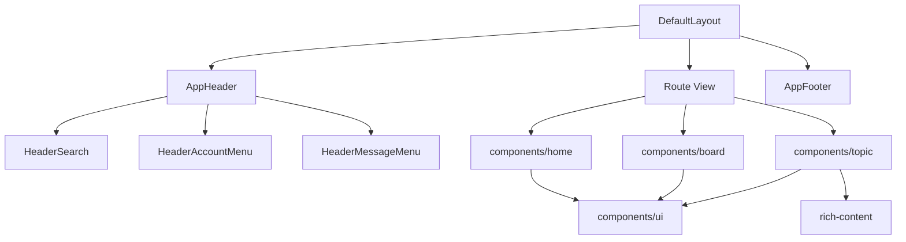

# CC98 全站高保真迁移指南

## 背景

阶段 0 至阶段 7 先完成了数据、路由、认证、阅读、写入和消息闭环，阶段 8 目前完成的是设计 token、主题状态和基础 UI 组件。这个顺序符合原路线图，但也留下了一个明显结果：功能已经能用，页面仍像一套通用论坛模板，旧 CC98 的信息密度、首页栏目、头部横幅、版面识别和用户中心入口没有迁过来。

本计划以 2026-07-16 的线上 CC98、同级 `Forum` 仓库和当前 `apps/website` 为基线，记录全站差异、迁移顺序和验收方式。后续改动应持续更新这份文档，不再把“样式收尾”当成一次批量换颜色任务。

调研基线：

- 原站：`https://www.cc98.org/`，桌面视口 1440×1000，线上默认使用夏季皮肤。
- 旧前端源码：同级 `Forum`，重点参考 `Components/MainPage.tsx`、`Components/Header.tsx`、`Components/Board/`、`Components/Topic/`、`Components/UserCenter/`、`Styles/MainPage.scss` 和 `Styles/Site.scss`。
- 当前实现：`main` 分支 `5ac2eba`，本地 `http://localhost:5173/`。
- 浏览器证据：`.artifacts/browser/2026-07-16-full-fidelity-migration/`，该目录只存本地截图和临时报告，不提交。

## 当前差异不是一层 CSS 能解决的

旧站首页直接消费 `/config/index`，页面包含全站公告、推荐阅读、热门话题、校园活动、学术通知、学习园地、感性情感、跳蚤市场、求职广场、实习兼职、推荐功能、广告、校园意见箱、福利优惠、论坛统计和三个二维码。当前首页只消费 `/config/global`、本月热门和全部版面，实际呈现为公告、一张热门卡片和一张版面导航卡片。

页面壳也没有接完整。旧站首页头部高 192px，其中顶栏高 48px，横幅使用当前皮肤背景图；内页头部收成 48px。当前所有页面都使用 56px 白色导航条，`--cc98-banner-image` 和 `--cc98-banner-height` 已定义，但没有组件消费。皮肤注册表覆盖 30 个旧编号并归约成 21 个 `skin`，CSS 只实现默认和一套节日皮肤，匿名默认也没有沿用旧站的夏季主题。

设计规范和高保真目标还有几处冲突。`DESIGN.md` 当前把卡片圆角定为 12px、操作蓝定为 `#1668dc`，首页截图里的旧站面板接近直角，栏目用 8px 顶部色条区分，夏季主色是 `#5198d8`。迁移不能继续把“旧站身份”和“通用现代卡片”混成一套规则，后续需要同步修订 `DESIGN.md`。

## 浏览器对比快照

| 项目         | 原站首页                                           | 当前首页                                            | 影响                               |
| ------------ | -------------------------------------------------- | --------------------------------------------------- | ---------------------------------- |
| 首页头部     | 192px 皮肤横幅，48px 半透明顶栏                    | 56px 白色导航                                       | 站点身份和换肤效果基本消失         |
| 内容版心     | 1140px                                             | 外层 1152px，实际卡片 1120px                        | 与设计 token 和旧站网格都没有对齐  |
| 首页列宽     | 左 820px、间隔 20px、右 300px                      | 公告通栏，下面 548px、间隔 24px、548px              | 原站主内容和运营侧栏关系丢失       |
| 首页内容高度 | 主内容约 2033px                                    | 主内容约 844px                                      | 大量栏目和入口缺失                 |
| 面板语言     | 8px 顶色条、紧凑列表、弱圆角                       | 1px 灰边、12px 圆角、留白偏大                       | 信息密度和 CC98 识别度下降         |
| 顶栏能力     | Logo、版面、新帖、关注、精选、场景化搜索、登录注册 | 文本 Logo、首页、版面、热门、新帖、精选、搜索、登录 | 搜索上下文、关注入口和原站布局缺失 |
| 页脚         | 运营链接、友情链接、版本、邮箱                     | 统计数字和“复刻版”                                  | 站点归属、外部服务和帮助入口缺失   |

基线取证时，浏览器控制台还有一条独立回归：`AppHeader.vue` 使用了 `UiButton`，但没有导入组件。该问题已随 M0 修复，后续截图不再受无关告警干扰。

## 迁移原则

### 保留用户已经形成的页面认知

首页栏目顺序、版面列表的分区方式、主题列表的信息密度、楼层左右分栏、关注入口、用户中心导航和消息分类都属于用户认知，不应继续用通用卡片替代。组件和数据层可以重写，用户看到的信息层级和主要操作位置要接近原站。

### 以线上页面为行为事实源，以旧仓库解释实现细节

旧仓库里有失效代码、注释掉的功能和重复路由。比如 `/index` 对应的页面基本为空，校园新闻组件已注释，旧移动端跳转也已停用。迁移时先看线上是否仍有入口，再用旧源码确认接口、字段和交互，不能按文件数量机械搬运。

### 继续使用语义 token，不复制 5000 行旧 SCSS

旧站的色条、版心、密度和皮肤背景要保留，但实现仍走 `mode + skin + style`、语义 token 和 `components/ui`。业务页面不读取具体皮肤名，不恢复多份全量 CSS，也不引入 jQuery 式 DOM 操作。

### 每个纵向切片同时完成数据、布局、状态和验证

首页迁移不能只画静态卡片，必须同时补 `/config/index` schema、query、加载状态、空状态、链接行为和截图验证。后续版面、主题、用户中心也遵循同一方式，避免再出现“接口已迁，页面仍是占位”的状态。

### 桌面高保真先完成，移动端另开计划

本轮按 1140px 桌面版心验收。小于版心的视口可以保证不崩溃，但不把移动端重排纳入完成定义，保持与路线图现有边界一致。

## 功能与页面差异矩阵

| 页面或能力       | 原站行为                                                                                           | 当前状态                                                     | 迁移结论                               |
| ---------------- | -------------------------------------------------------------------------------------------------- | ------------------------------------------------------------ | -------------------------------------- |
| 全局头部         | 首页横幅、内页细顶栏、Logo、关注、精选、场景化搜索、用户与消息下拉                                 | 统一白色 56px 顶栏，搜索为独立页面                           | 重做页面壳，保留新路由和认证实现       |
| 首页             | `/config/index` 聚合出十余个栏目和右侧运营区                                                       | 公告、本月热门、版面导航                                     | 第一优先级恢复                         |
| 版面列表         | 分区色条、主管、展开收起、版面图标、今日/总帖数、右侧跳转导航                                      | 分组卡片加纯文字三列                                         | 恢复层级、图标、统计和快速导航         |
| 版面页           | 版面信息、标签、精华、保留、版务记录、置顶、搜索、发帖、关注、管理入口                             | 基础信息、关注、发帖、置顶和普通列表                         | 补齐筛选、标签、记录、管理和视觉密度   |
| 主题列表项       | 状态图标、标题高亮、作者、时间、回复/浏览、最后回复、分页快捷入口                                  | 核心文字字段已齐                                             | 调整成原站密度，补状态图标和标签语义   |
| 主题阅读         | 主题信息区、用户侧栏、头像相框、等级资料、楼层、签名、奖励、赞踩、引用、只看、评分、管理、热门回复 | 已恢复阅读骨架、主要楼层互动、主题和楼层管理、记录与 IP 分组 | 主题阅读与楼层能力已完成               |
| 新帖             | 经典、卡片、仅媒体三种视图                                                                         | 三种视图、媒体预览、服务端偏好和增量加载均已恢复             | 已完成，后续与关注、精选和搜索统一视觉 |
| 关注             | 关注版面、关注用户、收藏更新三页                                                                   | `/focus` 三类聚合、版面筛选和增量加载已恢复                  | 已完成，关注关系管理继续留在用户中心   |
| 精选             | 随机推荐和刷新历史                                                                                 | 旧站行式布局、换一换和上一批均已恢复                         | 已完成，推荐历史按当前用户隔离         |
| 搜索             | 顶栏内按主题、用户、版面、版内切换                                                                 | 场景化顶栏搜索、主题增量列表、用户直达和版面标签结果均已恢复 | 已完成，后续随各业务页回归搜索上下文   |
| 公开用户页       | 资料、签名、近期主题、关注、私信和管理入口                                                         | 资料、签名、关注、私信、管理入口和主题增量加载均已恢复       | 已完成，管理入口只对管理员显示         |
| 用户管理         | 全站锁定、屏蔽、TP、解除处罚、删除近期内容和查看近期发言                                           | 管理页、三类处罚、内容删除和发言分页均已恢复                 | 已完成，写入只用本地 mock 验证         |
| 用户中心首页     | 头像、完整资料、签名和近期主题                                                                     | 200px 导航、资料页、签名和近期主题均已恢复                   | 首页已完成，设置与其余子页继续分片迁移 |
| 资料设置         | 头像、签名、个人资料、其他偏好                                                                     | 头像、签名、生日、头衔和资料表单均已恢复                     | 已完成，隐私扩展随真实入口再补         |
| 主题设置         | 30 个旧编号、日夜自动切换、时间设置                                                                | 21 个皮肤中心、明暗模式、昼夜规则和迁移状态均已恢复          | 主题中心已完成，剩余 18 套皮肤留到 M9  |
| 财富转移         | 用户中心入口                                                                                       | 转账表单、手续费预览、校验和结果反馈已恢复                   | 已完成，只用本地 mock 验证写入         |
| 收藏与自定义版面 | 分组、排序、搜索、关注版面                                                                         | 主要管理能力已迁                                             | 视觉重排，补与关注页的联动             |
| 消息             | 回复、@、系统、私信、设置                                                                          | 头部下拉、三类通知、私信和消息设置均已高保真恢复             | 已完成                                 |
| 签到             | 月历、补签、统计                                                                                   | 说明、留言签到、连续天数、财富奖励、补签规则和月历均已恢复   | 已完成，写入只用本地 mock 验证         |
| 站点管理         | 公告、首页栏目和广告管理                                                                           | 公告、缓存刷新和四类首页栏目管理均已恢复                     | 已完成，写入只用本地 mock 验证         |
| 版主管理         | 置顶、锁定、精华、移动、高亮、批量操作、禁言、版务记录                                             | 主题、楼层和版面批量操作均已恢复                             | 已完成                                 |
| IP 查询          | 主题 IP 查询和独立工具                                                                             | 主题页 IP 分组已恢复，独立工具尚未迁移                       | 只对完整主题管理权限显示               |
| 年度总结         | 2025 年度总结页                                                                                    | 竖版卡片、条件分页、图表、抽卡和成就页均已恢复               | 已完成，保留原路由和活动图片           |
| 历史活动路由     | `/annual-review-2022` 已注释，`/index` 只有标题没有正文                                            | 新站未添加对应路由                                           | 明确废弃，不迁移空页和线上 404         |
| 错误页           | 多种状态页和明确返回入口                                                                           | 401、403、404、500、维护中和网络错误页均已恢复               | 已完成，保留旧插图和登录、重试入口     |
| 页脚             | 运营服务、友情链接、版本、邮箱                                                                     | 论坛统计和复刻说明                                           | 恢复有效链接，删除失效链接需有记录     |

## 首页要按原站信息架构重新实现

### 数据契约先修完整

新增 `indexQuery`，直接请求 `/config/index` 并使用 `indexSchema`。当前 schema 会丢弃真实响应里的 `todayTopicCount`、`specialOffer` 和 `manualHotTopic`，实施首页前要补齐字段并用 `packages/api/fixtures/anonymous/getConfigIndex.json` 做回归。

首页不要再用月热门接口代替热门话题。`/config/index.hotTopic` 是首页十大，包含版面名和版面 ID；周热门、月热门和历史上的今天只作为栏目标题右侧的三个入口。

建议的 query 边界：

- `indexQuery`：首页聚合数据，60 秒 `staleTime`，与旧站缓存周期接近。
- `/config/global`：不再承担首页主体数据。后续页面确有消费方时再建立独立 query，避免保留没有调用方的导出。
- `homepageAdvertisementQuery`：广告轮播单独请求 `/config/global/advertisement`，独立设置缓存和可见性过滤。
- 登录用户的福利优惠按字段和可见性展示，匿名状态不渲染空壳。

### 首页组件按栏目职责拆分

建议放在 `components/home/`：

- `HomeAnnouncement.vue`：渲染 UBB 公告，保留多行结构和链接。
- `HomeRecommendedReading.vue`：图片、标题、摘要、圆点切换，支持键盘和自动轮播暂停。
- `HomeTopicPanel.vue`：热门、校园活动、学术通知等共用的紧凑主题列表，支持主色和次色两种标题条。
- `HomeRecommendedFunctions.vue`：推荐功能图标和外链。
- `HomeAdvertisement.vue`：广告轮播，图片尺寸固定，失败时不留空白占位。
- `HomeForumStats.vue`：今日帖数、今日主题数、总主题数、总回复数、在线用户、总用户和最新用户。
- `HomeQrCard.vue`：小程序和公众号二维码。

`HomeView.vue` 只负责 query、左右栏编排和页面标题，不把所有栏目继续堆在一个文件里。

### 首页桌面布局规格

- 外层固定 1140px 居中。
- 左栏 820px，右栏 300px，中间 20px。
- 公告和推荐阅读占满左栏。
- 左栏下面每行两块 400px 栏目，中间 20px。
- 右栏按推荐功能、广告、校园意见箱、福利优惠、统计、二维码排序。
- 栏目列表默认 10 条，标题和版面名单行省略，悬停可看到完整标题。
- 页面底色、面板底色、主色条和次色条全部来自语义 token。

### 首页验收

- 匿名访问时，线上当前存在的首页栏目均有对应区域，没有数据的栏目不渲染空卡片。
- 热门话题显示版面名，标题链接进入主题，版面名进入对应版面。
- 推荐阅读能在鼠标、键盘和触摸板场景切换，自动轮播不会抢夺焦点。
- 原站和新站都在 1440×1000、默认夏季皮肤下截图，栏目顺序、列宽和首屏信息量一致。
- UBB 公告、外链图片和空标题均有降级处理。

## 视觉系统要从“通用卡片”回到 CC98

### 页面壳

`AppHeader` 需要区分首页和内页。首页渲染 192px 的皮肤横幅，顶栏叠在横幅上；内页只渲染 48px 主色顶栏。横幅消费 `--cc98-banner-image` 和 `--cc98-banner-height`，不能在组件里判断皮肤名称。

顶栏恢复 1140px 内部网格，左侧依次是图形 Logo、CC98 论坛、版面列表、新帖、关注、精选和搜索，右侧是登录注册或头像、用户名、消息和用户菜单。当前独立搜索页继续保留，顶栏输入框只是统一入口。

### 默认皮肤

旧站的“系统默认”编号 0 会读取部署配置，当前线上配置指向夏季编号 4。新实现需要保留这个语义：

- `default` 表示跟随站点默认，不代表无皮肤。
- 匿名用户和没有保存偏好的用户解析为当前站点默认皮肤。
- 第一版可以把站点默认配置为 `summer`，同时保留以后更换默认皮肤的单一配置入口。
- `summer` 必须在高保真首页开始前实现，因为它是当前线上视觉基线。

### 密度、圆角和层级

修订 `DESIGN.md` 时，应把首发 `solid` 定义成 CC98 的紧凑桌面风格：

- 正文和列表默认 14px，元信息 12px。
- 面板圆角优先 0 至 4px，弹窗和独立工具卡可以保留 8px。
- 首页和版面区块使用顶部色条，普通列表依靠分隔线，不给每一行套大圆角卡片。
- 页面主要层级靠底色、描边和色条，阴影只给浮层。
- 主色跟随皮肤，操作态可以使用经过对比度修正的深色变体。

`elegant` 和 `fluent` 继续留作后续风格，不在高保真迁移中展开。先把 `solid` 做成可识别的 CC98。

### 版心和间距 token

把 `DefaultLayout` 和 `AppHeader` 的 `max-w-6xl` 改为消费 `--cc98-content-width`。UnoCSS 需要提供明确的内容宽度 shortcut，页面不再各写一套 `max-w-*`。现有 `--cc98-space-*` 和 `--cc98-radius-*` 也要进入 UnoCSS theme 或组件变体，否则这些 token 只是声明，没有约束力。

## 核心页面迁移顺序

### M0：修复基线，冻结对比口径

- 修复 `AppHeader.vue` 的 `UiButton` 导入告警。
- 让 header 实际消费 banner token。
- 统一 1140px 版心。
- 明确 `default` 皮肤如何解析为站点默认，先实现夏季皮肤。
- 补 `/config/index` schema 缺失字段和 query。
- 建立页面差异台账，记录“保留、重做、废弃、待确认”四种状态。

验收：`vp run ready` 通过；首页、版面列表、登录页没有控制台错误；默认主题截图可稳定复现。

### M1：首页完整迁移

- 按上一节拆出首页组件。
- 恢复左右栏和全部线上栏目。
- 恢复推荐阅读、广告轮播、统计和二维码。
- 外部链接补 `rel="noopener noreferrer"`，图片补替代文本和失败占位。

验收：首页数据只发起必要请求；首屏结构、栏目顺序和线上原站一致；匿名和登录态分别验证。

### M2：头部、页脚和版面列表

- 恢复首页与内页两种头部。
- 恢复场景化搜索和关注入口。
- 页脚恢复仍有效的运营链接、友情链接、版本和邮箱。
- 版面列表恢复分区主管、展开收起、版面图标、统计和右侧跳转导航。
- 版面图标缺失时使用统一 fallback，不依赖每次手工更新静态 board info。

验收：在 1140px 版心下与原站同屏对比；键盘可以操作搜索、展开收起和快速导航。

### M3：版面页和主题列表

- 把版面标题、简介、统计、关注、发主题和搜索整理成紧凑头区。
- 补标签筛选、精华、保留、版务记录等入口，URL 与筛选状态同步。
- 置顶主题与普通主题使用同一列表结构，通过状态图标和分隔表达层级。
- 补标题高亮、匿名、投票、锁定、精华、内部可见等状态标识。
- 版主可见的批量操作放在独立工具条，普通用户不渲染空入口。

验收：普通用户和版主权限分别验证；筛选、翻页、返回和深链接保持状态；20 条主题的首屏密度接近原站。

### M4：主题阅读和楼层

- 楼层恢复左侧用户栏和右侧正文区，宽度、头像、用户名、等级、资料、楼层号和时间形成稳定网格。
- 正文继续使用现有 `ContentRenderer`，不要把皮肤背景铺到正文里。
- 补签名、奖励、赞踩状态、只看此人、楼层追踪、热门回复和私信入口。
- 收藏、投票、评分、引用、编辑和回复沿用现有 mutation 与草稿恢复逻辑。
- 管理操作按权限加载，包含删除、锁定、置顶、精华、移动、高亮和 IP 查询。

验收：历史 UBB、Markdown、图片、附件、投票和长主题分别抽样；页码、楼层锚点、引用后跳转和回复后定位通过浏览器回归。

### M5：发现、关注和搜索

- 恢复 `/focus` 聚合页，包含关注版面、关注用户和收藏更新；版面筛选写入 URL，保留双击进入版面的操作。
- 新帖页保留经典、卡片和仅媒体三种视图，视图写入 URL，并同步保存服务端偏好。
- 精选页保留随机刷新历史和上一次结果，当前批次与上一批按登录用户隔离保存。
- 顶栏搜索支持主题、用户、版面和版内搜索，复用现有搜索页展示结果。

搜索入口根据当前路由切换上下文：普通页面提供主题、用户和版面；版面页、主题页与版内搜索结果页提供版内、全站、用户和版面。主题搜索每次读取 20 条，版内与全站请求分别使用 `/topic/search/board/{boardId}` 和 `/topic/search`；用户搜索按用户名进入公开用户页，版面搜索使用紧凑标签集合展示结果。

验收：搜索条件写入 URL；刷新和返回不丢状态；未登录访问受限入口时能登录并回到原位置。

### M6：用户中心和主题设置

- 重做用户中心导航和首页摘要。
- 补个人资料、头像、签名和其他设置。
- 建立主题中心，展示全部皮肤预览、已实现状态、日夜自动切换、浏览器同步和时间设置。
- 完成剩余皮肤时按旧站八个变量逐套转换，只覆盖原始 token 和两张背景图。
- 补财富转移和仍有效的低频设置。

用户中心首页恢复原站左右页面壳：左侧 200px 导航，右侧展示 160px 头像、账号身份、收到的赞、两列资料、UBB 签名和最近发表的主题。近期主题使用 `/me/recent-topic`，版面信息通过 `/board/` 批量补齐，不恢复旧站的逐条版面请求和滚动缓存。

公开用户页复用同一资料组件，恢复用户详情导航、账号状态、关注和私信入口。用户名路径查询成功后规范为 `/user/id/{id}`；登录用户的近期主题每次读取 10 条并滚动加载，最多保留 200 条，匿名用户仍可查看公开资料。

资料设置页使用 `/usercenter/settings`，恢复头像、UBB 签名、性别、生日、头衔、QQ、邮箱和个人简介。头像上传继续使用 `/file/portrait` 与 `/me/portrait`，不迁移旧站手写 Canvas 裁剪器；资料提交使用 `/me`，并在客户端校验邮箱、QQ 和真实日期。

主题中心使用 `/usercenter/theme`，保留旧站 14rem × 6rem 的缩略图按钮和点击即保存行为。旧站 30 个编号继续归约为 21 个 `skin`，亮暗交给独立 `mode`；系统默认明确表示跟随站点默认，当前解析为夏季。已落地的夏季和春节使用真实横幅缩略图，其余 18 套皮肤按旧站主色显示“待迁移”并禁用。昼夜设置支持浏览器明暗同步、固定时间切换和独立的亮色、深色模式，保存失败时回滚本地状态。

验收：服务端主题编号与本地 `skin + mode` 双向一致；自动日夜切换跨午夜可用；刷新无明显闪烁；未实现皮肤不能显示成可选成功状态。

### M7：消息、签到和实时入口

- 头部恢复消息下拉和分类未读数。
- 消息页补设置入口，统一回复、@、系统和私信的列表骨架。
- 签到页对齐旧月历、连续签到和补签反馈。
- SignalR 事件到达后，同步更新头部、消息页和用户中心摘要。

验收：实时事件、已读、全部已读、私信发送和补签分别验证；重复事件不会重复累加未读数。

### M8：管理、活动和边缘功能

- 迁移公告和首页栏目管理。
- 迁移版主管理、用户管理、版务记录和 IP 查询。
- 按线上入口迁移年度总结和节日活动页。
- 完成 401、403、404、500、维护中和网络错误页面。
- 对每个旧路由给出迁移、替代或废弃结论。

验收：高风险接口只用有权限的测试账号和专用测试数据验证；删除、封禁、财富和站点配置不在真实生产数据上做试探性操作。

截至 2026-07-18，M8 已经完成。错误页、站点管理、版务工具、用户管理和 2025 年度总结均已迁移。主题页会按管理员、超级版主、当前版主和主题作者权限显示入口，完整权限可执行锁定、热门控制、删除、移动、提升、两级固顶、精华和高亮，并查看 7 条分页的管理记录与 IP 分组。楼层管理恢复奖励、惩罚、删除、TP 和解除 TP，版面页恢复主题勾选、批量锁沉和批量删除。用户管理只对管理员开放，包含全站锁定、屏蔽、TP、解除处罚、删除近期主题与回复，以及每页 10 条的近期发言查询。年度总结恢复 600×960 原始卡片比例、滚轮和键盘翻页，以及按数据跳过抽卡或竞猜页的规则。旧 `/annual-review-2022` 线上为 404，`/index` 只有空正文，均不迁移。

### M9：全皮肤和全站回归

- 逐套实现剩余皮肤的主色、次色、顶栏色、页面底色、正文底色、横幅和卡片背景。
- 默认亮、默认暗、夏季和一套节日皮肤覆盖全部核心页面。
- 对比度、键盘操作、焦点、加载、错误、空状态和长文本全部检查。
- 更新路线图，把未迁移项明确标为废弃或后续项目。

验收：计划范围内没有“接口已完成但页面仍是占位”的入口；`vp run ready` 和浏览器回归全部通过。

## 组件边界建议

高保真迁移会增加页面结构，但不要把旧站的每个小类都照搬成组件。建议围绕稳定视觉和行为边界拆分：

基础 UI 负责按钮、输入、弹窗、菜单、标签和可访问性。业务组件负责栏目、版面项、主题项、用户侧栏和楼层。页面只编排 query、路由状态和业务组件。

## 每个迁移切片的工作方式

每个页面或能力按下面顺序推进：

1. 打开线上原站，记录 1440×1000 截图、可交互元素和网络请求。
2. 阅读旧源码中对应页面、样式和接口，不加载无关目录。
3. 对照当前页面，填写差异台账，区分数据缺失、结构缺失、视觉缺失和行为缺失。
4. 先补公共 schema 和 query，再写业务组件和页面编排。
5. 为加载、空数据、401、403、404 和普通错误提供完整状态。
6. 跑受影响包的增量 `vp check` 和测试。
7. 用 agent-browser 在原站和当前站重复同一条用户路径，保存截图；多步骤交互再录屏。
8. 切片完成后更新本计划的进展和差异台账。

一个 PR 只做一个能独立验收的纵向切片。首页、页面壳、版面列表、版面页、主题页应分开，避免一次提交同时改几十个页面后无法判断回归来源。

## 验证体系

### 静态检查和测试

- 改完文件立即跑受影响范围的 `vp check`。
- 公共 schema 变化补 fixture 解析回归。
- 有分支和状态的主题解析、轮播、筛选、日夜切换和权限控制补 Vitest。
- 提交前跑 `vp run ready`。

### 浏览器验证矩阵

| 维度 | 最低覆盖                                                       |
| ---- | -------------------------------------------------------------- |
| 视口 | 1440×1000；另测 1140px 宽度不横向错位                          |
| 主题 | 夏季亮色、默认暗色、春节亮色                                   |
| 身份 | 匿名、普通登录用户；管理页另测有权限账号                       |
| 页面 | 首页、版面列表、版面、主题、发帖、用户中心、消息、签到、错误页 |
| 状态 | 加载、空数据、长标题、图片失败、401、403、404、普通网络错误    |

页面数据随时变化，不用全页像素差作为唯一门槛。版心、列宽、头部高度、栏目顺序、主要操作位置和首屏密度使用明确数值验收；动态标题和统计数字以结构对齐为准。

### 无障碍和交互

- 顶栏搜索、菜单、轮播、展开收起和弹窗都能用键盘完成。
- 焦点样式清楚，弹窗关闭后焦点回到触发器。
- 图片有替代文本，纯装饰背景不进入无障碍树。
- 文字对比度守 WCAG AA，皮肤主色不满足白字对比时使用操作色变体。
- 不只用颜色表示置顶、锁定、未读、错误和选中状态。

## 明确不迁的旧实现

- 旧 React 组件、Redux、jQuery DOM 操作和 SCSS 文件组织。
- 多份全量 CSS 加替换 `#mainStylesheet` 的换肤方式。
- 已停用的移动端 PWA 跳转提示。
- 空的 `/index` 页面和仅为历史路径存在的重复实现。
- 旧 UBB 编辑器。新内容继续写 Markdown，编辑历史 UBB 时先转 Markdown。
- 线上没有入口、源码已注释且没有产品需求的栏目。废弃前要在差异台账记录依据。

## 风险

- 旧站包含长期累积的权限分支，匿名、普通用户、版主、站务看到的入口不同，不能只用匿名截图判断功能是否存在。
- `/config/index` 和管理接口有历史拼写，例如 `recommandationreading`，公共契约要兼容服务端，UI 文案使用正常中文。
- 皮肤图片和版面图标数量大，批量迁移时要检查体积、缓存和失败降级。
- 旧站很多链接在新窗口打开，新实现要逐项判断是否仍有必要，站内主流程默认使用 SPA 导航。
- 高保真会降低当前通用卡片的圆角和留白，需同步更新 `DESIGN.md`，否则后续 agent 会按旧规范把页面改回去。
- 管理、财富、补签和 IP 查询涉及权限或敏感数据，只做有边界的验证。

## 完成定义

迁移完成时应满足：

- 线上原站仍在使用的桌面入口都有新页面，或在差异台账中写明替代方案和废弃理由。
- 首页恢复完整信息架构，页面壳、版面列表、版面页和主题页具备清楚的 CC98 视觉身份。
- 主题 token、皮肤背景、默认皮肤和主题设置 UI 连成完整链路。
- 主要阅读、写入、关注、用户中心、消息和签到流程通过浏览器回归。
- 管理和边缘功能按权限完成迁移，没有用通用错误页或空白卡片代替。
- `DESIGN.md`、路线图和本计划与实际实现一致。
- `vp run ready` 通过，浏览器控制台没有未处理错误和组件解析告警。

## 近期三个切片

1. `M9` 剩余皮肤：逐套恢复旧站皮肤 token、横幅和背景图。
2. `M9` 皮肤回归：用默认亮、默认暗、夏季和节日皮肤覆盖核心页面。
3. `M9` 全站回归：完成权限、路由、交互、视觉和控制台验收。

## 进展与调整

- 2026-07-16：完成线上首页和版面列表的浏览器取证，确认当前差异覆盖信息架构、页面壳、视觉语言和边缘功能，不能继续作为单纯样式收尾处理。
- 2026-07-16：确认 `/config/index`、年度总结、版主管理、IP 查询、主题设置、财富转移等多数后端 operation 已在 `packages/api` 登记，主要工作集中在 schema 完整性、query、页面和权限 UI。
- 2026-07-16：确认 banner token 尚无消费方，21 个 `skin` 只实现 2 个，线上系统默认实际解析为夏季皮肤。
- 2026-07-17：完成首页高保真迁移。`/config/index` 已接入，公告、推荐阅读、热门话题、校园活动、学术通知、学习园地、感性情感、跳蚤市场、求职广场、实习兼职、推荐功能、广告、论坛统计和二维码均已恢复；页面壳开始消费横幅 token，夏季成为系统默认皮肤。
- 2026-07-17：浏览器在 1440×1000 下确认横幅 192px、顶栏 48px、版心 1140px、主栏 820px、侧栏 300px、双列栏目 400px。首页搜索、推荐阅读轮播、广告轮播、站内 SPA 导航和远程图片加载通过验证，控制台无错误。
- 2026-07-17：M0 和 M1 已完成并通过 `vp run ready`。下一切片进入 M2 版面列表，不再继续扩张首页组件范围。
- 2026-07-17：完成 M2 版面列表。恢复 12 个分区的主管、展开收起、版面图标、今日与总帖数、四列紧凑文字版面和右侧快速导航；浏览器确认 266 个版面、53 个图标均正常渲染，锚点与版面跳转保持 SPA 导航。
- 2026-07-18：完成 M3 版面页与主题列表。恢复 240px 版面信息栏、900px 公告栏、发主题与发投票入口、两层标签、精华、保存、版务记录、置顶状态图标和 64px 主题行；普通、精华、保存、标签和版务记录均保持 SPA 路由，投票入口会直接打开 Markdown 编辑器的投票模式。
- 2026-07-18：登录态浏览器预览确认版心 1140px、头区两列为 240px 与 896px 可用宽度、普通页合并 2 条置顶与 20 条主题、图片零破损。匿名访问仍进入登录状态页，不暴露受限版面内容。
- 2026-07-18：完成 M4 主题阅读页。恢复 104px 主题信息区、248px 用户栏、888px 正文栏、40px 楼层标记、签名档、奖励、匿名身份、最热回复和主楼内投票，正文继续复用 Markdown 与 UBB 渲染层。
- 2026-07-18：只看此人和楼层追踪改为 URL 查询状态，可刷新、返回和分页；过滤分页按结果帖子数计算，不额外计入主楼，切换过滤模式后不会残留热评缓存。引用会滚动到 Markdown 回复编辑器，分享链接、收起图片、收藏、评分、赞踩和私信入口保留。
- 2026-07-18：登录态浏览器预览确认 1440×1000 下版心与两列尺寸符合旧站规格，1140px 视口无横向溢出，匿名头像尺寸为 417×417，图片零破损。取证截图保存在 `.artifacts/browser/2026-07-18-topic-fidelity/topic-final.png`，版主管理操作继续归入 M8。
- 2026-07-18：完成 M5 的新帖页切片。经典模式恢复 180px 作者区、858px 主题区和 100px 版面区；卡片与仅媒体模式恢复 250px 用户栏、554px 主题流和 318px 推荐栏，并支持图片展开、隐私模式、自定义版面与随机推荐。
- 2026-07-18：三种新帖视图使用可刷新的 URL，服务端同步保存 `topicViewMode`。仅媒体模式改用 `/topic/new-media`，普通和媒体查询缓存隔离；列表按 20 条增量加载，刷新会回到首批结果，最多读取 500 条。
- 2026-07-18：浏览器确认 1440×1000 下卡片布局总宽 1140px，三栏宽度为 250px、554px 和 318px，经典行高 82px；1140px 视口无横向溢出，图片零破损，刷新、重载、返回、图片展开和隐私模式通过验证。取证截图保存在 `.artifacts/browser/2026-07-18-newtopics-fidelity/`。
- 2026-07-18：完成 M5 的关注聚合页。顶部恢复关注版面、关注用户和收藏更新三类入口；关注版面保留“全部帖子”和自定义版面标签，单击筛选主题，双击进入对应版面。
- 2026-07-18：关注版面、关注用户和收藏更新分别接入 `/me/custom-board/topic`、`/me/followee/topic` 和 `/topic/me/favorite`，单个版面使用 `/board/{id}/topic`。列表每次读取 20 条，滚动到末尾自动加载，最多保留 200 条。
- 2026-07-18：浏览器确认 1440×1000 下关注页宽 1140px，标签栏高 40px，主题行高 82px，作者区 180px，版面区 100px；1140px 视口无横向溢出。筛选、刷新、重载、返回、双击跳转、自动加载和登录来源页恢复通过验证，取证截图保存在 `.artifacts/browser/2026-07-18-focus-fidelity/focus-board.png`。
- 2026-07-18：完成 M5 的随机精选页。10 条推荐主题恢复 180px 作者区、主题标题与推荐摘要、100px 版面区，继续使用 `/topic/random-recommendation`，并批量补齐版面和作者资料。
- 2026-07-18：换一换会保存当前批次，上一批可回退一次；当前结果和上一批按用户 ID 写入本地存储，刷新页面不会重新请求或丢失回退状态，切换账号也不会复用其他用户的推荐记录。
- 2026-07-18：浏览器确认 1440×1000 下精选页宽 1140px，主题行高 82px，作者区 180px，版面区 100px；1140px 视口无横向溢出。换一换、上一批、重载、未登录来源页恢复和图片降级通过验证，取证截图保存在 `.artifacts/browser/2026-07-18-recommended-fidelity/recommended.png`。
- 2026-07-18：完成 M5 的搜索切片。普通页面顶栏提供主题、用户和版面搜索；版面页、主题页与版内结果页增加版内和全站上下文。版面 ID 从当前版面或主题数据中取得，搜索条件写入 URL，用户搜索直接进入公开用户页。
- 2026-07-18：主题搜索恢复 180px 作者区、858px 主题区、100px 版面区和 82px 行高，每次读取 20 条并支持增量加载；版面搜索恢复紧凑标签集合。全站、版内、用户、版面、空结果和未登录来源页恢复均已验证。
- 2026-07-18：浏览器确认 1440×1000 下搜索结果首批为 20 条，1140px 视口下页面宽 1108px 且无横向溢出，控制台无错误或警告。取证截图保存在 `.artifacts/browser/2026-07-18-search-fidelity/search-topics.png`，下一切片进入 M6 用户中心。
- 2026-07-18：完成 M6 的用户中心首页与导航切片。移除统计卡片入口，恢复原站 200px 左侧导航、160px 圆头像、账号身份、收到的赞、完整资料、UBB 签名和最近发表的主题；导航保持 Vue Router 无刷新切换，并且任一时刻只有当前入口高亮。
- 2026-07-18：浏览器确认 1440×1000 下用户中心为 200px 导航、908px 内容区和 32px 间距；1140px 视口下页面宽 1108px 且无横向溢出。首页读取 `/me`、`/me/recent-topic?from=0&size=11` 和批量 `/board/`，匿名访问会保存 `/usercenter` 并进入登录页。取证截图保存在 `.artifacts/browser/2026-07-18-usercenter-fidelity/usercenter-home.png`，下一切片进入公开用户页。
- 2026-07-18：完成 M6 的公开用户页。个人主页与用户详情共用资料组件，字段顺序仍按旧站区分；公开页恢复 160px 头像、账号状态、收到的赞、资料、UBB 签名、私信、关注和最近发表的主题。
- 2026-07-18：用户名访问会规范到用户 ID 路径；本人页面显示个人中心入口，其他用户支持关注和取消关注。近期主题每次读取 10 条，滚动加载最多 200 条，并通过 `/board/` 批量补齐版面名称。
- 2026-07-18：浏览器确认 1440×1000 下公开用户页为 200px 导航、908px 内容区和 32px 间距；1140px 视口无横向溢出。登录态自动加载、本人导航、关注切换、私信路径、匿名资料和登录来源页恢复均已验证，取证截图保存在 `.artifacts/browser/2026-07-18-usercenter-fidelity/public-user.png`，下一切片进入资料与头像设置。
- 2026-07-18：完成 M6 的资料设置页。新增 `/usercenter/settings`，恢复修改头像、UBB 签名、性别、生日、可用头衔、QQ、邮箱和个人简介；默认头像与本地图片共用 `/me/portrait` 写回，资料统一通过 `/me` 提交。
- 2026-07-18：资料表单会拒绝无效邮箱、非数字 QQ、不存在的日期和未来生日；未选择生日写回空值，9999 年继续表示保密。公共 API 契约补齐 `DisplayTitleId`，头衔列表使用 `/config/global/all-user-title`。
- 2026-07-18：浏览器确认 1440×1000 下设置页沿用 200px 导航与 908px 内容区，头像为 160px，签名编辑区高 252px；1140px 视口无横向溢出。默认头像写回、文件选择预览、表单校验、提交和重置通过验证，取证截图保存在 `.artifacts/browser/2026-07-18-usercenter-fidelity/user-settings.png`，下一切片进入主题设置与皮肤中心。
- 2026-07-18：完成 M6 的主题设置与皮肤中心。新增 `/usercenter/theme` 和导航入口，恢复旧站缩略图按钮、当前皮肤、点击保存和昼夜设置；30 个旧编号继续归约为 21 个皮肤，夏季、春节和系统默认可选，其余 18 套明确显示“待迁移”。
- 2026-07-18：主题中心支持亮色、深色、浏览器明暗同步、昼夜自动切换和固定时间设置。春节亮暗分别写回编号 13、12，夏季写回编号 4；网络失败会回滚本地皮肤，不会留下视觉与服务端状态不一致。
- 2026-07-18：浏览器确认 1440×1000 下主题中心沿用 200px 导航和旧站 14rem × 6rem 皮肤卡片；1140px 视口的页面宽度与视口一致，没有横向溢出。切换、保存、刷新、自动规则、匿名来源页和错误回滚均已验证，取证截图保存在 `.artifacts/browser/2026-07-18-theme-fidelity/`，下一切片进入用户中心剩余子页。
- 2026-07-18：完成 M6 的“我的主题”页。移除通用主题列表里的作者、回复数、浏览数和末页入口，恢复旧站由版面、发布时间和主题标题组成的个人活动记录；版面名称通过 `/board/` 批量补齐，避免逐条请求。
- 2026-07-18：主题记录每页显示 10 条，请求第 11 条判断下一页。分页恢复靠右的 40px 方形数字按钮，页码写入 URL；浏览器确认第一页、第二页、返回、匿名来源页和 1140px 无横向溢出，取证截图保存在 `.artifacts/browser/2026-07-18-user-content-fidelity/my-topics.png`，下一切片进入“我的回复”。
- 2026-07-18：完成 M6 的“我的回复”页。移除通用卡片和下拉筛选，恢复旧站“显示热门回复”和“显示全部回复”按钮；每条回复按时间、赞、踩、版面和正文摘要排列，UBB 与 Markdown 内容统一转为纯文本摘要，并直接链接到对应楼层。
- 2026-07-18：全部回复与热门回复分别使用 `/me/recent-post` 和 `/me/hot-post`，筛选和页码写入 URL。浏览器确认 10 条分页、末页 3 条、热门 8 条、切换、刷新、匿名来源页和 1140px 无横向溢出，取证截图保存在 `.artifacts/browser/2026-07-18-user-content-fidelity/my-posts.png`，下一切片进入“我的足迹”。
- 2026-07-18：完成 M6 的“我的足迹”页。移除通用设置卡片和完整主题列表，恢复旧站历史记录复选框、开启与关闭确认框，以及由版面、主题时间和标题组成的浏览记录。开关继续同步网页版和小程序，开启说明保留最近 30 天的产品边界。
- 2026-07-18：关闭历史记录后会立即清空本地查询缓存并停止请求，重新开启后自动加载第一页，避免视觉状态与服务端不一致。浏览器确认确认框、开关、10 条分页、第二页 7 条、匿名来源页和 1140px 无横向溢出，取证截图保存在 `.artifacts/browser/2026-07-18-user-content-fidelity/my-history.png`，下一切片进入“我的收藏”。
- 2026-07-18：完成 M6 的“我的收藏”页。恢复旧站同一行内的分组、排序、关键词搜索和“管理分组”入口，收藏主题继续使用版面、发布时间、标题和右侧“操作”菜单；移动分组与取消收藏不再占用每条记录的固定表单空间。
- 2026-07-18：收藏管理弹层恢复新增、编辑和删除三个入口，保留 10 个自定义分组上限、默认分组保护和删除后主题移回默认分组的规则。浏览器确认三种排序、关键词搜索、10 条分页、末页 3 条、移动、取消收藏、分组增删改、匿名来源页和 1140px 无横向溢出，取证截图保存在 `.artifacts/browser/2026-07-18-user-content-fidelity/my-favorites.png`，下一切片进入“关注版面”。
- 2026-07-18：完成 M6 的“关注版面”页。恢复 112px 圆形版面图标、版面名称、版主、今日主题、总主题和右侧关注按钮，移除通用列表的简介、确认框和额外卡片边框；图标失败时继续使用站内统一降级资源。
- 2026-07-18：取消关注后版面保持原位置并切换为“重新关注”，用户可以立即撤销，重新关注期间也不会闪回加载页。浏览器确认四个版面、取消与恢复、图片零破损、匿名来源页和 1140px 无横向溢出，取证截图保存在 `.artifacts/browser/2026-07-18-user-content-fidelity/followed-boards.png`，下一切片进入“关注用户”。
- 2026-07-18：完成 M6 的“关注用户”页。恢复 60px 圆头像、用户名、帖子数、粉丝数、关注状态和私信按钮，列表使用旧站虚线分隔与 10 条数字分页；完整用户资料继续通过 `/user` 批量查询，不恢复旧站的本地用户数据库。
- 2026-07-18：关注按钮保留“已关注”、悬停“取消关注”、处理中和失败状态。取消后用户仍留在原位置，可立即重新关注；浏览器确认第二页、私信路径、取消与恢复、头像零破损、匿名来源页和 1140px 无横向溢出，取证截图保存在 `.artifacts/browser/2026-07-18-user-content-fidelity/following-users.png`，下一切片进入“我的粉丝”。
- 2026-07-18：完成 M6 的“我的粉丝”页。列表复用旧站 60px 头像、帖子数、粉丝数、关注按钮、私信按钮和虚线分隔；互相关注用户显示“已关注”，尚未关注的粉丝显示“关注”，本次取消后才显示“重新关注”。
- 2026-07-18：粉丝关系继续使用 `/me/follower` 分页读取编号，再通过 `/user` 批量补齐资料。浏览器确认 10 条首页、1 条末页、主动关注、取消与恢复、私信路径、头像零破损、匿名来源页和 1140px 无横向溢出，取证截图保存在 `.artifacts/browser/2026-07-18-user-content-fidelity/followers.png`，下一切片进入财富转移和剩余低频设置。
- 2026-07-18：完成 M6 的转账系统。恢复收款人、金额、理由、手续费规则、实时预览和提交反馈；多人用户名按空格拆分并去重，一次最多 10 人，最低金额为 10，提交前检查余额。
- 2026-07-18：`/me/transfer-wealth` 的成功响应补为公共 schema，提交成功后按实际成功名单扣减本地财富值。高风险写入只在本地 mock 验证，没有对真实账号执行转账；浏览器确认空表单、人数上限、多人预览、成功反馈、匿名来源页和 1140px 无横向溢出，取证截图保存在 `.artifacts/browser/2026-07-18-user-content-fidelity/transfer-wealth.png`。
- 2026-07-18：旧用户中心没有其他独立低频设置页。浏览历史开关已归入“我的足迹”，主题浏览模式已归入“新帖”，资料和昼夜规则分别归入“修改资料”和“切换皮肤”。M6 至此完成，下一切片进入 M7 的头部消息下拉。
- 2026-07-18：完成 M7 的头部消息下拉。恢复旧站圆形铃铛、总未读徽标和 128px 宽的四行菜单，回复、@、系统和私信分别显示分类未读数；菜单继续使用 Vue Router 无刷新跳转。
- 2026-07-18：下拉支持鼠标悬停与键盘聚焦，收起时不会留下可聚焦的隐藏链接。浏览器确认四类入口、零未读状态、1440px 和 1140px 布局，控制台无错误或警告；取证截图保存在 `.artifacts/browser/2026-07-18-message-fidelity/header-message-dropdown.png`。
- 2026-07-18：完成 M7 的回复、@ 和系统通知页。消息壳恢复 198px 左侧导航、908px 内容区和顶部“全部标为已读”，三类列表按旧站密度显示版面、秒级时间、用户、主题与系统内容；每页 10 条，页数使用 `/me/all-message-count` 计算。
- 2026-07-18：浏览器确认回复第二页 3 条、@ 第二页 1 条、系统通知标题与相关主题入口。一键已读同时调用三个分类接口，头部、导航和三类列表同步清零；匿名来源页、1440px、1140px 和控制台均通过验证，取证保存在 `.artifacts/browser/2026-07-18-message-fidelity/`。
- 2026-07-18：完成 M7 的私信页。恢复 198px 近期联系人栏、714px 会话窗、50px 圆头像、左右气泡、分钟内时间合并、每次 7 人的联系人加载，以及每次 10 条的历史消息加载；直接从用户页发起的临时会话会出现在联系人栏顶部。
- 2026-07-18：加载 10+10+3 条历史消息时保持原滚动位置，发送成功后联系人置顶并滚到最新消息。图片选择、粘贴和拖放复用 `/file` 上传并插入 UBB 图片；浏览器确认发送、图片显示、未读清零、匿名来源页、1440px、1140px 和控制台均通过验证，取证保存在 `.artifacts/browser/2026-07-18-message-fidelity/private-messages.png` 与 `private-message-send.webm`。
- 2026-07-18：完成 M7 的消息设置。恢复回复、@、系统、私信四类本地通知偏好，以及“回帖是否跳至最新回复”；继续使用旧站 `noticeSetting` 存储键，默认前四项为“是”，回帖跳转为“否”。
- 2026-07-18：回帖流程开始读取本地设置，选择“否”时留在当前页，选择“是”时跳到新回复所在末页。浏览器确认默认值、保存提示、刷新持久化、匿名来源页、1440px、1140px 和控制台均通过验证，取证截图保存在 `.artifacts/browser/2026-07-18-message-fidelity/message-settings.png`，下一切片进入签到页。
- 2026-07-18：完成 M7 的签到页。恢复旧站签到说明、五档财富奖励、可选留言、连续签到信息、补签卡数量、规则浮层、月份选择和从 2016 年 6 月开始的签到月历；已签到、补签、漏签和未来日期使用四种明确状态。
- 2026-07-18：签到与补签写入只在本地 mock 验证。浏览器确认留言签到后连续天数和财富奖励更新，补签后卡数从 3 张减为 2 张并在最近漏签日显示“补”；月份上下限、匿名来源页、1440px、1140px 和控制台均通过验证。取证保存在 `.artifacts/browser/2026-07-18-signin-fidelity/`，M7 至此完成，下一切片进入 M8 错误页。
- 2026-07-18：完成 M8 的错误页切片。恢复旧站 401、403、404 和 500 插图及居中页面骨架，新增维护中和网络连接中断页面；未知路由统一进入完整 404，不再显示通用小卡片。
- 2026-07-18：401 支持保存站内来源页并进入登录，500、维护中和网络错误提供重试。浏览器确认六类状态、任意未知路径、标题更新、1440px 和 1140px 均正常，控制台无错误或警告；取证保存在 `.artifacts/browser/2026-07-18-error-fidelity/`，下一切片进入站点管理。
- 2026-07-18：完成 M8 的站点管理切片。恢复旧站宽工作台、全站公告编辑与 UBB 预览、首页缓存刷新，以及推荐阅读、推荐功能、Banner 和福利优惠四类栏目管理；栏目继续按旧接口区分内容、图片、排序权重、有效天数、过期时间和可见性字段。
- 2026-07-18：管理员入口回到头部用户下拉菜单。匿名访问会保存 `/sitemanage` 并进入登录页，普通用户进入完整 403，只有权限字段为“管理员”的用户才会加载管理数据，避免复刻旧站匿名可见后台表单的问题。
- 2026-07-18：公告、缓存、栏目新增和栏目修改只在本地 mock 验证，没有写入真实站点配置。浏览器确认 10 条分页、四类动态表头、写入反馈、1440px 宽工作台、1140px 无横向溢出和控制台零警告；取证保存在 `.artifacts/browser/2026-07-18-site-manage-fidelity/`，下一切片进入版务工具与活动页。
- 2026-07-18：完成 M8 的主题级版务工具。管理员、超级版主和当前版主拥有完整权限，主题作者只要服务端返回非空 `topicAuthorPermissions`，就能使用管理和管理记录，但不能查看 IP。普通用户不渲染空入口。
- 2026-07-18：恢复锁定、热门控制、删除、移动、提升、版面固顶、全站固顶、精华和高亮九类操作，所有操作要求理由，锁定、固顶和高亮要求有效天数。管理记录按旧站每页 7 条读取，IP 查询按地址折叠楼层。
- 2026-07-18：主题版务写入只在本地 mock 验证。浏览器确认高亮状态写回、管理记录第二页、IP 折叠分组、普通用户权限、1440px、1140px 和控制台均正常；取证保存在 `.artifacts/browser/2026-07-18-topic-moderation/`，下一切片进入楼层管理与版面批量操作。
- 2026-07-18：完成 M8 的楼层管理。每个可见楼层恢复奖励财富、奖励威望、扣除财富、扣除威望、删除、TP 和解除 TP 七项操作；奖励财富会显示当前版面当日已发数量、上限和单次 1000 的限制。
- 2026-07-18：楼层入口只对完整管理权限开放，并保留旧站 144 版面主题作者特例。奖励、删除和解除 TP 只在本地 mock 验证，浏览器确认写入后奖励刷新、删除楼层与热评副本同步、普通用户无入口、1140px 无横向溢出和控制台零警告；取证保存在 `.artifacts/browser/2026-07-18-topic-moderation/`，下一切片进入版面批量操作。
- 2026-07-18：完成 M8 的版面批量管理。完整版务权限会在普通主题列表中看到主题勾选框和批量管理工具条，恢复批量锁沉、批量删除、四档下沉天数、五个预设理由和自定义理由。
- 2026-07-18：批量请求继续使用旧站的重复 `id` 查询参数，成功后通过 Vue Query 刷新版面与置顶列表，不再整页跳转。写入只在本地 mock 验证，浏览器确认批量锁沉、删除两条后列表刷新、选择清空、普通用户无入口和控制台零警告，下一切片进入用户管理。
- 2026-07-18：完成 M8 的用户管理。公开用户页只对管理员显示管理入口，管理路由同时使用登录与管理员守卫；普通用户直接访问会进入完整 403 页面。
- 2026-07-18：恢复全站锁定、屏蔽、TP 和解除处罚，TP 天数只接受永久或 7 至 1000 天。删除近期主题与回复、查看近期发言共用 1 至 365 天的范围校验，近期发言每页显示 10 条，并补齐版面、楼层、IP 和已删除状态。
- 2026-07-18：所有用户管理写入只在本地 mock 验证。浏览器确认三类处罚、解除处罚、删除数量反馈、两页发言，以及删除后自动回到有效页；1440px、1140px 和控制台均通过验收，取证保存在 `.artifacts/browser/2026-07-18-user-manage-fidelity/`，下一切片进入年度总结和活动页。
- 2026-07-18：完成 M8 的 2025 年度总结。恢复原站 `/annual-review-2025`、600×960 竖版活动图片、上下翻页、滚轮切换、概览、点赞、主题、评分、常用版面、发言时段、抽卡、竞猜和成就页面。
- 2026-07-18：页面序列会按 `cardDraw` 和 `bet` 数据跳过不存在的活动页，版面链接继续使用 Vue Router。柱状图改用轻量 CSS 绘制，不迁移旧 BizCharts；入场动画支持减少动态效果偏好。
- 2026-07-18：浏览器确认 1440px 与 1140px 下卡片均为 480×768，登录来源页、上下按钮、键盘 Home/End、滚轮事件、可选页面跳转、长成就和控制台均正常。取证保存在 `.artifacts/browser/2026-07-18-annual-review-fidelity/`，下一步核对仍在线的节日活动入口。
- 2026-07-18：完成 M8 活动路由审计。旧 `App.tsx` 只有 `/annual-review-2025` 仍启用；`/annual-review-2022` 已被注释，线上进入完整 404；`/index` 只设置页面标题，组件和线上页面均没有正文。
- 2026-07-18：节日图片和 SCSS 全部属于主题皮肤，不存在第二个独立活动页面。M8 至此完成，空 `/index` 和已下线的 2022 年度总结明确废弃，不在新站添加占位路由，下一阶段进入 M9 剩余皮肤和全站回归。

## 决策记录

- 阶段 8 的设计系统计划保留为基础设施记录，本计划承接全站高保真迁移。
- `solid` 风格调整为紧凑的 CC98 桌面风格，不新增一套与它重叠的 `classic` 维度。
- 首页优先消费 `/config/index`，不再用月热门和版面列表拼装替代首页聚合数据。
- 原站信息架构和用户认知优先保留，旧技术实现不迁。
- 页面差异以线上行为为准，旧仓库只作为实现和接口参考。
- 高保真复刻保留 Vue SPA、无刷新路由和 Markdown 优先编辑器，功能行为与旧站等价即可，不迁移旧技术实现。
