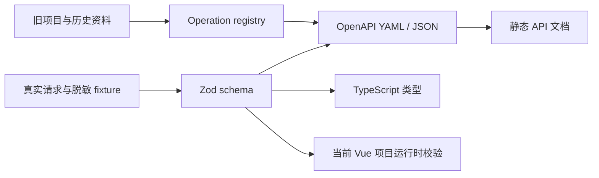
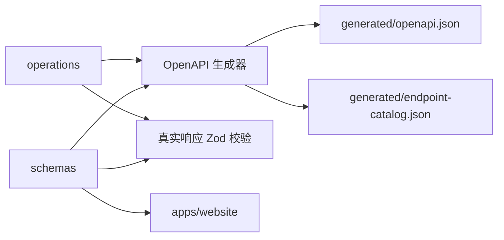
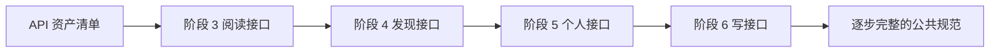

# CC98 OpenAPI 公共基础设施

> 状态：部分完成。Zod-first 契约、OpenAPI 生成、接口探测和网站接入已经完成；静态文档、公共使用说明和发布准备仍待实施。

## 背景

CC98 的前端和周边项目长期依赖同一组 API，但契约分散在多个位置：

- 当前 Vue 项目的 Zod schema 和请求函数。
- 旧 React 项目的 `@cc98/api` TypeScript 声明。
- 新旧前端中的实际接口调用。
- 现有 OpenAPI 描述和线上接口行为，二者可能存在差异。

这种状态会让每个 98 项目重复查接口、手写类型和处理历史差异。阶段 3、4 也需要逐个探测接口，如果只把结论写进页面代码，后续项目仍要重做一遍。

因此可以把 API 契约做成公共基础设施，与 `@cc98/ubb` 类似，为其他 98 前端、机器人、脚本和客户端提供可复用资产。核心产物包括 Zod 运行时 schema、由同一套契约生成的 OpenAPI 文件、TypeScript 类型和脱敏样例，不绑定当前 Vue 项目的请求 SDK。

## 定位

这个项目属于基础设施，第一期目标是覆盖旧项目能够发现的全部接口，并通过真实请求编写和验证 Zod schema。覆盖工作按风险分批推进，但第一期完成定义不局限于阶段 3。

OpenAPI 文件记录 HTTP operation、参数、认证和响应；Zod schema 负责运行时校验并推导 TypeScript 类型。认证编排、Vue Query、页面状态和业务组件仍留在应用层。

## 目标

- 建立 CC98 API 的接口目录和统一命名。
- 覆盖当前项目、旧项目和可发现历史资料中的全部接口。
- 对可安全调用的接口发起真实请求，根据实际响应编写 Zod schema。
- 提供通过 lint 和 bundle 校验的 OpenAPI 文档。
- 标记每个接口的来源、验证状态、认证要求和风险等级。
- 从 Zod schema 推导 TypeScript 类型，并生成或校验 OpenAPI component schema。
- 提供静态 API 文档和可下载的单文件规范。
- 建立接口探测、脱敏样例、差异记录和回归检查流程。
- 允许后续发布为公共 npm 包，不与 Vue 或当前网站绑定。
- 为 `@cc98/ubb` 和未来公共包统一补齐许可证、仓库信息、版本和发布流程。

## 非目标

- 不保证旧项目调用过的接口仍然有效，未经验证的接口不能标记为稳定。
- 不生成包含账号、密码、token 或真实用户隐私数据的样例。
- 不把 OAuth client secret 当作服务端秘密写入规范或示例。
- 不在第一版生成完整业务 SDK。先提供规范和类型，避免过早绑定 fetch 库、认证策略或运行环境。
- 不把真实请求等同于可以无条件执行。写入、管理和破坏性接口必须使用专用测试资源并逐项授权。
- 不把写接口的在线自动探测放进普通 CI，避免误发帖、误操作或产生副作用。

## 契约来源与可信度

接口信息按以下优先级处理：

1. 线上接口的脱敏实测结果。
2. 后端维护方提供的当前 OpenAPI 或源码定义。
3. 当前 Vue 项目已经通过真实数据校验的 schema。
4. 旧 React 项目的调用代码与 `@cc98/api` 声明。
5. 注释、历史文档和推测。

OpenAPI 中为接口和 schema 增加扩展字段，明确事实来源，不把历史线索写成已验证契约：

```yaml
x-cc98-verification: verified
x-cc98-verified-at: 2026-07-11
x-cc98-source:
  - live-response
  - legacy-forum
x-cc98-risk: read-only
```

建议状态：

- `verified`：当前环境已实测。
- `documented`：来自后端规范，尚未实测。
- `legacy-observed`：仅在旧前端发现。
- `conflicted`：规范与实测不一致。
- `unknown`：只知道路径，响应和权限未确认。

风险等级：

- `read-only`：无副作用读取。
- `account-scoped`：读取个人或隐私数据。
- `write`：创建或修改数据。
- `destructive`：删除、管理或不可逆操作。

## 目录与包结构

建议新增 `packages/api`。它是可执行契约包，不只是规范文件包：

```text
packages/api/
├── src/
│   ├── schemas/
│   │   ├── board.ts
│   │   ├── topic.ts
│   │   ├── post.ts
│   │   ├── user.ts
│   │   └── common.ts
│   ├── operations/
│   │   ├── boards.ts
│   │   ├── topics.ts
│   │   ├── users.ts
│   │   ├── auth.ts
│   │   └── me.ts
│   ├── registry.ts
│   └── index.ts
├── generated/
│   ├── openapi.yaml
│   ├── openapi.json
│   └── endpoint-catalog.json
├── fixtures/
│   ├── anonymous/
│   ├── authenticated/
│   └── README.md
├── scripts/
│   ├── discover-endpoints.mjs
│   ├── probe-readonly.mjs
│   ├── sanitize-fixture.mjs
│   └── generate-openapi.mjs
├── README.md
├── package.json
└── vite.config.ts
```

Zod schema 和 operation 元数据按领域拆分，构建时生成 OpenAPI 和接口目录。npm 包建议导出：

- 包根路径：Zod schema、推导类型和公共枚举。
- `./openapi.yaml`
- `./openapi.json`
- `./catalog`
- `./package.json`

公共包可以依赖 Zod，但不依赖 Vue、Vue Query、Pinia 或 ofetch。使用者可以只导入类型，也可以导入 schema 对响应做运行时校验。请求和认证策略由使用者决定。

### 包内应该存放

- 后端原始 wire schema，对字段名、nullable、optional 和枚举做准确描述。
- 每个 operation 的 method、path、参数、请求体、响应、认证、风险和验证状态。
- 从 Zod 推导的 TypeScript 类型。
- 生成后的 OpenAPI YAML、JSON 和接口目录。
- 经过脱敏的最小响应 fixture。
- 接口发现、真实请求探测、脱敏、生成和校验脚本。
- 公共使用文档、许可证、版本和贡献说明。

### 包内不应该存放

- token、账号密码、OAuth 凭证和未脱敏响应。
- 当前网站的 `queryKey`、缓存时间、路由跳转和页面错误文案。
- Vue 组件、Pinia store、登录状态和业务权限判断。
- 对具体 fetch 客户端的强绑定封装。
- 写接口测试产生的真实帖子、附件或管理记录。

## OpenAPI 设计约定

### 基础信息

- 规范版本、标题、许可证、仓库和联系方式完整填写。
- `servers` 至少包含正式 API `https://api-v2.cc98.org`。
- OAuth 服务与业务 API 分开描述。OAuth token 端点不强行伪装成业务 API server 下的路径。
- 所有 operation 都有稳定 `operationId`，格式使用动词加领域，例如 `getBoard`、`listBoardTopics`、`getTopicPosts`。
- tag 按领域划分：`Boards`、`Topics`、`Posts`、`Users`、`Me`、`Messages`、`Site`、`Auth`。

### 参数和分页

- 复用 `from`、`size`、`boardId`、`topicId`、`userId` 参数定义。
- 明确 `from` 从 0 开始，页面页码不属于 API 契约。
- 为 `size` 写出已验证的默认值和上限；不确定时不编造 maximum。
- 返回裸数组的接口照实描述，不为了“更标准”虚构分页包装对象。
- 没有总数时注明客户端应通过响应长度或多取一条判断下一页。

### schema

- 公共结构拆为 `Board`、`Topic`、`Post`、`BasicUser`、`User`、`Tag` 等组件。
- 只把实测始终存在的字段标为 required。旧 TypeScript 声明中的必填不直接等于线上必填。
- `nullable`、字段缺失和空字符串分开描述。
- 时间字段声明格式并提供脱敏示例，不在规范中预先格式化成人类可读文本。
- UBB 与 Markdown 使用明确枚举，例如 `PostContentType`，并在说明中链接 `@cc98/ubb`。
- 历史拼写字段不能静默重命名。规范保留 wire name，在说明中标注兼容背景。

### 认证与错误

- 业务 API 使用 bearer token security scheme。
- 每个 operation 显式声明匿名可访问或需要认证，不只依赖全局 security。
- 统一描述 401、403、404、429 和 5xx，但不假设所有接口返回相同错误 body。
- 搜索限频等业务 403 需要独立说明，不能只写“权限不足”。
- `canEntry=false` 这类 200 响应中的权限字段按真实 schema 记录。

### 示例与隐私

- fixtures 默认不提交完整线上响应，只提交最小化、脱敏、可审查样例。
- 用户名、ID、头像、IP、帖子内容、私信和 token 全部替换。
- 样例脚本采用字段白名单和固定假数据，不只做字符串正则替换。
- 个人、消息和管理接口默认不保存响应 fixture。

## Zod、OpenAPI 与当前应用的关系

Zod schema 是响应和请求体结构的可执行事实源，operation registry 记录路径、参数、认证和状态码，二者共同生成 OpenAPI。这样不会同时手写两套 schema。



网站直接从 `@cc98/api` 导入公共 schema 并执行 `parse`，不再维护应用内转发层或平行定义。OpenAPI 生成后再用独立 validator 校验 fixtures，保证生成结果与 Zod 一致。

## 接口清单

除 OpenAPI 本身外，维护一份机器可读的接口清单，用于追踪覆盖率：

| 字段       | 说明                                                       |
| ---------- | ---------------------------------------------------------- |
| method     | HTTP method                                                |
| path       | API 路径                                                   |
| domain     | 领域                                                       |
| stage      | 对应迁移阶段                                               |
| auth       | anonymous、optional、required                              |
| risk       | read-only、account-scoped、write、destructive              |
| status     | verified、documented、legacy-observed、conflicted、unknown |
| source     | 发现位置或规范来源                                         |
| verifiedAt | 最近验证日期                                               |

这份清单应由脚本从 OpenAPI 扩展字段生成 Markdown 或 JSON，避免另维护一份容易过期的手工表格。

## 全接口覆盖策略

第一期覆盖所有能从旧项目、当前项目、网络记录和历史资料发现的接口，但按风险分四批验证。

### A. 匿名只读接口

可以批量发起真实请求，包括站点配置、公开版面、热门主题和公开用户信息。记录成功响应、空响应和公开错误响应。

### B. 登录只读接口

使用专用低权限测试账号，包括 `/me/*`、关注、收藏、历史、消息和通知读取。响应只在内存中完成 schema 推断和校验，落盘前严格脱敏；私信正文等高隐私响应默认不保存 fixture。

### C. 可回滚写接口

使用专用测试版面和测试数据，包括发主题、回复、编辑、点赞、收藏、关注、评分、投票和上传。每个探测场景必须定义：

- 前置资源。
- 请求体样例。
- 期望状态码和响应。
- 回滚或清理动作。
- 重复运行是否安全。

创建的数据使用固定前缀和运行 ID，探测结束后删除或恢复。无法自动回滚的接口不进入批量脚本。

### D. 破坏性与管理接口

包括删帖、封禁、批量管理、财富操作和站点管理。默认只建立来自旧项目的 `legacy-observed` 契约，不自动调用。只有具备隔离环境、最小权限账号、明确审批和恢复方案时才做真实请求验证。

“覆盖全部接口”指清单和契约不遗漏；“全部已验证”需要区分可安全实测和暂时不能实测的管理接口，不能为了完成度在生产环境制造风险。

## 真实请求到 Zod schema 的流程

每个接口按固定流程处理：

1. 从调用代码提取 method、path、query、body 和认证要求。
2. 准备匿名、正常、空数据、边界和错误场景。
3. 发起请求并保留仅供当前进程使用的原始响应。
4. 先脱敏，再写入 fixture；高隐私响应不落盘。
5. 人工编写 Zod schema，不直接采用单份样本自动推断的 required 结论。
6. 用多份成功和错误响应反复 `safeParse`。
7. 从 Zod 与 operation metadata 生成 OpenAPI。
8. 使用独立 OpenAPI validator 再校验 fixture。
9. 记录验证账号类型、日期、状态码、样本数量和未覆盖分支。

为了判断字段是否 optional 或 nullable，同一列表接口至少采集非空和空结果；用户、主题和帖子类接口尽量覆盖匿名、已注销、删除、锁定等真实分支。无法构造的边界保持保守 schema，并标记待验证，不用 `z.unknown()` 掩盖普通字段。

## 工具链

实现前做一个短试验，再固定工具：

- OpenAPI lint 与 bundle：选择支持多文件引用、自定义扩展和 OpenAPI 3.1 的成熟 CLI。
- TypeScript 类型生成：优先只生成类型、不捆绑 HTTP 客户端的工具。
- schema 校验：只读探测脚本用 OpenAPI validator 校验响应。
- 文档：从 bundled spec 生成静态页面，部署不依赖后端服务。

选型要求：

- 许可证允许公共项目使用。
- CLI 可在 Node 22 运行。
- 输出稳定，升级不会造成大面积无意义 diff。
- 依赖只用于开发，不增加网站运行时代码体积。
- 能在 CI 中离线 lint 和 bundle，在线探测单独触发。

初步可试验 `@redocly/cli` 配合 `openapi-typescript`。在试验结果写入本计划前，不把它们定为长期架构决策。

## 版本与发布

### 版本语义

- patch：补描述、示例、验证状态，或修复不影响生成类型的错误。
- minor：增加 endpoint、schema 或可选字段。
- major：删除或重命名 operation、修改已发布类型的兼容性，或者改变包导出。

后端本身的不兼容变化需要在 changelog 中明确记录，不应为了保持 npm semver 而隐藏 wire contract 变化。

### 发布形态

第一步先在 monorepo 内稳定使用，再开放发布：

1. 去掉 `private`，补 `repository`、`homepage`、`bugs`、`publishConfig` 和 `files`。
2. 使用公开 npm scope 或确认 `@cc98` scope 的发布权限。
3. 发布前运行 lint、bundle、类型生成、测试和 package dry-run。
4. Git tag 与 npm 版本对应，生成中文 changelog。
5. 文档站随 tag 或主分支发布，页面标明规范版本与最近验证日期。

`@cc98/ubb` 可以复用相同发布流程，但应单独完成 README、API 文档、许可证确认和 package exports 检查，不与 API spec 首次发布绑成一个不可拆分的大任务。

## CI 与安全边界

普通 CI 执行：

- OpenAPI lint。
- 多文件 bundle。
- 生成物无未提交 diff。
- TypeScript 类型生成。
- fixtures schema 校验。
- 包构建和发布内容 dry-run。

普通 CI 不执行：

- 需要真实账号的接口请求。
- 写入、删除、投票、点赞、收藏或管理操作。
- 保存线上个人数据作为 artifact。

在线只读探测作为手动或定时任务，token 从 CI secret 注入，日志中不打印请求头和完整响应。账号范围保持最小，只用于允许探测的接口。

## Zod-first 重构执行方案

当前实现仍以 `cc98.openapi.json` 为输入，通过 `corrections.mjs` 修补规范，再用 `z.fromJSONSchema` 生成运行时 schema。这条链路不适合作为长期维护方式：人工事实分散在补丁脚本中，TypeScript 类型由手写转换器生成，删除旧 OpenAPI 后无法构建。

本轮重构把人工维护入口收敛到两类 TypeScript 源文件：

- `src/schemas/` 按领域维护 Zod schema，并通过 `z.infer` 导出类型。
- `src/operations/` 维护 operation metadata，统一 registry 记录 method、path、operationId、参数、请求体、响应 schema、认证、风险、来源和验证状态。

OpenAPI、endpoint catalog、探测参数和响应校验都从这两类源文件派生。旧 `cc98.openapi.json` 在迁移完成后删除，不参与正常生成、构建或测试。



### 阶段 1：建立并行的 Zod schema 层

- 建立 common、board、topic、post、user、me、message、config 等领域文件。
- 先迁移网站已经使用和 fixtures 已覆盖的 schema，再迁移剩余组件。
- 每个阶段保留现有生成物，新增测试用 fixtures 直接校验 Zod schema。
- 类型只通过 `z.infer` 导出，删除 `schemaToType` 的前提是公共类型已全部由领域 schema 提供。

验收：网站仍能从 `@cc98/api` 获取原有公共导出；匿名和登录 fixtures 均通过新 Zod schema。

### 阶段 2：建立 operation registry

- 按领域拆分 operation 定义，最后汇总为唯一 registry。
- registry 显式记录参数位置和 schema、请求体、按状态码区分的响应 schema、认证、风险、来源和验证状态。
- 迁移 `corrections.mjs` 中补入的接口和响应差异，包括评分理由、用户近期发言、nullable 字段和错误字符串。
- operationId 在 registry 中固定，不再由路径临时推导。

验收：registry 包含 136 个 operation、116 个 path，operationId 唯一；旧探测报告中的 operationId 都能在 registry 中找到。

### 阶段 3：切换生成器和探测脚本

- 使用 Zod 的稳定 JSON Schema 导出能力生成 OpenAPI component schema，不使用实验性的 `z.fromJSONSchema`。
- 从 registry 生成 paths、security、requestBody、responses 和 endpoint catalog。
- 匿名、登录和写探测直接取得 registry 中的 Zod response schema 执行 `safeParse`。
- 保留现有脱敏 fixture 和 probe report 文件格式，避免迁移期间丢失验证证据。

验收：重新生成的 OpenAPI 可加载且没有断裂 `$ref`；全部已有成功响应继续通过 Zod；401、403 和冲突响应保留真实状态。

### 阶段 4：移除 OpenAPI-first 链路

- 删除 `cc98.openapi.json`，不在仓库中保留平行历史规范。
- 删除 `corrections.mjs`、`schemaToType`、`z.fromJSONSchema` 和旧版生成入口。
- 删除旧输入后运行生成、测试和构建，确认正常流程不读取它。
- 更新 README、架构、依赖说明和执行计划索引，写清事实源与生成边界。

验收：删除 legacy 输入后，`node packages/api/scripts/generate.mjs`、包测试、网站类型检查和构建仍成功。

### 阶段 5：收尾验证

- 审计公共导出，网站继续只依赖 `@cc98/api`，不直接引用生成物或内部文件。
- 核对 OpenAPI、catalog、registry、fixtures 和 probe report 的 operation 数量与状态。
- 不执行管理、财富、补签、站点配置等高风险成功测试，已有权限拒绝作为真实验证结果保留。
- 运行 `vp run ready`，并检查 token、refresh token 和原始隐私数据未进入 diff。

## 实施步骤

下面的清单记录项目从零建立公共 API 基础设施时的原始步骤。Zod-first 重构以本节前面的五阶段方案为准，历史条目保留用于追溯，不再作为当前实现顺序。

### 1. 建立接口资产清单

- [x] 扫描当前项目 query、旧项目 API 调用和 `@cc98/api` 声明，生成初始 endpoint 清单。
- [x] 为每个 endpoint 标记阶段、认证、风险、来源和验证状态。
- [x] 合并路径参数写法不同但语义相同的调用，保留冲突记录。
- [x] 识别旧项目引用但当前后端可能已经废弃的接口。

### 2. 工具链试验

- [x] 用阶段 3 接口验证最小 OpenAPI 3.1 生成链路，随后扩展到完整 operation registry。
- [x] 完成 OpenAPI 生成、单文件输出、TypeScript 类型推导和生成物一致性检查；静态文档归入第 7 阶段。
- [x] 确认生成 diff 稳定且 Node 22 可用；许可证与公共发布材料归入第 8 阶段。
- [x] 根据试验结果采用 `zod-openapi`，并更新 `docs/dependency.md`。

### 3. 创建 `packages/api`

- [x] 建立 package 元数据、目录和 Vite+ 检查配置。
- [x] 建立按领域组织的 Zod schema 和 operation registry。
- [x] 编写 server、tags、security scheme 和公共参数。
- [x] 加入 `x-cc98-*` 验证扩展约定。
- [x] 配置 OpenAPI 生成、接口目录生成和当前 workspace 所需的 package exports。

### 4. 验证全部只读接口

- [x] 批量验证匿名只读接口，建立公开响应和错误响应 schema。
- [x] 使用专用测试账号验证登录只读接口。
- [x] 建立 `Board`、`Topic`、`Post`、`User`、`Message` 等领域 schema。
- [x] 加入脱敏 fixture，记录样本数量和未覆盖分支。
- [x] 记录线上行为与旧类型之间的差异。

### 5. 验证写入与高风险接口

- [x] 准备专用测试账号、测试版面、测试主题和上传空间，并记录普通用户无法清理部分测试内容的限制。
- [x] 为可回滚写接口编写场景、清理逻辑和幂等保护；无法安全清理的探测脚本不再保留。
- [x] 按创建、编辑、互动、上传顺序验证，失败时停止后续依赖场景。
- [x] 逐项评估破坏性和管理接口，没有隔离与恢复方案时只记录权限拒绝，不执行成功测试。
- [x] 未实测的高风险接口保留完整清单并标记对应验证状态。

### 6. 接入当前网站

- [x] 把网站已有 Zod schema 迁入公共包并保持 API 行为不变。
- [x] 网站 query 直接导入公共 schema 和推导类型。
- [x] 增加关键 fixture 同时通过 Zod 与生成 OpenAPI 的契约测试。
- [x] 删除应用中已经迁移完成的重复 schema 和类型。
- [x] 保持应用层 query key、错误映射和认证编排独立于规范包。

### 7. 文档与公共使用说明

- [ ] 编写从零开始的 README：获取规范、生成类型、调用 API、认证和限频注意事项。
- [ ] 生成接口目录、认证标记和验证日期页面。
- [ ] 提供 TypeScript、curl 和通用 fetch 的最小示例，示例不包含真实凭证。
- [ ] 链接 `@cc98/ubb`，说明帖子内容类型与解析方式。

### 8. 发布准备

- [ ] 在没有 `@cc98` 发布权限时先使用仓库内包名，不抢占或冒用官方 scope。
- [ ] 评估无 scope 公共包名、自有 scope 或 GitHub Packages。
- [ ] 补许可证、贡献指南、行为准则、版本策略和安全报告方式。
- [ ] 配置发布 dry-run 和 changelog。
- [ ] 先发布预览版本，在当前网站和一个独立示例项目中消费验证。

### 9. 持续维护

以下内容是长期维护规则，不参与本计划的完成状态判断：

- 前端各阶段只消费和修正已有公共契约，不在应用内新增平行 schema。
- 新发现的接口先进入资产清单，再补 operation、Zod 和验证记录。
- 定期检查 `verifiedAt`，过期接口进入待复验列表。

## 验证

### 规范验证

- 所有 `$ref` 可解析，bundle 后是有效单文件 OpenAPI。
- 每个 operation 有唯一 `operationId`、tag、认证声明和验证状态。
- path 参数都声明为 required，参数类型与路径一致。
- schema 的 required、nullable 和 optional 与脱敏 fixture 一致。
- 推导 TypeScript 类型无 `any` 泄漏，除非响应确实无法建模并有说明。

### 契约验证

- 所有可安全调用的匿名和登录只读接口响应能通过对应 Zod schema。
- 当前网站使用公共包中的同一份 Zod schema。
- 规范与线上不一致时测试失败并输出字段路径，不自动放宽 schema。
- 401、403、404 和 429 至少有一个经过验证的接口示例。
- 可回滚写接口重复执行后不会残留测试数据。

### 发布验证

- `npm pack --dry-run` 只包含规范、生成类型、README、许可证和必要元数据。
- 在 monorepo 外的最小 TypeScript 项目中可以导入类型和读取规范文件。
- 静态文档可以从 bundled spec 独立构建。
- `vp run ready` 通过。

## 与前端阶段的关系



API 基础设施应先建立清单和公共 schema 骨架，再与阶段 3 并行。全部接口盘点可以先完成，但不必等所有高风险接口都实测后才继续前端；阶段 3 需要的接口应优先达到 `verified`，其余接口按风险批次推进。

## 发布前待确认事项

1. 包当前继续留在 monorepo；公共发布时再决定是否拆分独立仓库。
2. 没有 `@cc98` npm scope 权限时，未来选择自有 scope、无 scope 包名还是 GitHub Packages。实现阶段可以暂时保持 `private`，不影响内部消费。
3. 是否准备公开当前仓库。如果仓库暂时不公开，可以后续只拆出 `packages/api` 和 `packages/ubb`。

专用测试账号、测试版面和测试主题已经用于契约验证。管理和破坏性接口没有隔离环境，因此继续保留权限拒绝与未验证状态，不在生产环境执行成功探测。

## 进展与调整

- 2026-07-11：完成当前 monorepo、旧项目 API 类型和调用位置的第一轮盘点。
- 2026-07-11：确认当时仓库没有 OpenAPI 资产，`@cc98/ubb` 也尚未完成公共发布配置。
- 2026-07-11：用户要求第一期覆盖全部接口，并通过真实请求编写 Zod schema；包定位调整为可执行契约包。
- 2026-07-11：确认暂无 `@cc98` npm scope 发布权限，发布命名延后决定。
- 2026-07-11：确认没有后端维护的当前规范，契约需要从调用代码和线上行为重建。
- 2026-07-11：基于用户提供的 `cc98.openapi.json` 建立 `packages/api`，整理出 134 个 operation 和 52 个组件 schema。
- 2026-07-11：完成全部匿名 GET 的第一轮真实请求；24 个成功响应均通过对应 Zod 校验，110 个 operation 仍需登录或写入验证。
- 2026-07-11：实测修正无时区时间字符串、nullable 字段、HTTP 200 错误包和匿名访问声明，并补入旧项目确认存在但原规范遗漏的接口。
- 2026-07-11：认证探测脚本支持从 Git 忽略且权限为 `600` 的 `.cc98-token.local` 读取 token，等待 token 后继续登录态批次。
- 2026-07-11：继续核对旧项目后补入 `GET /post/rating-reason` 与 `GET /user/{id}/post`，总计达到 136 个 operation、116 个 path 和 56 个组件 schema；前者匿名及登录态实测 200，后者使用有效普通用户 token 实测为空响应体的 401。
- 2026-07-11：完成 Zod-first 重构。56 个组件拆入 `src/schemas/`，136 个 operation 拆入 `src/operations/`；生成器和三类探测改为直接使用 Zod 与 registry，删除 `corrections.mjs`、`schemaToType` 和 `z.fromJSONSchema`。
- 2026-07-11：旧 OpenAPI 已删除。删除该文件后，OpenAPI 生成、包测试和包构建仍成功。
- 2026-07-11：网站删除 `apps/website/src/api/schemas.ts` 转发层，页面和 store 直接从 `@cc98/api` 导入公共 schema、类型和内容类型常量。不可回滚的写探测脚本已删除，历史报告继续保留。
- 2026-07-11：OpenAPI 生成改用 `zod-openapi`，删除自研的 schema 转换和引用判断；生成结果只保留从 operation 可达的 54 个组件 schema。
- 2026-07-11：删除集中维护的 component 映射和全局注册循环，稳定 component ID 改为在各领域 schema 定义处通过 `.meta({ id })` 声明。
- 2026-07-11：按 Zod 4 推荐方式把 44 处 `.passthrough()` 和 1 处 `.strict()` 等价迁移为 `z.looseObject()` 与 `z.strictObject()`；默认 `z.object()` 的 strip 行为保持不变。
- 2026-07-11：扫描 `.merge()`、`.deepPartial()`、`.nonstrict()`、`.strip()`、`z.nativeEnum()`、`z.promise()`、可选类型快捷方法、旧错误参数、旧内部类型、字符串格式链式方法、单参数 `z.record()` 和 error `.format()` / `.flatten()`，未发现其他遗留用法。
- 2026-07-11：根据真实 fixture 补充 `BoardTagData`、`BoardMutedUser` 和 `AnnualCardDraw`，并补齐年度回顾用户的 `userId`。其余空宽松对象因样本为空、为 `null`、只有错误响应或缺少安全写请求样本，继续保持宽松。
- 2026-07-11：重新生成后仍为 136 个 operation、116 个 path，组件随真实结构补充调整为 57 个，全部可从 paths 传递到达。
- 2026-07-11：修正 `/connect/token` 的空请求体契约，改用密码登录与刷新 token 的可辨识联合，并为 operation 声明独立的 OpenID server；网站删除本地 token schema，直接复用 `@cc98/api`。
- 2026-07-11：probe 的临时 bearer header 文件改为通过 `try/finally` 统一清理，覆盖 curl 启动失败和其他异常退出路径。
- 2026-07-11：Token 请求的三个稳定 component 加入生成结果，OpenAPI 调整为 60 个可达组件；operation 和 path 数量保持 136 / 116。
- 2026-07-11：包测试增加生成物一致性门禁，在临时目录重新生成 OpenAPI 和 endpoint catalog 后进行 JSON 结构比较；`vp run ready` 现在可以发现忘记更新的生成文件，且不会改写工作区。
- 2026-07-18：完成状态审计。接口资产、Zod-first 契约、生成物、真实探测和网站接入已经落地；第 7、8 阶段的静态文档、公共示例和发布准备继续保留为后续计划。

## 决策记录

- 2026-07-11：公共包包含 Zod schema、operation registry、生成 OpenAPI、推导类型、脱敏 fixture 和验证脚本，不生成绑定特定请求库的 SDK。
- 2026-07-11：第一期建立全部接口清单并按风险分批实测，阶段 3 接口优先达到 `verified`。
- 2026-07-11：线上实测优先于旧前端类型，未验证的历史接口必须标记来源和状态。
- 2026-07-11：Zod schema 是数据结构的可执行事实源，OpenAPI 由 Zod 与 operation metadata 生成。
- 2026-07-11：Zod 到 OpenAPI 的转换和 `$ref` 管理由成熟依赖负责，项目只维护领域 schema、operation metadata 和文件输出入口。
- 2026-07-11：只有具有独立领域含义、需要稳定复用的 schema 声明 component ID；简单参数和临时包装保持内联。
- 2026-07-11：写接口不进入普通 CI 在线探测。
