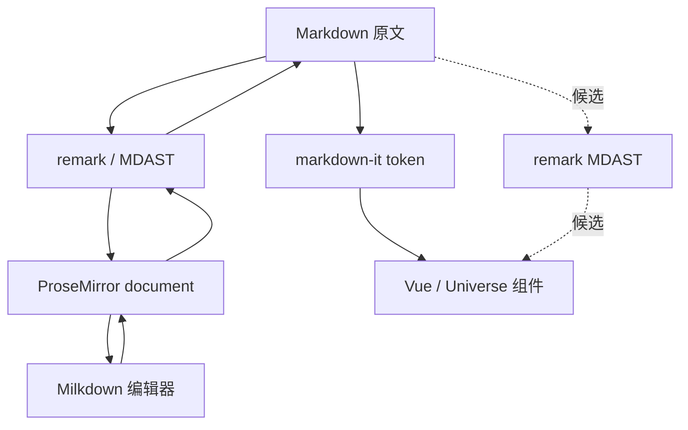

# Milkdown 选型调研

> 状态：调研已完成，生产编辑器迁移待实施。当前网站继续使用 `md-editor-v3`，正式迁移需要单独的实施计划。

## 背景

网站当前使用 `md-editor-v3` 编写 Markdown，阅读侧通过 `markdown-it.parse()` 生成 token，再由 Vue 渲染器转换成 `Universe*` 组件。编辑器仍以源码编辑和独立预览为主，距离 Typora 一类所见即所得体验有明显差距。

Milkdown 以 ProseMirror 作为编辑态文档模型，通过 remark 在 Markdown、MDAST 和 ProseMirror document 之间转换。引入后不一定需要同步替换阅读侧解析器。保留 `markdown-it` 可以避免立即重写现有 renderer，统一到 remark 则可以减少语法实现差异。两种方案需要用真实构建产物和语法样本比较，不能先假设 remark 更重。

## 目标

- 量化 Milkdown 的依赖、构建体积、懒加载边界和 Vue 集成成本。
- 验证 Markdown 在 Milkdown 中载入、编辑、导出后的语义和源码变化。
- 比较“阅读侧保留 markdown-it”和“阅读侧迁移 remark”两种方案，不提前假设统一 parser 一定更优。

## 非目标

- 本轮不直接替换生产编辑器。Milkdown 只有在选型结论明确后才进入正式迁移。
- 不因为 Milkdown 使用 remark，就立即迁移阅读侧 Markdown renderer。
- 不重新设计富内容样式，选型 spike 只验证编辑能力、结构和集成边界。

## 架构候选

### 阅读侧候选

方案 A 保留 `markdown-it`，编辑器按路由懒加载 Milkdown。优点是现有阅读 renderer 不需要迁移，编辑器依赖也不会进入所有页面；代价是项目同时维护 markdown-it token renderer 和 Milkdown 的 remark 语法配置。

方案 B 把阅读侧迁移到 remark/MDAST。优点是编辑和阅读可以共享语法插件与节点类型；代价是需要重写现有 token renderer，并重新验证组件映射、安全策略和所有 Markdown 样本。临时构建中 remark parse-only 入口小于 markdown-it，体积不是否决迁移的理由，但仍要用真实 workspace chunk 验证。

最终选择以构建 chunk、gzip 体积、Markdown 样本一致性和维护成本为准。parser 数量不单独作为决策指标。

## 实施步骤

### 阶段一：建立基线

- [x] 记录当前 website 构建产物和 MarkdownEditor 所在 chunk。
- [x] 整理现有 Markdown 语法、上传、附件和安全约束。
- [x] 建立 Milkdown 评估样本，覆盖标题、列表、表格、引用、代码、链接、图片、附件、删除线和中文输入。

### 阶段二：Milkdown spike

- [x] 在临时入口验证 Crepe 的挂载和销毁。
- [x] 确认图片上传回调和附件 Markdown 的集成边界。
- [x] 记录 Markdown 载入后直接导出的变化，以及编辑后的序列化结果。
- [x] 验证中文 IME、撤销重做、代码块和表格；粘贴与只读状态移入正式 workspace 集成计划。
- [x] 构建 Milkdown、Crepe、remark 和 markdown-it 的隔离入口，记录 gzip 体积。
- [x] 给出当前选型建议，正式替换生产编辑器前再做 workspace 集成 spike。

### 阶段三：文档和验证

- [x] 回写本计划的 Milkdown 结论、体积数据和未解决问题。
- [x] 本轮只形成 spike 建议，不新增长期解析架构 ADR。
- [x] 运行增量检查和 `vp run ready`。

## 验证

- Milkdown spike 能载入和导出 Markdown，附件、中文输入和撤销重做可用，图片上传回调的接入方式明确。
- 构建报告能区分阅读入口、编辑器懒加载 chunk 和共享依赖。
- Markdown 评估样本明确记录语义一致、源码规范化和不支持三类结果。

## 进展与调整

- 2026-07-13：确认 Milkdown 的 Markdown 边界使用 remark/MDAST，编辑态核心是 ProseMirror document。remark 不会在每次键入时重新解析全文，但监听器如果每次 transaction 都序列化 Markdown，仍需节流。
- 2026-07-13：当前网站构建中，`markdown-it` chunk 为 45.89KB gzip，写作路由的 `drafts` 编辑器 chunk 为 134.27KB gzip。
- 2026-07-13：隔离入口构建中，markdown-it parse-only 为 52.4KB gzip，`remark-parse + remark-gfm` 为 32.1KB gzip。remark 并不比 markdown-it 重，是否迁移阅读侧主要取决于 renderer 重写成本和语法一致性。
- 2026-07-13：`@milkdown/kit + CommonMark + history` 为 110.9KB gzip，加入 GFM 后为 135.7KB gzip。Crepe 默认完整入口为 906.8KB JavaScript 和 11.6KB CSS gzip，主要体积来自完整 UI、CodeMirror 语言数据和 KaTeX。
- 2026-07-13：Crepe 可以载入标题、强调、引用、列表、任务列表、表格、代码块、链接、图片和附件，中文输入与撤销正常。Markdown 序列化会把 `-` 列表规范化为 `*`，并调整列表项空行。
- 2026-07-13：Crepe 默认 `ImageBlock` 会把标准图片的 alt 改成宽高比。禁用该 feature 后，标准图片 Markdown 可以无损往返；附件普通链接不受影响。正式接入图片上传时可以使用 `onUpload(file) => Promise<string>`。
- 2026-07-13：临时环境中的 Crepe 依赖 Vue `^3.5.20`，项目当前使用 Vue 3.6 beta。正式 spike 需要确认 pnpm 是否产生重复 Vue，以及 ProseMirror white-space 警告是否来自样式加载时序。

## 当前建议

Milkdown 值得进入正式 workspace spike，但不直接采用 Crepe 默认完整入口。优先用 `@milkdown/kit` 按需组装 CommonMark、GFM 和 history，并在写作路由懒加载。正式 spike 需要补齐 Vue peer dependency、图片上传、粘贴、只读状态、样式警告和现有表单状态同步验证。

第一阶段保留阅读侧 `markdown-it`。原因是现有 token renderer、安全策略和测试已经完整，立即迁移 remark 不会直接改善编辑体验。remark parse-only 更小，因此后续不能再用“remark 太重”否决统一 parser；等 Milkdown 集成稳定后，再用真实 workspace chunk、语法差异和 renderer 维护成本决定是否迁移到 MDAST。

## 后续实施入口

- [ ] 新建生产编辑器迁移计划，完成 workspace 集成 spike 后再替换 `md-editor-v3`。

## 决策记录

- 2026-07-13：Milkdown 调研不直接替换生产编辑器，正式迁移需要单独的实施计划。
- 2026-07-13：阅读侧 parser 是否统一不按依赖数量决定，以主包体积、懒加载效果、语法一致性和维护成本综合判断。
- 2026-07-13：后续正式集成优先评估按需组装的 Milkdown Kit，不直接引入 Crepe 完整功能集。
- 2026-07-13：Milkdown 首次接入不绑定阅读侧 parser 迁移，避免把编辑体验改造和 renderer 重写放进同一批变更。
