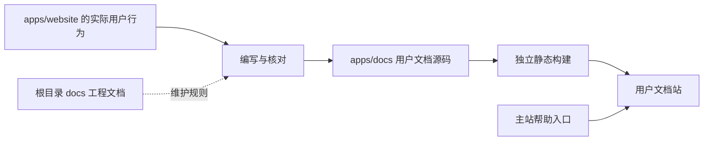

# 用户文档站

> 状态：待实施。当前尚未创建 `apps/docs`，实施时优先验证 VitePress。

## 背景

项目现有 `docs/` 面向开发者和 agent，记录架构、协作规范、质量门槛、ADR 与执行计划。随着网站功能趋于完整，明暗模式、皮肤、发帖、消息、收藏和个人设置等用户可见行为也需要稳定说明。目前相关信息散落在代码和迁移计划中，普通用户无法直接查阅，功能调整时也缺少对应的文档维护入口。

用户文档需要和代码在同一仓库内维护，但它有独立的读者、导航、构建和发布需求。因此将文档站作为 monorepo 中的应用，目标位置为 `apps/docs`，不放入面向工程准则的根目录 `docs/`，也不作为供其他应用依赖的 `packages/*` 公共包。

## 目标

- 在 `apps/docs` 建立面向普通用户的中文帮助文档站。
- 让用户可以从主站进入文档站，并按任务查找登录、阅读、发帖、消息、账号和主题设置说明。
- 让用户可见行为与文档同源维护，功能变更时能明确判断是否需要同步文档。
- 将文档构建、链接检查和主要页面验证纳入项目质量流程。
- 保持文档站与 `apps/website` 的应用边界，不复制业务逻辑，不依赖网站内部源码。

## 非目标

- 本计划阶段不创建 `apps/docs`、不安装依赖、不修改主站入口，也不配置部署。
- 首期不迁移现有开发者文档、ADR、执行计划和 API 契约说明。
- 首期不建设多语言、版本化文档、评论系统或复杂内容管理后台。
- 不从 TypeScript 类型、路由或组件注释自动生成用户文档正文。
- 不未经验证直接搬运旧论坛帮助内容，所有说明以当前网站的实际行为为准。

## 边界与内容流

`apps/website` 是功能事实源，`apps/docs` 负责将已经落地的行为转换成用户可以执行的说明。两者可以依赖公共 `packages/*`，但 `apps/docs` 不直接导入 `apps/website/src`。如果后续确实出现需要共享的稳定数据，应先判断它是否属于公共包，而不是为了文档方便打破应用边界。

根目录 `docs/` 继续服务开发者和 agent。用户文档的协作要求写入现有工程准则，但用户正文、图片和文档站配置都归入 `apps/docs`。

## 站点与目录方案

计划中的应用结构如下：

- `apps/docs/package.json`：独立的开发、构建和检查命令。
- `apps/docs` 下的站点配置：导航、侧栏、站点标题、链接和构建选项。
- `apps/docs/guide/`：入门、阅读、搜索、发帖和回复。
- `apps/docs/account/`：登录、个人资料、收藏、关注和浏览历史。
- `apps/docs/messages/`：回复、提及、系统通知和私信。
- `apps/docs/appearance/`：皮肤、明暗模式和日夜自动切换。
- `apps/docs/faq/`：权限、网络错误、内容显示和常见操作问题。
- `apps/docs/public/`：经过筛选的截图和其他静态资源。

文档框架在实施阶段通过短期 spike 确认。默认优先评估 VitePress，因为它与现有 Vue、Vite 技术栈一致，并提供导航、Markdown 扩展、静态构建和本地搜索。只有在 Vite+ 集成、部署路径、中文搜索或设计接入存在明确阻碍时，才考虑自建 Vue 文档应用。

框架选择如果只是本次实现细节，记录在本计划的决策记录中；如果形成长期构建边界或引入新的公共约束，再补 ADR。

## 内容设计

### 首批文档

首批内容按用户任务组织，不照搬网站代码模块：

- 开始使用：登录、退出和基本导航。
- 浏览论坛：版面、主题、楼层、热门、新帖、推荐和搜索。
- 发表内容：发主题、回复、编辑、Markdown、图片和附件。
- 管理个人内容：主题、回复、收藏、关注、浏览历史和自定义版面。
- 查看消息：回复、提及、系统通知、私信和消息设置。
- 调整外观：选择皮肤、手动明暗模式、跟随浏览器和固定时间切换。
- 常见问题：权限不足、登录失效、网络错误、内容无法显示和写入失败恢复。

外观设置作为第一篇样板文档。它需要准确说明手动模式与自动日夜切换的优先级、浏览器模式同步、固定时间和跨午夜规则、登录用户的服务端保存，以及没有亮暗配对的皮肤如何表现。正文使用界面名称，不暴露 `ThemeSetting`、Pinia 或 API 字段。

### 写作约定

- 一篇文档解决一个明确任务，标题使用用户会搜索的说法。
- 操作步骤引用真实按钮、菜单和页面名称，并说明完成后的可见结果。
- 涉及登录、管理员、版主或主题作者权限时，在操作前说明适用条件。
- 错误处理写用户可以采取的下一步，不展示内部异常、接口路径或实现细节。
- 截图只用于文字难以说明的空间关系或复杂操作。截图必须来自当前界面，避免依赖容易变化的整页画面。
- 文档可以记录关联的主站路由或功能域作为维护元数据，但这些信息不显示在用户正文中。
- 文档语言遵循项目中文规范，写作和审稿使用项目内的 write skill。

## 实施步骤

### 阶段一：框架与发布方式确认

- [ ] 验证 VitePress 在 pnpm workspace 和 Vite+ 命令体系中的开发、构建与类型检查行为。
- [ ] 确认文档站发布在独立域名还是主站子路径，并验证静态资源 `base`、刷新和深层链接。
- [ ] 验证中文本地搜索、站内链接检查和主站设计 token 的复用边界。
- [ ] 在本计划中记录框架结论；有长期架构影响时补 ADR。

### 阶段二：应用骨架

- [ ] 创建 `apps/docs`，补齐 `dev`、`build` 和必要的检查命令。
- [ ] 建立首页、导航、侧栏、404 页面和基础中文站点信息。
- [ ] 确认 `vp install`、根目录 `vp check` 和 `vp run ready` 能覆盖文档应用。
- [ ] 更新 `ARCHITECTURE.md`，将 `apps/docs` 加入模块布局和应用边界。

### 阶段三：内容基线

- [ ] 建立内容目录、页面模板和维护元数据约定。
- [ ] 完成外观设置样板文档，并根据代码、测试和真实页面核对日夜切换行为。
- [ ] 补齐登录、阅读、发帖、消息、账号设置和常见问题的首批文档。
- [ ] 检查术语与主站用户可见文案一致，删除实现术语和迁移过程描述。

### 阶段四：主站接入与发布

- [ ] 在主站稳定位置增加“帮助”入口，链接到文档站首页。
- [ ] 确认独立域名或子路径下的导航、资源、深层链接和错误页正常。
- [ ] 建立文档站的构建与部署流程，不影响主站现有发布。
- [ ] 为部署失败保留独立回滚方式，避免文档站阻断主站发布。

### 阶段五：维护机制

- [ ] 在 `AGENTS.md` 增加用户文档入口和按需阅读说明。
- [ ] 在 `docs/collaborating.md` 规定：修改用户可见流程、权限、界面名称或核心规则时，需要检查对应用户文档。
- [ ] 建立功能域与文档页面的关联清单，供实现和 Review 时核对。
- [ ] 将格式、站内链接、资源引用、重复路径和构建检查纳入质量流程。

## 验证

- 文档应用可以独立开发和构建，主站构建不依赖文档站运行。
- 首页、目录、侧栏、站内链接、深层链接、404 页面和静态资源在目标部署路径下正常。
- 匿名用户可以访问全部公开帮助内容，文档站不依赖 CC98 登录状态。
- 外观设置样板与当前实现一致，覆盖手动模式、浏览器同步、固定时间、跨午夜和保存行为。
- 文档在亮色、深色和至少一套节日皮肤下可读；桌面端主要视口无横向溢出。
- `vp check`、相关测试、文档构建、链接检查和 `vp run ready` 通过。

## 风险与待确认事项

- 文档站的域名和部署目标尚未确定，框架配置前需要先确认独立域名或主站子路径。
- 用户文档最主要的长期风险是与实际行为脱节，需要通过协作规则、关联清单和 Review 约束降低漂移。
- 截图更新成本较高，首批文档应以文字为主，并限制截图范围。
- 管理和版务功能受权限影响，正式编写前需要用对应身份验证，不能依据路由或按钮名称推测行为。
- 如果复用主站视觉 token 需要直接导入应用源码，应改为复制稳定的视觉规范或提取公共资产，不能建立 `apps/docs -> apps/website` 依赖。

## 进展与调整

- 2026-07-17：确认用户文档作为独立应用规划在 `apps/docs`，本轮只编写执行计划，不创建应用、不选择最终框架。

## 决策记录

- 2026-07-17：用户文档站归入 `apps/docs`，因为它拥有独立页面、构建产物和发布入口，不属于可复用公共包。
- 2026-07-17：根目录 `docs/` 继续存放工程准则和实施记录，不承载用户文档正文。
- 2026-07-17：首选评估 VitePress，但框架结论需要经过 workspace、搜索和部署路径 spike 后确定。
- 2026-07-17：用户文档以当前网站行为为事实源，不从旧站文档或代码结构自动推导正文。
