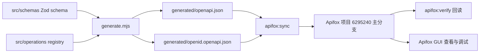

# Apifox CLI 单向同步接入

> 状态：调研中。项目初始化已固定 Apifox CLI 依赖并完成安装验证，包内命令、同步算法和 Apifox 云端验证尚未实施。

## 背景

`packages/api/src/schemas/` 中的 Zod schema 和 `packages/api/src/operations/` 中的 operation registry 已经是 CC98 API 定义的唯一事实源。生成器据此产出两份 OpenAPI：

- `generated/openapi.json`：主 API，当前包含 135 个 operation、115 个 path。
- `generated/openid.openapi.json`：OpenID，当前只包含 `POST /connect/token`。

Apifox 主要供人查看接口、展开请求结构和调试。当前依赖 GUI 手工导入，导入结果容易与仓库脱节，agent 也无法稳定判断重复接口、服务地址和认证配置是否正确。本次接入 Apifox CLI，把同步和结构检查收敛为 `@cc98/api` 包内的显式命令。

Apifox 项目 ID 为 `6295240`。截至 2026-07-18，`packages/api` 已将 `apifox-cli@2.2.7` 固定为精确 devDependency，npm 最新版本也是 `2.2.7`。CLI 通过 `vp exec -F @cc98/api apifox` 运行，不依赖全局安装。

## 目标

- 从仓库生成物单向同步到 Apifox 主分支，不创建 Apifox AI 分支。
- 在 `@cc98/api` 中提供 `apifox:check`、`apifox:sync` 和 `apifox:verify` 三个命令。
- 把主 API 与 OpenID 导入同一个 Apifox 项目的独立模块，保留各自的 server 和认证语义。
- 同步后通过 CLI 回读结构，发现缺失、重复、残留和错误归类。
- 连续执行同步不会新增重复接口，仓库删除的受管接口不会长期残留在 Apifox。
- 在 `packages/api/README.md` 写清事实源、同步方向、GUI 与 CLI 的分工，以及日常命令。

## 非目标

- 不从 Apifox 反向生成或覆盖 Zod schema、operation registry 和 OpenAPI。
- 不执行 CC98 登录、token 刷新或其他真实 API 请求。
- 不保存 CC98 用户名、密码、access token、refresh token 或 client secret。
- 不把 Apifox 云端同步加入 `vp check`、`vp run ready`、普通测试或 CI。
- 不创建项目专用 Skill。
- 不使用桌面自动化操作 Apifox GUI。
- 不把本次接入扩展为通用 API 发布平台或完整的 Apifox 项目治理。

## 事实源与同步边界



同步脚本只读取生成物，不直接解释 TypeScript 源码。生成物过期时，`apifox:check` 必须先失败，不能把旧 JSON 上传到 Apifox。Apifox 中的临时修改可以被后续同步覆盖，不能作为契约修复入口。

验证发现契约问题时，按问题所在层修复：

- schema、请求体、认证或 server 错误：修改 `src/schemas/` 或 `src/operations/`，重新生成并测试。
- 模块归类、导入参数或回读比较错误：修改 Apifox 配置和同步脚本。
- CLI 缺少所需能力：记录限制并暂停，不能用 GUI 手工修改伪装成自动同步完成。

## 当前基线

| 产物                            | operation | path | server                    | 全局 security |
| ------------------------------- | --------: | ---: | ------------------------- | ------------- |
| `generated/openapi.json`        |       135 |  115 | `https://api-v2.cc98.org` | Bearer        |
| `generated/openid.openapi.json` |         1 |    1 | `https://openid.cc98.org` | 无            |

OpenID 规范中的 `POST /connect/token` 使用 `application/x-www-form-urlencoded`，Body 包含 `client_id`、`client_secret`、`grant_type`、`username`、`password`、`scope` 和 `refresh_token`。`grant_type` 支持 `password` 与 `refresh_token`，operation 自身为匿名请求。

这些数字是首次接入的验收基线，不应长期硬编码为同步规则。日常验证应从本地两份 OpenAPI 动态计算期望集合，再与 Apifox 回读结果比较。

## CLI 调研结论

2026-07-18 使用仓库内固定的 `apifox-cli@2.2.7` 核对了帮助、`cli-schema` 和官方文档，当前结论如下：

- 不传 `--branch` 时，项目资源命令默认操作主分支，仍应在写命令中显式传入主分支名称，避免脚本依赖隐式默认值。
- `apifox import --format openapi` 只暴露项目、分支、格式和文件参数，没有目标模块、冲突策略、目录同步或清理参数。
- `--module-import-mode` 和 `--module-map` 只适用于 Apifox 原生格式，不能直接用于两份 OpenAPI。
- GUI 的导入设置支持目标模块、覆盖、目录同步和删除未匹配资源，但这些选项没有出现在一次性 OpenAPI 导入的 CLI 命令面中，不能把 GUI 能力当作 CLI 已支持能力。
- 自动导入配置的 schema 包含 `moduleId`、`targetBranchId`、覆盖模式、`syncApiFolder` 和 `deleteUnmatchedResources`，数据源来自 URL 或 Git。当前 CLI 只提供配置的 `list`、`create`、`get`、`delete`，没有显式执行命令，不适合作为本地生成物的 `apifox:sync` 入口。
- `endpoint list` 可以按模块过滤，`export` 可以按模块导出，`folder create` 可以在指定模块中创建目录。登录后可以用这些命令完成项目盘点、受管范围定位和回读验证。
- 当前用户级 CLI 尚未登录，因此还不能确认项目模块 ID、主分支写权限、现有重复接口、环境结构和真实导入结果。

这轮调研否定了“直接把两份 OpenAPI 分别替换到两个模块”的原假设。实施必须先完成一次可清理的小规模导入试验，再决定同步算法。不能仅凭 CLI 帮助推断删除和组件迁移语义。

## 拟议文件

| 文件                              | 用途                                          |
| --------------------------------- | --------------------------------------------- |
| `packages/api/package.json`       | 保留已固定的 CLI 依赖，增加三个显式命令       |
| `pnpm-lock.yaml`                  | 已锁定 `apifox-cli` 及其传递依赖              |
| `.apifox/settings.json`           | 按官方约定保存项目 ID，不保存认证信息         |
| `packages/api/apifox.config.json` | 在确有需要时保存规范路径、主分支和稳定模块 ID |
| `packages/api/scripts/apifox.mjs` | 实现本地检查、同步编排和远端结构验证          |
| `packages/api/README.md`          | 保存 API 子包的长期使用说明                   |

官方文档把当前工作区的 `.apifox/settings.json` 作为 Agent 读取默认 `projectId` 的约定，没有给出通用配置 schema，也没有说明 CLI 会自动读取其中的自定义字段。因此根配置只保存 `projectId`。只有登录后确认模块 ID 稳定且脚本确实需要时，才增加包内配置文件，不提前维护一份猜测出来的映射。

同步逻辑先保持在一个脚本中，通过 `check`、`sync`、`verify` 子命令分流。只有回读数据归一化变得复杂时，再拆出纯函数和离线测试，不为简单的命令拼接预建抽象层。

## 命令职责

### `apifox:check`

本地检查和只读预检，不修改 Apifox：

1. 确认 CLI 版本满足计划中验证过的最低版本。
2. 调用现有生成物一致性检查，拒绝过期的 OpenAPI。
3. 解析两份 OpenAPI，检查 operationId、method、path、server、security 和请求体等同步所需字段。
4. 检查 Apifox 登录状态、项目读取权限和主分支写入前置条件。
5. 输出准备同步的两个模块、operation 数量和目标项目，不输出任何凭证。

### `apifox:sync`

显式修改 Apifox 云端状态：

1. 先执行与 `apifox:check` 相同的检查。
2. 按已验证的导入策略同步主 API 模块。
3. 主 API 成功后同步 OpenID 模块，任一步失败都停止后续动作。
4. 处理受管模块中的旧资源，保证 Apifox 最终与本地规范一致。
5. 自动执行 `apifox:verify`，验证失败时以非零状态退出。

脚本不能在失败后宣称同步成功。若 CLI 导入不是事务性的，应在错误消息中说明哪个模块已经修改，并指导再次运行同步或恢复受管模块。

### `apifox:verify`

只读回读 Apifox，并与本地规范做结构比较：

- 以 `operationId + method + path` 作为接口身份，模块作为受管范围。
- 检查本地接口是否全部存在，Apifox 受管模块中是否有多余接口。
- 检查同一身份是否重复，`/connect/token` 是否只存在一份。
- 检查主 API 不包含 `/connect/token`，OpenID 模块只包含该接口。
- 检查两个模块的 server、Bearer security、匿名 security 和表单请求体。
- 检查 Apifox 环境或服务配置没有把 OpenID 请求指向主 API。
- 输出缺失、重复、残留和字段差异，避免只返回笼统的失败状态。

验证只比较结构，不发送真实请求。GUI 中 Body 能否正常展开，优先由请求体 content type 和 schema 回读结果判断；首次接入完成后再在 GUI 中人工打开一次 `/connect/token`，确认字段展示符合预期。

## 实施步骤

### 阶段 1：确认 CLI 能力和权限

- [x] 使用 `vp exec -F @cc98/api apifox --help`、各子命令的 `--help` 和 `cli-schema` 查询当前 CLI 的真实参数。
- [x] 确认一次性 OpenAPI 导入不能指定目标模块、冲突策略和资源清理；不传 `--branch` 时默认主分支。
- [x] 确认 `endpoint list/get`、`environment list/get`、`folder list` 和 `export` 提供机器可读输出。
- [x] 确认 endpoint 可以按模块查询并移动到指定目录，目录创建 payload 可以指定模块；组件跨模块语义仍需在线试验。
- [ ] 确认主分支允许外部 AI 或 CLI 直接写入。若权限关闭，请用户在 Apifox 中开启，不创建 AI 分支规避限制。
- [ ] 确认用户已经执行 `apifox auth login`。登录凭证保存在 CLI 的用户级配置中，不写入仓库。
- [ ] 登录后读取项目、分支、模块、接口目录、环境和现有 endpoint，形成写入前快照。

这一阶段需要回答以下问题，并把结论更新到本计划的进展记录：

1. 项目当前有哪些模块，主 API 与 OpenID 是否已经位于独立模块。
2. 一次性 OpenAPI 导入会落入哪个模块和目录，重复导入时是否保留 endpoint ID。
3. OpenAPI 已删除的接口在再次导入后会怎样处理。
4. 将 endpoint 移入其他模块的受管目录后，数据模型、鉴权组件和引用是否仍然完整。
5. 受管资源能否仅靠公开 CLI 命令安全清理，且不影响用户维护的示例、测试场景和文档。

### 阶段 2：固定依赖与非敏感配置

- [x] 把 `apifox-cli@2.2.7` 作为 `packages/api` 的精确 devDependency。
- [x] 运行 `vp install` 更新锁文件，确认项目固定的 Node 24 环境可执行 CLI。
- [x] 在 pnpm 构建白名单中明确禁止 Apifox CLI 传递依赖的数据库驱动和 SSH 原生脚本。
- [ ] 新增根 `.apifox/settings.json`，只记录项目 ID `6295240`。
- [ ] 登录并确认模块 ID 稳定后，再决定是否新增 `packages/api/apifox.config.json`。
- [ ] 确认配置中没有 Apifox 登录 token、CC98 凭证或其他秘密。
- [ ] 在 `package.json` 增加三个脚本，均通过包内固定版本的 `apifox` 执行。

建议的包级调用方式：

```bash
vp run @cc98/api#apifox:check
vp run @cc98/api#apifox:sync
vp run @cc98/api#apifox:verify
```

### 阶段 3：实现本地检查

- [ ] 复用 `scripts/check-generated.mjs` 的生成物一致性能力，不另写一套 OpenAPI 生成逻辑。
- [ ] 从两份 JSON 动态计算 operation 集合和数量。
- [ ] 检查两个规范没有重叠接口，唯一允许的 OpenID operation 是 `postConnectToken`。
- [ ] 检查主 server、OpenID server、全局 security 和 operation security。
- [ ] 检查 `/connect/token` 的表单 content type、required 标记和可展开字段。
- [ ] 在缺少 CLI、未登录、项目不可读或无主分支权限时给出明确错误。

### 阶段 4：完成最小写入试验并选择同步算法

- [ ] 经用户确认后，在主分支使用唯一命名的临时 operation 做最小导入试验，记录首次导入、重复导入、源码删除后再导入的资源变化。
- [ ] 试验前保存相关模块的 endpoint、目录、环境和导出快照，试验结束后删除临时资源并确认快照差异归零。
- [ ] 验证 endpoint 移动到目标模块目录后，数据模型、鉴权组件、server 和请求体引用是否完整。
- [ ] 如果公开 CLI 工作流能够指定受管模块并安全删除未匹配资源，使用导入器完成同步。
- [ ] 如果只能导入后逐项整理，只有在组件引用和清理范围都能验证时，才采用“导入、归类、删除残留”的方案。
- [ ] 如果两条路线都不能保证模块边界和幂等性，暂停实现，不调用未公开接口，也不在仓库中重写一套 OpenAPI 到 Apifox 的完整转换器。

### 阶段 5：实现受管模块同步

- [ ] 为主 API 和 OpenID 分别建立受管模块，不把两份规范合成一个 server 不明确的文件。
- [ ] 使用阶段 4 验证通过的同步算法，不再预设模块整体替换一定可用。
- [ ] 清理范围只能覆盖配置中声明的受管模块，不能删除用户在 Apifox 中维护的其他接口、示例、测试场景或文档。
- [ ] 同步动作显式指定项目和主分支，并通过已验证的模块 ID 或受管目录限定写入和清理范围，不能依赖当前目录之外的隐式状态。
- [ ] 保存命令输出中的资源 ID 只用于本次运行；需要长期稳定的非敏感模块 ID 时写入包内配置。
- [ ] 同步过程中不打印环境变量、认证文件和完整 CLI 用户配置。

如果 CLI 不能保证模块替换，也没有安全的删除接口，首版 `apifox:sync` 应停止并报告残留资源，不得静默留下与仓库不一致的投影。确认可控方案后再完成该阶段。

### 阶段 6：实现回读验证

- [ ] 用 CLI 获取受管模块中的 endpoint 详情，归一化为可比较的数据结构。
- [ ] 用本地 OpenAPI 生成期望集合，不复制维护接口清单。
- [ ] 比较 operationId、method、path、模块、server、security、content type 和请求字段。
- [ ] 将缺失、重复、残留和字段差异分别输出。
- [ ] 第一次同步后立即验证，再执行第二次同步和第二次验证，确认资源数量不增长。
- [ ] 在 GUI 中人工检查两个模块、服务地址和 `/connect/token` Body 展开效果，GUI 不参与自动化流程。

### 阶段 7：补充包内知识并收尾

- [ ] 更新 `packages/api/README.md`，写明源码事实源、生成物、单向同步和受管模块边界。
- [ ] 说明 GUI 供人查看和调试，CLI 供 agent 同步和结构验证。
- [ ] 说明 `apifox auth login` 是用户级登录，仓库不保存认证信息。
- [ ] 说明 `apifox:sync` 会修改云端，`apifox:check` 和 `apifox:verify` 不发送 CC98 请求。
- [ ] 说明修复契约时应修改 Zod schema 或 operation registry，不能只改 Apifox。
- [ ] 运行中文标点检查、`vp check` 和 `vp run ready`。
- [ ] 最后单独执行三条 Apifox 命令完成外部验证，不把它们塞进 `vp run ready`。

## 失败处理

| 情况                           | 处理                                                                        |
| ------------------------------ | --------------------------------------------------------------------------- |
| CLI 未安装或版本不符           | `apifox:check` 失败，并提示运行 `vp install`                                |
| CLI 未登录                     | 提示用户执行 `vp exec -F @cc98/api apifox auth login`，不接收用户粘贴 token |
| 项目或主分支无权限             | 停止同步，提示用户调整 Apifox 权限                                          |
| 生成物过期                     | 停止同步，先修复源码并重新生成                                              |
| 主 API 导入失败                | 不继续导入 OpenID，保留 CLI 错误摘要                                        |
| OpenID 导入失败                | 标记主 API 已变更，要求修复后重新运行完整同步                               |
| 回读发现重复或残留             | 同步失败，输出具体 endpoint 和模块，不忽略差异                              |
| Apifox 与 OpenAPI 表达能力不同 | 优先修正导入映射；若属于 CLI 限制，在计划中记录并暂停                       |
| OpenAPI 本身有问题             | 修改 `src/schemas/` 或 `src/operations/`，重新生成、测试、同步              |

## 验收标准

- `packages/api` 固定使用已验证的 `apifox-cli` 版本，其他 agent 拉取仓库后可通过 `vp install` 获得同一 CLI。
- `apifox:check` 在不修改云端的前提下检查生成物、CLI、登录和项目权限。
- `apifox:sync` 只由显式命令触发，直接同步 Apifox 主分支。
- `apifox:verify` 不发送真实 CC98 请求，能输出可定位的结构差异。
- Apifox 受管模块与本地两份 OpenAPI 的 operation 集合一致。
- `/connect/token` 在 Apifox 中只存在一份，主 API 模块没有该路径。
- 主 API server 为 `https://api-v2.cc98.org`，OpenID server 为 `https://openid.cc98.org`。
- 主 API 使用 Bearer security；匿名接口保持匿名；`/connect/token` 不要求 Bearer。
- `/connect/token` 使用 `application/x-www-form-urlencoded`，GUI 中可以展开登录和刷新所需字段。
- 连续执行两次 `apifox:sync` 后，endpoint 和受管模块数量不增加，没有重复资源。
- 从源码删除一个用于试验的临时 operation 后重新同步，Apifox 不再保留该 operation。试验只能使用本地临时变更，验证后恢复，不能提交测试接口。
- 仓库 diff 中没有 Apifox 登录凭证、CC98 凭证或用户数据。
- `vp run ready` 通过，且该命令不访问 Apifox 云端。

## 进展与调整

- [x] 2026-07-18：确认仓库事实源和两份生成物的当前结构，主 API 为 135 个 operation，OpenID 为 1 个 operation。
- [x] 2026-07-18：确认 Apifox 项目 ID 为 `6295240`，同步目标为主分支，不使用 AI 分支。
- [x] 2026-07-18：确认不做认证冒烟测试、不管理 CC98 凭证、不创建项目专用 Skill。
- [x] 2026-07-18：确认长期知识写入 `packages/api/README.md`，云端同步不加入 `vp run ready`。
- [x] 2026-07-18：项目初始化已固定并安装 `apifox-cli@2.2.7`，CLI 统一通过 Vite+ 运行，原生传递依赖的构建脚本保持禁用。
- [x] 2026-07-18：完成离线 CLI 命令面调研，确认一次性 OpenAPI 导入没有模块、冲突和清理参数。
- [ ] 登录后完成项目结构、权限和最小写入调研。
- [ ] 实现配置、命令、同步和验证。
- [ ] 完成两次幂等同步与 GUI 人工检查。
- [ ] 更新包内 README 并通过质量门禁。

## 决策记录

- 2026-07-18：仓库中的 Zod schema 和 operation registry 共同构成唯一事实源，Apifox 是可重建投影。
- 2026-07-18：同步方向固定为仓库到 Apifox，不接受 Apifox 反向覆盖源码。
- 2026-07-18：GUI 面向用户查看和调试，CLI 面向 agent 同步和结构验证。
- 2026-07-18：直接同步 Apifox 主分支，不建立 AI 分支。
- 2026-07-18：主 API 与 OpenID 保持两份规范和两个受管模块，避免混淆 server 与 security。
- 2026-07-18：Apifox CLI 作为 `packages/api` 的精确 devDependency，避免依赖全局安装版本。
- 2026-07-18：外部同步只能由显式命令触发，离线质量门禁不依赖 Apifox 的网络、账号和服务状态。
- 2026-07-18：首次接入只验证结构和幂等性，不发起真实认证请求。
- 2026-07-18：不采用自动导入作为首版同步入口，因为当前 CLI 只能管理自动导入配置，不能显式执行本地生成物同步。
- 2026-07-18：同步算法必须通过可清理的最小写入试验确定。若公开 CLI 无法保证模块边界和残留清理，计划停在调研阶段。

## 官方资料

- [Apifox CLI 介绍](https://apifox.com/blog/apifox-cli/)
- [Apifox CLI 命令说明](https://docs.apifox.com/cli-command-options)
- [Apifox CLI 与 Claude Skills](https://apifox.com/blog/apifox-cli-and-claude-skills/)
- [Apifox 导入设置](https://docs.apifox.com/import-settings)
- [Apifox 定时导入](https://docs.apifox.com/scheduled-import)
- [Apifox 模块](https://docs.apifox.com/module)
