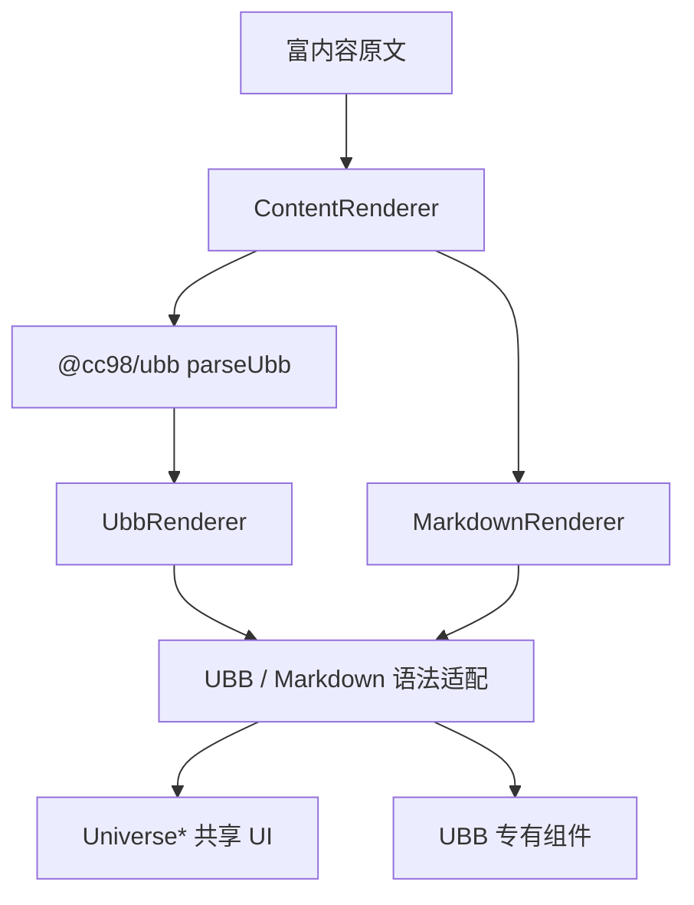

# UBB Vue 渲染器执行计划

## 背景

`packages/ubb` 已经完成 UBB 文本到 AST 的解析，并提供 HTML、Markdown 导出器。网站还没有消费这棵 AST，`TopicView` 也没有帖子内容渲染入口。

本计划实现第一版 Vue UBB 渲染器。设计参考同级 `Forum` 项目的历史行为，但不照搬旧 handler 架构：解析器继续产出纯数据 AST，网站按语法适配层和共享 UI 层分别组织代码。

## 目标

- 建立 `ContentRenderer`、UBB 适配层、Markdown 适配层和共享 `Universe*` 组件。
- 覆盖 `packages/ubb` 识别的全部静态标签和正则标签族。
- 标签分派显式、可检查。新增解析标签但没有渲染器时，覆盖测试必须失败。
- UBB 和 Markdown 可以有不同解析流程，但链接、图片、代码块、表格和媒体复用相同 UI。
- 第一条页面链路接入 `TopicView`，证明原始 UBB 可以经过 AST 渲染成 Vue 组件树。

## 非目标

- 不在本阶段抽取独立的富内容组件包，代码先留在 `apps/website`。
- 不实现 UBB 编辑器，也不做 Markdown 编辑或 Markdown 转 UBB。
- 不做纯文本 URL、B 站链接或公式自动识别，它们不是 UBB tag。
- 不在前端重新计算回复可见、楼主可见或指定用户可见等业务权限。
- 不为每个 tag 机械创建组件和测试文件。

安全策略和视觉设计会随链接、图片、媒体等标签逐项落地。本计划只确定它们的集中入口和组件边界，不提前写一套脱离具体行为的完整框架。

## 原项目调研结论

`Forum/Ubb/Core.tsx` 中的 `UbbCodeContext` 只组合渲染选项和一次执行中的状态，不包含当前用户或主题数据：

- `UbbCodeOptions` 控制图片、媒体、表情、Markdown、外链和最大图片数等行为。
- `UbbCodeContextData` 保存图片计数和引用状态等遍历数据。
- `needreply`、`posteronly`、`allowviewer` 由 handler 根据标签参数选择提示文案，不在前端包裹后续内容或重新判断权限。

新实现保留“公开选项 + 内部状态”的边界，但引用层级等可直接从 AST 得出的信息不放进可变状态。

## 架构



### 分层边界

`ContentRenderer` 是页面入口，接收内容类型、原文和渲染选项。`type="ubb"` 时调用 `parseUbb`，`type="markdown"` 时进入 `MarkdownRenderer`。

`UbbRenderer` 接收 `UbbNode[]`，创建本次渲染的内部上下文并遍历节点。文本节点直接输出，tag 节点交给注册表匹配到的处理器。

UBB 和 Markdown 适配层解释各自的语法、兼容规则和参数，再转换成共享 UI 的 props。适配层可以直接输出纯文本，也可以使用只属于该语法的组件，不强制所有路径都经过 `Universe*`。

`Universe*` 组件只表达可跨格式复用的 UI 和交互，不读取 `UbbNode`，也不判断内容来自 UBB 还是 Markdown。Markdown 解析器、UBB 表情等源格式专有能力不使用 `Universe*` 命名。

## 目录

```txt
apps/website/src/components/rich-content/
  ContentRenderer.vue
  options.ts
  types.ts

  universe/
    UniverseRoot.vue
    UniverseTextStyle.vue
    UniverseAlignedBlock.vue
    UniverseLink.vue
    UniverseSiteLink.vue
    UniverseImage.vue
    UniverseQuote.vue
    UniverseCodeBlock.vue
    UniversePlainText.vue
    UniverseDivider.vue
    UniverseTable.vue
    UniverseAudio.vue
    UniverseVideo.vue
    UniverseBili.vue
    UniverseUpload.vue
    UniverseMath.vue
    UniverseMessageBar.vue

  ubb/
    UbbRenderer.vue
    context.ts
    registry.ts
    renderUbbNode.ts
    textStyle.ts
    alignment.ts
    link.ts
    structure.ts
    siteLink.ts
    literal.ts
    media.ts
    permission.ts
    emotion/
      resolveEmotionTag.ts
      UbbEmotion.vue

  markdown/
    MarkdownRenderer.vue
    markdownIt.ts
    markdownPreprocess.ts
    renderMarkdownToken.ts
```

目录是职责地图，不要求第一步创建全部文件。同类标签可以继续合并；只有当一个文件职责过重时再拆分。`strong`、`em`、`tr`、`td` 等没有独立交互或设计约束的语义元素可以由适配层直接创建，不为了满足命名形式增加空包装组件。

## 核心接口

### `ContentRenderer`

```ts
export type RichContentType = "ubb" | "markdown";

export interface ContentRendererProps {
  content: string;
  type: RichContentType;
  options?: Partial<RichContentOptions>;
}
```

`options` 是调用方可配置的稳定输入。不同页面可以关闭图片、外链、媒体、表情或 Markdown，也可以限制图片数量。

### 渲染选项和内部上下文

```ts
export interface RichContentOptions {
  allowExternalUrl: boolean;
  allowImage: boolean;
  allowExternalImage: boolean;
  allowMediaContent: boolean;
  allowEmotion: boolean;
  allowEmbeddedMarkdown: boolean;
  allowToolbox: boolean;
  maxImageCount: number;
}

interface UbbRenderState {
  imageCount: number;
}

export interface UbbRenderContext {
  options: Readonly<RichContentOptions>;
  state: UbbRenderState;
}
```

`UbbRenderContext` 由 `UbbRenderer` 创建，不作为页面 prop。第一版只加入实际使用的字段；引用层级从 AST 递归关系得到，不照搬旧项目的可变标志。

`allowEmbeddedMarkdown` 只控制 UBB 内的 `[md]`。顶层 `type="markdown"` 表示页面已经决定按 Markdown 渲染，不受该选项影响。

### Tag 注册表

```ts
export type UbbTagRenderer = (
  node: UbbTagNode,
  context: UbbRenderContext,
  renderChildren: RenderUbbChildren,
) => VNodeChild;

const staticTagRenderers: Record<UbbStaticTagName, UbbTagRenderer>;
const regexFamilyRenderers: Readonly<Record<UbbRegexTagFamily, UbbTagRenderer>>;

export function resolveUbbTagRenderer(tag: string): UbbTagRenderer | undefined;
```

静态标签使用精确映射，动态编号标签先由 `packages/ubb` 的统一匹配函数得到稳定的 `family`，网站只维护 `family → renderer` 映射，不复制解析器正则。两种注册方式是 `registry.ts` 内部实现，对外只提供统一查找函数。

`renderChildren` 由遍历器注入，handler 不直接 import 遍历实现，避免 registry 和递归函数形成循环依赖。

`packages/ubb` 需要导出静态标签名、`UbbRegexTagFamily` 和 `matchUbbRegexTagFamily(tag)`。未知标签由解析器降级为文本，渲染层不再设置吞掉未知输入的默认处理器。

## 字面内容和 Markdown

| UBB tag | 适配层       | 最终入口            | 第一版语义                                          |
| ------- | ------------ | ------------------- | --------------------------------------------------- |
| `code`  | `literal.ts` | `UniverseCodeBlock` | 按纯文本显示代码，可与 Markdown fenced code 共享 UI |
| `md`    | `literal.ts` | `MarkdownRenderer`  | 把纯文本交给 Markdown 解析流程                      |
| `noubb` | `literal.ts` | `UniversePlainText` | 原样显示文本，不再解析 UBB                          |

`MarkdownRenderer` 是格式适配入口，不叫 `UniverseMarkdown`。它把 Markdown token 转换成 `UniverseLink`、`UniverseImage`、`UniverseCodeBlock` 等共享组件。

如果 `allowEmbeddedMarkdown=false`，`[md]` 内容按纯文本显示。原项目为旧引用语法做过预处理，新实现只有在真实内容样本证明仍需要兼容时才移植，并为兼容分支补测试。

Markdown 配置必须显式关闭原始 HTML。链接和图片 URL 与 UBB 共用安全函数，拒绝 `javascript:` 和不允许的 `data:` 等协议；后续增加插件时不得绕过该入口。

## 表情标签族

正则标签包括：

- `emNN`
- `acNN`、`acNNNN`
- `msNN`
- `cc98NN`
- `tbNN`
- `a:NNN`、`c:NNN`、`f:NNN`

这些标签的匹配形式、合法编号和资源后缀不同，但最终都是 UBB 专有的行内图片表情。统一由纯函数解析：

```ts
export interface EmotionDescriptor {
  family:
    "em" | "ac" | "ms" | "cc98" | "tb" | "mahjong-animal" | "mahjong-cartoon" | "mahjong-face";
  code: string;
  src: string;
  alt: string;
}

export function resolveEmotionTag(tag: string): EmotionDescriptor | null;
```

`resolveEmotionTag` 内部可以按标签族拆 resolver，集中保存合法范围、离散编号和 GIF/PNG 规则。普通表情和麻将最终都交给 `UbbEmotion`，不再创建 `UniverseMahjongTile`。

`UbbEmotion` 留在 UBB 适配层，因为当前 Markdown 不消费这些标签。以后出现跨格式复用需求时，再提升为 `UniverseEmotion`。所有标签族统一遵守 `allowEmotion`，不复制原项目中 `tb` 和麻将绕过选项的行为。非法编号或 `allowEmotion=false` 时显示原始 `[tag]`，保留内容信息和复制能力。

## 权限提示标签

| UBB tag       | 适配层          | 最终入口             | 第一版语义                       |
| ------------- | --------------- | -------------------- | -------------------------------- |
| `needreply`   | `permission.ts` | `UniverseMessageBar` | 根据位置参数显示“回复后可见”提示 |
| `posteronly`  | `permission.ts` | `UniverseMessageBar` | 根据位置参数显示楼主可见相关提示 |
| `allowviewer` | `permission.ts` | `UniverseMessageBar` | 根据位置参数显示指定用户可见提示 |

这三个标签是服务端权限结果对应的提示标记。前端不读取 viewer/topic，不包裹后续节点，也不重新决定正文是否可见。缺少参数时使用默认提示；参数越界时稳定降级，不让渲染失败。

## 其它标签映射

文字样式、布局、站内链接、表格、图片、附件、媒体和公式沿用当前标签清单，但按职责决定落点：

- 跨格式可复用的最终 UI 使用 `Universe*`。
- UBB 参数解释和历史兼容规则留在 `ubb/`。
- 简单文本降级可以直接返回文本，不为了满足分层形式额外套组件。
- `[img]` 按 `docs/ubb/img.md` 的参数、安全和计数规则实现。

### 引用兼容

原项目的 `QuoteTagHandler` 不只是输出嵌套引用，还会识别“以下是引用”等历史结构、调整嵌套引用并控制连续引用的样式。AST 能直接提供嵌套层级，但不能自动复现这些归一化行为。

实现前先用真实旧帖样本确认仍需保留的兼容规则。需要保留时，将其收敛到纯函数 `normalizeQuoteNode` 并单独测试；如果第一版改为标准嵌套 `<blockquote>`，必须在实现记录中明确行为变化并完成人工抽样验证。

## 实施步骤

### 阶段 1：渲染骨架和注册表

- 新建 `ContentRenderer`、`UbbRenderer`、渲染选项和内部上下文。
- 实现静态注册表、正则标签族匹配和统一查找函数。
- `apps/website` 增加 `@cc98/ubb` workspace 依赖。
- 先用普通文本和少量代表标签跑通 AST 到 Vue 的完整链路。

验收：普通文本和代表标签能够渲染；注册表遗漏解析器已知标签时测试失败。

### 阶段 2：文字、布局、链接和结构

- 实现文字样式、对齐、普通链接和站内链接。
- 实现引用、分隔线和表格结构。
- 调研真实旧帖中的引用结构，决定实现 `normalizeQuoteNode` 还是接受标准嵌套引用。
- 对非法参数和错误表格结构提供稳定降级，不抛出渲染异常。

验收：选择包含嵌套、参数和降级分支的代表片段验证，不要求每个 tag 一个测试文件。

### 阶段 3：代码、Markdown 和纯文本

- 实现 `UniverseCodeBlock` 和 `UniversePlainText`。
- 新建独立的 `MarkdownRenderer`，让 `[md]` 和 `type="markdown"` 进入同一入口。
- Markdown token 逐步复用已存在的共享 UI；未支持 token 使用明确降级。
- 显式关闭原始 HTML，并让链接、图片 URL 经过共享安全策略。

验收：代码中的 UBB 保持字面量；`allowEmbeddedMarkdown` 只影响 `[md]`；危险 HTML 和 URL 不进入最终输出。

### 阶段 4：图片、附件、媒体和公式

- 实现 `img`、`upload`、`audio`、`mp3`、`video`、`bili`、`math`、`m`。
- 将 APlayer、DPlayer、HLS 和 B 站 iframe 集成内聚到对应的 `Universe*` 组件；当前没有富内容之外的播放器调用方，不保留只转发 props 的 `components/media/` 层。
- 落实集中 URL 检查、图片计数和关闭媒体时的降级行为。

验收：重点覆盖外链策略、图片数量、媒体关闭和参数分支，不机械要求八个独立测试文件。

### 阶段 5：表情和权限提示

- 实现 `resolveEmotionTag` 和 `UbbEmotion`。
- 完整迁移各标签族的合法编号和资源后缀规则。
- 实现三个权限提示标签的消息映射和稳定降级。

验收：表情边界、离散编号、后缀分支和 `allowEmotion` 有测试；权限标签只生成提示，不影响相邻节点。

### 阶段 6：页面接入和文档同步

- 在 `TopicView` 的帖子内容位置接入 `ContentRenderer`。
- 选取包含多类标签的真实 UBB 片段做组合验证。
- 同步更新 `ARCHITECTURE.md`、`docs/frontend.md` 和相关 `docs/ubb/` 文档。
- 浏览器人工检查帖子正文、链接、图片、表格、代码、表情和媒体的基础行为。

验收：`TopicView` 不再保留渲染占位文案，真实内容可读，`vp run ready` 通过。

## 实施进度

- [x] `packages/ubb` 导出静态标签和正则标签族契约。
- [x] 建立 `ContentRenderer`、UBB/Markdown 适配层、内部渲染上下文和共享 UI。
- [x] 覆盖解析器识别的全部静态标签和正则标签族。
- [x] 完成标签完整性、表情、权限、图片状态、URL/Markdown 安全和 SSR 组合测试。
- [x] `TopicView` 根据帖子 `contentType` 渲染 UBB 或 Markdown。
- [x] 浏览器确认 `TopicView` 能正常挂载并展示未登录错误态；真实帖子接口返回 401，富内容组合由 SSR 测试验证。
- [x] 使用已登录 Chrome 验证真实主题：10 个楼层、引用、图片、链接和表情均正常渲染，控制台无错误。
- [x] 扫描热门主题前 3 页，共人工渲染检查 300 楼；未出现正文加载失败或图片加载失败。
- [x] 抽样论坛指南、编程技术、天籁之音、文学交流等版面，原文命中 UBB 的 987 楼；定位语法大全、引用压力和麻将表情样本。
- [x] 根据引用压力帖补充引用链拉平：嵌套深度从 38 层降为 1 层，最窄引用从 32px 恢复到 968px。
- [x] 增加全部 UBB 标签渲染契约：测试清单必须与解析器导出的静态标签和正则标签族完全一致，并逐组走完整 SSR 渲染链路。
- [x] `vp run ready` 通过。

引用最初采用标准嵌套 `<blockquote>`。真实引用压力帖证明深层引用会把正文压缩到不可读宽度，因此现已加入纯函数式引用链拉平；暂不移植旧 handler 的可变上下文和“以下是引用”文本归一化。

### 真实帖子覆盖记录

- `6561290` 等 10 个本月热门主题：检查前 3 页，覆盖普通正文、引用、链接、图片、视频和 `ac`、`em`、`ms`、`cc98`、`tb` 表情族。
- `4759491`「CC98 Durian 语法大全 & 新手代码测试楼」：覆盖文字样式、对齐、字号、颜色、图片、视频、音频、附件、引用、内嵌 Markdown、分隔线、代码、字体、表格、权限提示和 Markdown 楼层。
- `6572355`「超级无敌吊炸天引用测试」：覆盖 102 个引用节点和 4 个视频实例，并用于验证深层引用拉平。
- `6453806`：验证麻将 `a:008` 资源加载成功，图片尺寸为 32×37，无加载失败。
- `5015671`：验证历史 `[mp3]` 帖子能挂载 APlayer，原始标签没有残留。
- `6193643`、`5045308` 等历史技术帖：补充代码块和 B 站内容样本。

真实抽样尚未找到稳定的 `[math]`、`[m]`、`[posteronly]`、`[allowviewer]` 帖子。它们已经进入全部标签渲染契约；后续找到可公开复现的帖子时，再补到这份记录，不为了凑齐清单伪造“真实覆盖”。

## 测试策略

测试围绕容易回归的分支、状态和边界组织，不按源码文件数量分配测试。

### 必要测试

- `emotion.test.ts`：表驱动覆盖每个表情族的代表值、边界、离散编号、GIF/PNG 分支、非法编号和 `allowEmotion=false`。
- `permission.test.ts`：覆盖三个标签的默认消息、有效消息编号和越界降级，确认不会吞掉相邻内容。
- 图片状态测试：覆盖同一次渲染中的累计计数、超过上限后的降级，以及两次独立渲染之间状态重置。
- URL 与 Markdown 安全测试：覆盖 UBB/Markdown 的危险协议、Markdown 原始 HTML 关闭和安全 URL 正常通过。
- 引用兼容测试：覆盖真实旧帖证明必要的引用链拉平，不复制旧 handler 的可变上下文实现。
- Markdown 兼容预处理测试：只在保留原项目兼容规则时增加，标准 Markdown 语法交给 `markdown-it` 自身保证。
- `ContentRenderer` 组合测试：用少量真实片段覆盖 UBB 原文到最终语义 HTML，以及 UBB/Markdown 类型分派。
- 全部标签渲染契约：样本声明覆盖的静态标签和正则标签族必须与 `packages/ubb` 导出清单完全一致，每组样本还要断言关键语义输出。

组件组合测试优先使用现有 `@vue/server-renderer` 输出语义 HTML，不为本计划额外引入 jsdom、`@vue/test-utils` 或浏览器测试框架。

### 不要求的测试

- 不为 `b → UniverseStrong` 等无分支映射逐个建文件。
- 不断言稳定 key、内部组件层级或整棵 DOM 大快照。
- 不重复测试 Vue、`markdown-it` 和浏览器本身已经保证的行为。
- 第一版不建立 `TopicView` 自动 E2E；页面接入通过组合测试和浏览器人工验证完成。

如果采用 TDD，测试和实现的分工遵守 `docs/quality.md`，主 agent 不同时编写同一逻辑的测试和实现。

## 完成定义

- `packages/ubb` 识别的每个静态 tag 都存在显式注册项。
- 每个正则 tag 家族都存在显式匹配器，并经过资源规则校验。
- 正则标签族只在 `packages/ubb` 定义匹配规则，网站不复制正则。
- Markdown 使用独立 `MarkdownRenderer`，不出现 `UniverseMarkdown`。
- 普通表情和麻将共享 `UbbEmotion`，不出现 `UniverseMahjongTile`。
- 权限标签只显示服务端结果提示，不依赖 viewer/topic，也不包裹后续节点。
- 测试覆盖注册完整性和高风险行为，不要求每个处理器一个测试文件。
- `TopicView` 接入真实 UBB 内容，相关文档与代码注册表一致。
- `vp run ready` 通过。

## 提交拆分建议

1. `feat(ubb): 建立富内容渲染骨架与注册表`
2. `feat(ubb): 实现文字布局链接与结构标签`
3. `feat(content): 接入代码与 Markdown 渲染`
4. `feat(ubb): 实现图片附件媒体与公式标签`
5. `feat(ubb): 实现表情与权限提示标签`
6. `feat(topic): 接入帖子富内容渲染`

## 决策记录

- 2026-07-10：第一版建立语法适配层和共享 UI 层，避免 UBB 与 Markdown 各自维护一套链接、图片、代码块和媒体组件。
- 2026-07-10：所有解析器已知 tag 必须显式处理，注册表覆盖测试负责阻止遗漏。
- 2026-07-11：渲染上下文改为公开选项与内部状态，不加入 viewer/topic；权限 tag 按原项目行为解释为服务端结果提示。
- 2026-07-11：Markdown 使用独立 `MarkdownRenderer`，不进入 `Universe*` 命名空间。
- 2026-07-11：普通表情和麻将共享 UBB 专有的 `UbbEmotion`，资源解析规则集中在纯函数中。
- 2026-07-11：测试按高风险行为组织，不再要求每个处理器文件对应测试文件。
- 2026-07-11：根据双项目 review，正则标签族匹配收敛到 `packages/ubb`，补充引用兼容调研、Markdown 安全和图片状态测试。
- 2026-07-11：引用压力帖出现 38 层嵌套和 32px 最窄正文，补充纯函数式引用链拉平；“以下是引用”文本归一化仍保持不移植。
- 2026-07-11：真实帖子接口允许楼层 `title=null`，schema 改为可空；开发环境错误态显示具体异常，避免查询和解析错误被统一文案掩盖。
- 2026-07-11：旧项目表情使用同域 `/static/images`，新项目本地开发没有这组资源，渲染器改用原站 `https://www.cc98.org/static/images`。
- 2026-07-11：真实帖子抽样用于发现历史兼容问题；解析器已知标签的完整性由全部标签渲染契约兜底，不要求每种稀有标签都必须先找到公开旧帖。
- 2026-07-11：音频、视频和 B 站播放器当前只服务富内容渲染，第三方播放器生命周期直接由对应 `Universe*` 组件管理；出现第二个业务调用方后再提取底层播放器。
- 2026-07-11：删除直接复述 schema、注册表对象键和基础标签映射的重复测试；parser 测试按 `recursive`、`text`、`empty`、`autoclose` 模式组织，用代表样本代替逐标签排列枚举。
