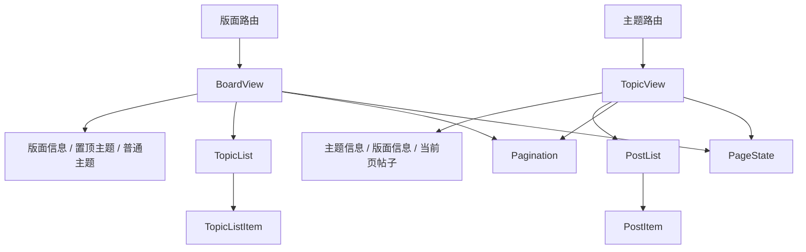

# 第三阶段：核心阅读闭环

## 背景

阶段 3 要打通首页、版面和主题之间的核心阅读路径，并为阶段 4 提供主题列表、分页和页面状态等共享能力。

当前项目已经具备路由骨架、认证请求、Vue Query、基础 schema 和富内容渲染，但阅读页面仍是早期原型：

- `BoardView` 只显示路由参数，没有请求版面信息或主题列表。
- `TopicView` 只请求当前页帖子，没有主题信息、版面信息、总页数和完整楼层 UI。
- `boardTopicsQuery` 与 `topicPostsQuery` 已存在，但没有页面消费前者，也没有对应组件测试。
- 登录页支持读取 `logOnRedirectUrl`，受限页面尚未负责写入来源页并跳转登录。
- 页面各自处理加载与错误，缺少可供后续发现类页面复用的统一状态。

旧 React 项目用于核对接口和行为，不直接迁移组件。阶段 3 只实现阅读闭环，发帖、回复、点赞、收藏、投票和管理操作继续留在后续阶段。

## 目标

- 用户可以从首页或版面列表进入版面，再进入主题。
- 版面页展示版面信息、普通主题列表和正确分页。
- 主题页展示主题标题、所属版面、统计信息和当前页楼层。
- 版面和主题都以 URL 表示页码，刷新、分享和前进后退后状态一致。
- 历史 UBB 与新 Markdown 帖子在完整楼层 UI 中正常渲染。
- 401、403、404、服务端错误、空列表和 schema 校验失败有明确且一致的页面状态。
- 受限内容引导登录，登录后返回原页面。
- 产出阶段 4 可以直接复用的主题列表项、分页、页面状态和路由参数工具。

## 非目标

- 不实现发主题、回复、编辑、点赞、收藏、评分、投票和上传。
- 不实现主题管理、版主管理、版面事件和大字报编辑。
- 不实现最佳帖、精华帖、标签筛选和复杂主题预览，除非确认它们是当前版面阅读的必需入口。
- 不迁移旧项目鼠标悬停后额外请求前 10 楼的主题预览，避免 N+1 请求。
- 不引入虚拟滚动。每页主题 20 条、帖子 10 楼，普通列表足够。
- 不实现移动端专用布局，但基础页面不能出现阻断阅读的溢出。

## 调研结论

### 当前项目已有能力

| 能力                                       | 状态     | 说明                               |
| ------------------------------------------ | -------- | ---------------------------------- |
| `/list/:boardId/:type?/:page?`             | 骨架     | 路由存在，页面未实现               |
| `/topic/:topicId/:page?`                   | 部分可用 | 能请求并渲染当前页帖子             |
| `GET /board/{id}/topic`                    | 查询已写 | 未被页面消费                       |
| `GET /topic/{id}/post`                     | 查询已写 | 缺主题信息和总页数                 |
| `topicSchema`、`postSchema`、`boardSchema` | 初版     | 需按真实响应补充或修正             |
| UBB、Markdown 渲染                         | 已完成   | 可直接放入楼层组件                 |
| 登录后返回                                 | 半完成   | 登录页会读取来源页，阅读页不会写入 |

### 旧项目阅读接口

| 数据     | 接口                                     | 用途                                 |
| -------- | ---------------------------------------- | ------------------------------------ |
| 版面信息 | `GET /board/{boardId}`                   | 名称、描述、权限、统计等             |
| 普通主题 | `GET /board/{boardId}/topic?from&size`   | 每页 20 条                           |
| 置顶主题 | `GET /topic/toptopics?boardid={boardId}` | 版面置顶和全站置顶                   |
| 主题信息 | `GET /topic/{topicId}`                   | 标题、版面 ID、回复数、状态等        |
| 主题帖子 | `GET /topic/{topicId}/post?from&size`    | 每页 10 楼                           |
| 版面标签 | `GET /board/{boardId}/tag`               | 主题标签名称，是否纳入首版待接口探测 |

旧版面页还支持最佳帖、精华帖、标签筛选、批量管理和悬停预览。这些不是阶段 3 阅读闭环的必要条件，首版只保留普通主题和必要的置顶主题。

### 分页语义

- 版面主题每页 20 条。
- 主题帖子每页 10 楼，楼主计入第一页，因此总页数为 `ceil((replyCount + 1) / 10)`。
- 页码从 1 开始，接口使用 `from=(page-1)*size`。
- 页面请求超出总页数时，使用规范化路由替换到最后一页；非法 ID 或页码进入 404 或默认第一页，具体规则保持一致并补测试。
- 版面接口没有明确总数响应时，可暂用 `board.topicCount` 计算页数，但必须先确认该字段是否包含删除、置顶或无权限主题。若无法可靠计算，需要多取一条判断下一页，不能展示虚假的总页数。

## 方案

### 组件与数据流

路由页负责解析参数、组合 query 和设置页面标题。API 层负责请求与 schema 校验。共享组件只接收已校验数据，不直接发请求。

### API 与 schema

补齐查询：

- `boardQuery(boardId)`：`GET /board/{boardId}`。
- `boardTopicsQuery(boardId, from, size)`：保留并按实测响应修正。
- `boardTopTopicsQuery(boardId)`：`GET /topic/toptopics`，确认匿名权限和重复主题处理。
- `topicQuery(topicId)`：`GET /topic/{topicId}`。
- `topicPostsQuery(topicId, from, size)`：保留并按实测响应修正。

补齐或修正 schema：

- `boardSchema` 增加阅读页面实际使用的 `canEntry` 等字段。
- `topicSchema` 核对标签、高亮、置顶、锁定和最后回复字段。
- `postSchema` 核对头像、签名、楼层状态和删除状态。首版不展示的字段不必全部建模。

请求失败不能只保留通用 `Error`。增加小型错误归一化函数，至少区分未登录、无权限、不存在、服务端错误和响应校验失败。

### 版面页

页面结构：

1. 面包屑与版面标题。
2. 版面描述和必要统计。
3. 置顶主题，可与普通主题同组件展示，并按主题 ID 去重。
4. 普通主题列表。
5. 页首或页尾分页。

主题列表项首版展示：

- 状态或置顶标识。
- 标题和可选标签。
- 作者、发帖时间。
- 回复数、浏览数。
- 最后回复人和最后回复时间。
- 进入主题首页与最后一页的链接。

旧项目的标题颜色、粗体和斜体来自 `highlightInfo`。接口存在该字段时安全映射到有限样式，不接受任意 CSS 字符串。

### 主题页

主题页先请求主题信息，据此得到版面 ID、总页数和主题状态，再并行或依赖请求版面信息与当前页帖子。

页面结构：

1. 版面、主题面包屑。
2. 主题标题、作者、时间、回复和浏览统计、锁定状态。
3. 页首分页。
4. 当前页楼层列表。
5. 页尾分页。

楼层组件首版展示：

- 稳定锚点 `#floor-{floor}`，并兼容旧数字 hash 时的跳转转换。
- 用户名、匿名或已注销状态、楼主标识。
- 楼层号和发帖时间。
- 帖子标题（存在时）和富内容正文。
- 删除或不可见帖子采用明确占位，不渲染为空白卡片。

头像、签名、IP、点赞和操作栏不是完成阅读闭环的必要条件。头像字段在帖子响应中稳定存在时可以加入；签名和互动操作留到后续阶段。

### 共享分页

`Pagination` 使用 Vue Router 生成链接，不在组件内部维护页码状态：

- 接收当前页、总页数和生成目标路由的函数。
- 支持上一页、下一页、首页、末页和有限页码窗口。
- 当前页使用 `aria-current="page"`。
- 总页数未知时退化为只有上一页和下一页，下一页由“多取一条”或响应长度判断。
- 页码变化后交给路由滚动策略回到顶部；带楼层 hash 时滚动到目标楼层。

### 页面状态与登录返回

新增共享状态展示，但保持 API 简单，不建立全局错误 store：

- 加载中。
- 空列表。
- 需要登录。
- 无权限。
- 不存在。
- 通用错误与重试。

需要登录时：

1. 把 `route.fullPath` 写入统一来源页存储函数。
2. 跳转 `/logon`。
3. 登录成功后读取并删除来源页。
4. 只允许站内相对路径，拒绝外部 URL 和协议相对地址。

当前 `LogOnView` 直接读取 localStorage，应抽到认证或路由辅助模块中，并给来源页校验补测试。

## 实施步骤

### 1. 探测阅读接口

- [x] 使用匿名和登录状态探测版面信息、普通主题、置顶主题、主题信息和帖子接口。
- [x] 记录真实响应形状、401/403/404 语义和分页终止条件。
- [x] 确认版面信息允许匿名请求，普通主题、主题信息和帖子接口需要登录；受限版面通过 `canEntry=false` 区分登录引导和无权限。
- [x] 确认 `board.topicCount` 可用于展示总页数；后端在超大 offset 下存在已知深分页问题，前端本阶段不增加额外探针规避。
- [x] 确认置顶主题可能与普通主题重复，第一页按主题 ID 去重。

### 2. 建立共享基础设施

- [x] 增加路由 ID、页码和 `from` 换算工具。
- [x] 增加安全的登录来源页存取与校验。
- [x] 增加 API 错误归一化和共享页面状态组件。
- [x] 实现 URL 驱动的 `Pagination`。

### 3. 固定 API 契约

- [x] 根据探测结果核对 `boardSchema`、`topicSchema` 和 `postSchema`，现有契约可覆盖阶段 3。
- [x] 增加版面信息、置顶主题和主题信息 query。
- [x] 修正 query key，确保认证身份、版面、主题、页码和每页数量均参与缓存键。
- [x] 为依赖参数设置查询启用条件，非法 ID 不发送请求。

### 4. 实现版面主题列表

- [x] 实现 `TopicListItem` 和 `TopicList`。
- [x] 实现版面标题、描述、置顶主题和普通主题。
- [x] 实现普通主题分页和页码规范化。
- [x] 处理匿名作者、已注销用户、空标题、缺失最后回复人和高亮样式。
- [x] 把首页与版面列表中的链接统一到实际版面路由。

### 5. 完成主题阅读页

- [x] 请求主题信息和版面信息，展示标题、面包屑、统计和状态。
- [x] 抽出 `PostItem`，将现有富内容渲染接入完整楼层 UI。
- [x] 实现主题总页数、分页和超范围页码规范化。
- [x] 实现楼层锚点与旧数字 hash 兼容。
- [x] 处理删除帖、不可见帖、匿名用户和已注销用户。

### 6. 接入权限与返回链路

- [x] 版面和主题页面区分需要登录、无权限、404 和服务端错误。
- [x] 需要登录时保存当前完整路径并跳转登录。
- [x] 登录成功返回来源页，非法或外部来源页回到首页。
- [x] token 失效后清理登录态，并允许用户重新登录回到原阅读位置。

### 7. 测试与浏览器回归

- [x] 为参数解析、分页窗口、来源页校验和错误映射补纯逻辑测试。
- [x] 评估版面列表和主题楼层状态；当前组件以声明式组合为主，使用纯逻辑测试和真实浏览器回归覆盖，不新增重复组件测试。
- [x] 用匿名和测试账号完成首页到版面、版面到主题、分页和登录返回回归。
- [x] 验证 UBB、Markdown、图片、引用和媒体在楼层卡片中的布局。
- [x] 更新路线图，把阶段 3 标记完成并链接本计划。

## 验证

### 自动测试

- 非法、缺省、负数、零和超范围页码。
- 总页数已知与未知两种分页模式。
- 置顶主题与普通主题按 ID 去重。
- 登录来源页只接受站内绝对路径。
- 401、403、404、500、空数组和 Zod 校验失败映射到不同状态。
- 主题总页数计算包含楼主，`replyCount=0`、`9`、`10` 等边界正确。
- 主题或版面 ID 变化后不展示上一页面的缓存数据。

### 浏览器验证

按 `docs/quality.md` 复用已有开发服务器，验证：

- 首页或版面列表进入版面，再进入主题。
- 版面和主题的上一页、下一页、页码链接、刷新与前进后退。
- 最后一页、空页、超范围页码和不存在的 ID。
- 匿名可访问内容、受限内容登录引导、登录后返回。
- 主题内楼层 hash 定位。
- 深色和浅色主题下的主题列表、楼层、分页和错误状态。
- 键盘可操作分页，焦点状态可见。

### 质量门槛

- 每批改动后运行 `vp check`。
- 阶段收尾运行 `vp run ready`。
- 接口探测和浏览器验证结论持续写回本计划。

## 与第四阶段的交付边界

以下产物是第四阶段的直接前置，阶段 3 收尾时必须稳定：

- `TopicListItem` 和 `TopicList`。
- `Pagination`。
- 页面加载、空数据、登录、无权限、404 和通用错误状态。
- 路由参数解析和页码换算。
- 登录来源页存取与校验。
- 主题、版面和用户链接的基础生成规则。

阶段 4 可以扩展列表项展示版面名、头像、摘要和推荐信息，但不能另建一套平行列表。

## 确认结果

1. 阶段 3 只实现普通主题和置顶主题；最佳、精华和标签筛选已在后续高保真迁移中补齐。
2. 阶段 3 接入头像，签名与完整用户侧栏已在后续高保真迁移中补齐。
3. 旧数字 hash，例如 `#10`，已经兼容，现有站内和外部链接可以继续定位楼层。

## 进展与调整

- 2026-07-11：完成当前 Vue 项目与旧 React 项目的阅读闭环静态调研。
- 2026-07-11：确认版面页尚未实现，主题页只有帖子正文原型，阶段 3 仍是阶段 4 的硬前置。
- 2026-07-11：`packages/api` 已覆盖并实测阶段 3 所需阅读接口，步骤 1 的接口探测改为核对已有契约与少量行为确认，不再从零探测。
- 2026-07-11：确认初期功能优先、样式后置；本阶段以可阅读、可翻页、权限与登录返回正确为准，不追求视觉还原。
- 2026-07-11：真实接口确认版面信息可匿名读取，普通主题、主题信息和帖子接口需要登录；匿名访问阅读路径时先展示登录引导，登录后返回来源页。
- 2026-07-11：旧前端和真实接口均暴露超大 offset 的深分页异常，这是后端分页问题；阶段 3 保留按 `board.topicCount` 展示总页数和末页，不增加每页额外探针请求。
- 2026-07-11：完成首页、登录返回、版面与主题分页、楼层 hash、畸形 ID、明暗主题和富内容的真实浏览器回归，阶段 3 验收通过。

## 决策记录

- 2026-07-11：阶段 3 不引入虚拟滚动，版面每页 20 条、主题每页 10 楼使用普通列表。
- 2026-07-11：首版不迁移悬停主题预览，避免每个列表项额外请求帖子。
- 2026-07-11：分页状态只由 URL 驱动，共享组件不维护内部页码。
- 2026-07-11：登录来源页统一封装并校验，只允许站内相对路径。
- 2026-07-11：阶段 3 功能先做，样式后置；高亮标题等视觉细节有稳定字段时做最小映射，不做设计打磨。
