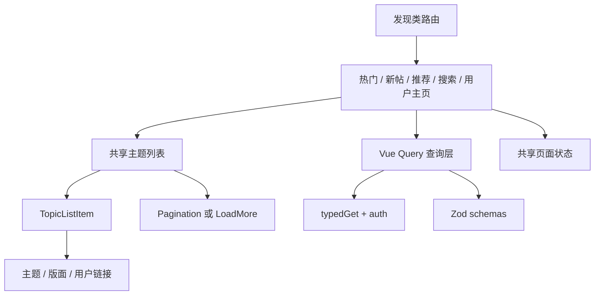

# 第四阶段：发现与列表迁移

## 背景

第四阶段迁移热门、新帖、推荐、搜索和用户主页等发现类页面。新项目应复用阶段 3 建立的主题列表项、分页、加载状态和错误状态，不再为每个入口复制一套列表实现。

本计划对照以下两个项目整理：

- 当前项目 `/Users/shellraining/Documents/cc98`：Vue 3 SPA，已经具备认证、请求封装、Zod schema、Vue Query 和富内容渲染。
- 旧项目 `/Users/shellraining/Documents/Forum`：React 16 前端，用于核对页面入口、接口路径、数据字段和交互语义，不直接迁移组件与状态管理代码。

阶段 3 已完成：`BoardView` / `TopicView`、`TopicListItem`、`Pagination`、`PageState` 和登录回跳均可复用。本阶段直接在其上扩展发现类页面。

## 目标

- 提供 7 日热门、30 日热门、历史热门、新帖和推荐入口。
- 提供主题搜索和版面搜索，搜索条件与 URL 同步。
- 提供按用户 ID 或用户名访问的公开用户主页，并展示近期主题。
- 所有主题类页面复用统一的主题列表项、分页或加载更多能力、空状态和错误状态。
- 匿名和登录状态下按真实接口权限展示入口；需要登录时保存来源页，登录后返回。
- 列表项可以进入主题、版面和用户主页，链接语义在各发现页面保持一致。

## 非目标

- 不迁移 `/me/*` 下的我的主题、回帖、收藏、关注和浏览历史，这些属于阶段 5。
- 不迁移用户管理操作，旧项目 `/user/:method/:id/manage` 不属于公开用户主页。
- 不迁移首页推荐卡片、关注流和随机最近主题等独立产品形态，除非实施前确认它们仍是第四阶段必须保留的入口。
- 不照搬旧项目的 Redux、类组件、jQuery 滚动监听、本地缓存和手写请求状态。
- 不在没有性能数据时引入虚拟列表。普通分页或 Vue Query 的受控加载更多足以覆盖本阶段。
- 不根据旧项目前端代码推断最终权限策略，接口可访问性以实施时的真实响应为准。

## 双项目调研结论

### 当前项目可复用能力

当前项目已经提供：

- `typedGet` 及认证续期、鉴权失败处理。
- `queryOptions`、集中式 query key 和 Vue Query 客户端。
- `topicSchema`、`boardSchema`、`userSchema`、`recommendedTopicSchema`、`meUserSchema`。
- 版面 / 主题阅读闭环，以及 `TopicListItem`、`TopicList`、`Pagination`、`PageState`。
- 路由参数解析、`normalizeApiError`、登录来源页保存与恢复。
- `ContentRenderer` 及 UBB、Markdown 安全渲染。

第四阶段仍需补齐：

- 发现类 query 与无限列表（`LoadMore` / `infiniteQueryOptions`）。
- 热门、新帖、推荐、搜索、用户主页路由与页面。
- `TopicListItem` 的版面链接、用户链接等展示扩展。
- Header / 首页到发现页的入口。

### 旧项目入口与接口

| 能力         | 旧路由                               | 旧接口                                                                                         | 旧行为                                   | 初步登录判断                             |
| ------------ | ------------------------------------ | ---------------------------------------------------------------------------------------------- | ---------------------------------------- | ---------------------------------------- |
| 30 日热门    | `/topic/hot-monthly`                 | `GET /topic/hot-monthly`                                                                       | 一次加载主题列表                         | 旧请求未主动附加 token，需实测匿名访问   |
| 7 日热门     | `/topic/hot-weekly`                  | `GET /topic/hot-weekly`                                                                        | 一次加载主题列表                         | 旧请求未主动附加 token，需实测匿名访问   |
| 历史热门     | `/topic/hot-history`                 | `GET /topic/hot-history`                                                                       | 一次加载主题列表                         | 需实测匿名访问及返回规模                 |
| 新帖         | `/newtopics`                         | `GET /topic/new?from&size`                                                                     | 每次 20 条，无限加载，最多 500 条        | 旧前端要求登录                           |
| 媒体新帖     | `/newtopics` 内模式切换              | `GET /topic/new-media?from&size`                                                               | 与新帖共用页面模式                       | 旧前端要求登录，是否保留待确认           |
| 推荐         | `/recommendedtopics`                 | `GET /topic/random-recommendation?size`                                                        | 每次随机 10 条，可查看上一批             | 旧前端要求登录                           |
| 主题搜索     | `/search?boardId&keyword`            | `GET /topic/search?keyword&from&size` 或 `GET /topic/search/board/{boardId}?keyword&from&size` | 全站或指定版面搜索，每次 20 条           | 旧前端要求登录，403 表示过于频繁或无权限 |
| 版面搜索     | `/searchBoard?keyword`               | `GET /board/search?keyword`                                                                    | 返回名称或描述匹配的版面                 | 旧前端没有登录前置判断，需实测           |
| 用户主页     | `/user/id/{id}`、`/user/name/{name}` | `GET /user/{id}`、`GET /user/name/{name}`                                                      | 用户名路由规范化为 ID 路由               | 旧请求附加 token，匿名策略需实测         |
| 用户近期主题 | 用户主页内加载                       | `GET /user/{id}/recent-topic?from&size`                                                        | 每次取 11 条，以第 11 条判断是否还有更多 | 权限和最大范围需实测                     |

旧项目在获取数据后混入了时间格式化、万级数字缩写、头像补全、匿名用户处理、标签处理和媒体摘要处理。新项目应保留原始 schema 数据，把格式化放在展示层的纯函数中，头像和摘要缺失时做明确降级。

### 路由建议

优先保留现有站点的可识别路径，减少旧链接失效：

| 页面      | 建议路由                                                             |
| --------- | -------------------------------------------------------------------- |
| 7 日热门  | `/topic/hot-weekly`                                                  |
| 30 日热门 | `/topic/hot-monthly`                                                 |
| 历史热门  | `/topic/hot-history`                                                 |
| 新帖      | `/newtopics`                                                         |
| 推荐      | `/recommendedtopics`                                                 |
| 主题搜索  | `/search?keyword={keyword}&boardId={boardId}&page={page}`            |
| 版面搜索  | `/search/boards?keyword={keyword}`，同时兼容旧 `/searchBoard`        |
| 用户主页  | `/user/id/{id}`、`/user/name/{name}`，用户名查询成功后替换为 ID 路由 |

热门、新帖和推荐是否需要在路径中加入页码，取决于接口是否能稳定分页。热门接口和随机推荐没有明确的总数语义，不应为了统一组件强行伪造页码。

## 方案

### 页面分层

路由级页面只负责读取路由参数、选择 query、组合页面标题和筛选控件。数据校验、请求参数和缓存键放在 `api/`；列表行和状态展示放在 `components/`；时间、数字和分页参数解析放在小型纯函数中。

### 共享主题列表

阶段 3 应先产出一个可复用的主题列表契约。第四阶段只按需要扩展，不为热门或搜索建立平行组件。

列表项至少覆盖：

- 标题、主题状态、发帖人和匿名状态。
- 所属版面，版面列表中可按上下文隐藏。
- 发帖时间、最后回复时间和最后回复人。
- 回复数、浏览数、点赞数等已有统计字段。
- 进入主题时定位最后一页或最后回复的规则。
- 可选标签、头像和摘要；接口没有字段时不发额外的 N+1 请求补齐。

`TopicList` 支持两种数据推进方式：

- `pagination`：搜索和阶段 3 的版面列表使用，页码写入 URL。
- `load-more`：新帖、推荐和用户近期主题使用，基于 `from/size` 或随机批次推进。

两种模式共享列表项、加载状态、空状态和错误状态，但不强行共享所有状态机。

### 查询与 schema

在 `api/schemas.ts` 中按真实响应补充：

- 发现列表主题 schema。优先从 `topicSchema` 扩展或组合，避免复制同名字段。
- 推荐接口的包装项 schema，旧项目显示返回项可能是 `{ topic, recommendation }` 结构，实施前必须抓取真实响应确认。
- 公开用户 schema。
- 用户近期主题 schema。
- 搜索和版面搜索 schema。

在 `api/queries.ts` 中补充稳定 query key：

- `hotTopics(period)`。
- `newTopics(mediaOnly, from, size)`，实现时可改为 `infiniteQueryOptions`。
- `recommendedTopics(batch)` 或显式刷新 token；随机接口不能只用固定 query key，否则刷新行为会被缓存吞掉。
- `searchTopics(keyword, boardId, from, size)`。
- `searchBoards(keyword)`。
- `userById(id)`、`userByName(name)`、`userRecentTopics(id, from, size)`。

搜索关键词先去除首尾空白，空关键词不发请求。query key 使用规范化后的关键词，URL 保留用户可读文本。所有动态路径参数在进入 query 前完成数字校验，非法 ID 直接进入 404 状态。

### URL 与筛选状态

- 搜索关键词、版面 ID 和页码以 URL 为唯一来源，刷新和分享后能恢复当前结果。
- 新帖的普通/媒体模式如果保留，也写入 query 参数，不只存在组件状态或 localStorage。
- 热门周期使用独立路由，避免同一页面内部维护难以分享的标签状态。
- 用户名入口查询成功后使用 `router.replace` 规范化为 `/user/id/{id}`，避免产生两份用户缓存和重复页面。
- 页码从 1 开始展示，请求层统一换算为 `from=(page-1)*size`。

### 权限与错误

实施前用匿名和登录两种状态探测所有接口，记录 200、401、403、404 和限频响应。页面按结果区分：

- 401：跳转登录并携带当前完整路径作为来源页。
- 403：显示无权限或搜索过于频繁的专用提示，不统一写成“加载失败”。
- 404：主题、版面或用户不存在。
- 其他错误：保留重试入口，开发环境可展示校验或请求详情。
- 空数组：显示空状态，不当作错误。

旧项目 `switch` 中存在未 `break` 的历史写法，不能据此推断错误语义。

### 缓存与刷新

- 热门列表可设置几分钟的 `staleTime`，返回页面时不必立即重取。
- 搜索结果按关键词、版面和页码缓存，关键词变化时取消旧请求或忽略过期结果。
- 新帖和用户近期主题使用 Vue Query 的无限查询能力，去重依据主题 ID。
- 推荐的“换一批”明确触发新请求；“上一批”先在当前页面会话中保留有限历史，不写入长期 localStorage。
- 不迁移旧项目 1 秒固定等待、滚动事件防抖和 500 条上限，除非真实接口或产品要求仍有这些限制。

## 实施步骤

### 0. 解除阶段依赖

- [x] 完成阶段 3 执行计划并实现版面主题列表、主题详情信息、楼层 UI 和共享分页。
- [x] 从阶段 3 提取 `TopicListItem`、`Pagination`、页面状态组件和路由参数解析。
- [x] 更新迁移路线图，阶段 3 完成后切换当前阶段为阶段 4。路线图现归档于 `docs/exec-plans/completed/2026-07-18-frontend-migration-roadmap.md`。

### 1. 接口探测与契约固定

- [x] 使用匿名和测试账号分别探测第四阶段接口，保存脱敏后的响应形状和状态码结论。
- [x] 核对 OpenAPI 与旧前端接口路径，确认热门周期、推荐包装结构、用户字段和搜索限频语义。
- [x] 确认新帖、搜索、用户近期主题的分页终止规则，避免继续沿用“多取一条”的隐式约定。
- [x] 确认哪些入口仍在现网使用，删去已经废弃的媒体新帖或历史热门入口。

### 2. 扩展 API 层

- [x] 扩展主题、搜索、版面搜索、公开用户和推荐响应 schema。
- [x] 增加热门、新帖、推荐、搜索、版面搜索和用户查询。
- [x] 为分页查询和无限查询建立稳定 query key。
- [x] 补充状态码到页面错误类型的映射，不在每个页面重复判断原始异常。

### 3. 完善共享列表基础设施

- [x] 扩展阶段 3 的主题列表项，覆盖版面、用户、统计和可选摘要。
- [x] 支持分页和加载更多两种列表容器。
- [x] 实现加载、空数据、无权限、限频、404 和通用错误状态。
- [x] 为用户、版面和主题链接统一生成规则，处理匿名或已注销用户。

### 4. 迁移热门与新帖

- [x] 实现 7 日、30 日和历史热门页面，复用同一页面骨架和不同 query 参数。
- [x] 实现新帖加载更多，恢复滚动位置和已加载数据由 Vue Query 管理。
- [x] 首版不保留媒体新帖模式。
- [x] 把首页热门占位查询改为正式 query，并链接到完整热门页面。

### 5. 迁移推荐

- [x] 确认推荐响应结构和推荐理由字段。
- [x] 实现「换一批」；首版不做「上一批」。
- [x] 处理固定 query key 导致随机结果不刷新的缓存问题。
- [x] 登录失效时保留来源页并引导登录。

### 6. 迁移搜索

- [x] 实现搜索表单、关键词和版面筛选的 URL 同步。
- [x] 实现全站主题搜索和版面内主题搜索。
- [x] 实现版面搜索，并兼容旧 `/searchBoard` 链接。
- [x] 处理空关键词、连续搜索、限频、无结果和输入法提交。

### 7. 迁移公开用户主页

- [x] 实现按 ID 和用户名查询用户，成功后规范化到 ID 路由。
- [x] 展示公开资料和近期主题，缺失或隐私字段不做猜测性占位。
- [x] 近期主题使用加载更多，切换用户时清理页面级历史状态。
- [x] 管理入口和个人中心入口排除在本阶段之外。

### 8. 导航与文档收尾

- [x] 在头部、首页或版面入口补充发现页面导航，避免只有手输 URL 才能访问。
- [x] 更新 `docs/frontend.md` 中新增的 API、组件和 composable 边界。
- [x] 阶段完成后更新迁移路线图状态和相关执行计划链接。路线图现归档于 `docs/exec-plans/completed/2026-07-18-frontend-migration-roadmap.md`。
- [x] 本阶段未形成需单独 ADR 的长期分页或错误模型。

## 验证

### 自动测试

- 路由参数：非法 ID、默认页码、页码与 `from` 的换算。
- 搜索状态：关键词规范化、版面筛选、URL 恢复和关键词变化后的请求隔离。
- 无限列表：下一页参数、终止条件、主题 ID 去重和刷新后的数据替换。
- 推荐历史：换一批、上一批、重复响应和缓存键行为。
- 用户路由：用户名查找后规范化为 ID 路由，用户切换不会串数据。
- 错误映射：401、403 限频、404、schema 校验失败和空数组分别进入正确状态。

组件测试只覆盖有状态分支和用户可见行为，不逐项断言静态 class 或 schema 字段声明。

### 浏览器验证

按 `docs/quality.md` 先探测 5173 并复用已有开发服务器。至少验证：

- 匿名访问热门、版面搜索和用户主页的真实结果。
- 匿名访问新帖、推荐和主题搜索时的登录引导与返回。
- 登录后从首页进入热门、新帖、推荐、搜索和用户主页，再进入主题和版面。
- 搜索条件、页码或模式在刷新、前进后退和复制链接后保持一致。
- 深色和浅色主题下的列表、空状态、错误状态和分页可读。
- 键盘可以操作搜索表单、分页、换一批和加载更多。
- 窄屏不作为本轮移动端适配，但不能出现阻断操作的水平溢出。

### 质量门槛

- 每批改动后运行 `vp check`。
- 阶段收尾运行 `vp run ready`。
- 真实接口探测与浏览器回归结论写回本计划的“进展与调整”。

## 阶段 4 已确认事项

- 调研对象是当前 `cc98` 与同级旧 React 项目 `Forum`。
- 阶段 3 已完成，共享列表与分页可直接复用。
- 保留历史热门入口；阶段 4 首版不迁媒体新帖模式，后续高保真迁移已补齐经典、卡片和仅媒体三种视图。
- 推荐页阶段 4 首版只做「换一批」；后续高保真迁移已补齐「上一批」和按用户隔离的本地批次缓存。
- 用户主页只做公开资料与近期主题，不包含管理入口。
- 接口权限以 `packages/api` registry 与探针为准：热门 / 版面搜索匿名可用；新帖 / 推荐 / 主题搜索 / 近期主题需登录。

## 确认结果

- 匿名用户主页按 ID 查询和空状态已经完成浏览器回归，页面按真实状态码展示内容、登录或错误状态。

## 进展与调整

- 2026-07-11：完成当前 Vue 项目与旧 React 项目的第一轮静态调研，建立入口、接口和交互矩阵。
- 2026-07-11：确认阶段 3 在代码中尚未完成，将共享主题列表与分页列为第四阶段启动门槛。
- 2026-07-11：用户确认调研对象和实施顺序，先完成阶段 3 再进入阶段 4。
- 2026-07-11：阶段 3 完成，开始实施阶段 4；默认产品决策写入上文「已确认事项」。
- 2026-07-11：落地热门 / 新帖 / 推荐 / 搜索 / 用户主页、`LoadMore`、发现 query 与 Header 入口；`topicSchema` 补充 `boardName` 并重新生成 OpenAPI。
- 2026-07-11：`vp run ready` 通过。匿名浏览器冒烟：热门三页有列表、版面搜索与 `/searchBoard` 重定向、用户名路由规范化到 ID、首页「查看全部」、新帖/推荐/主题搜索登录引导与跳转登录页。登录后新帖/推荐/搜索/近期主题与「换一批」需用真实账号复测。阶段 4 实现完成。

## 决策记录

- 2026-07-11：保留旧站主要公开路径，搜索筛选和分页状态改为 URL 驱动。
- 2026-07-11：主题列表支持分页与加载更多两种推进方式，但只共享展示和通用状态，不建立过度抽象的统一状态机。
- 2026-07-11：随机推荐用 refresh token 换一批；首版不做「上一批」和 localStorage 批次缓存。
- 2026-07-11：真实接口探测完成前，旧前端中的登录判断和状态码处理只作为线索，不作为契约。
- 2026-07-11：阶段 4 不复刻原版首页整页；首页只把本月热门预览接到正式 query 并链到完整热门页。
