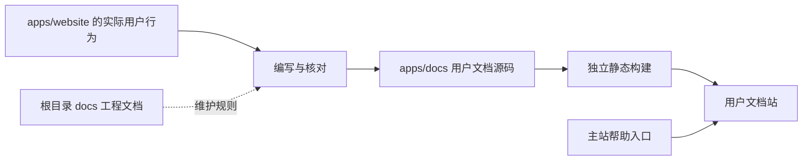

# 用户文档站

> 状态：已完成。用户帮助站已迁移到 VitePress 默认主题，并完成生产构建与浏览器验收。

## 背景

项目现有 `docs/` 面向开发者和 agent，记录架构、协作规范、质量门槛、ADR 与执行计划。随着网站功能趋于完整，明暗模式、皮肤、发帖、消息、收藏和个人设置等用户可见行为也需要稳定说明。目前相关信息散落在代码和迁移计划中，普通用户无法直接查阅，功能调整时也缺少对应的文档维护入口。

用户文档需要和代码在同一仓库内维护，但它有独立的读者、导航、构建和发布需求。因此将文档站作为 monorepo 中的应用，目标位置为 `apps/docs`，不放入面向工程准则的根目录 `docs/`，也不作为供其他应用依赖的 `packages/*` 公共包。

## 目标

- 在 `apps/docs` 建立面向普通用户的中文帮助文档站。
- 让用户可以从主站进入文档站，并按任务查找登录、阅读、发帖、消息、账号和主题设置说明。
- 让用户可见行为与文档同源维护，功能变更时能明确判断是否需要同步文档。
- 将文档构建、链接检查和主要页面验证纳入项目质量流程。
- 保持文档站与 `apps/website` 的应用边界，不复制业务逻辑，不依赖网站内部源码。

## 非目标

- 首期不迁移现有开发者文档、ADR、执行计划和 API 契约说明。
- 首期不建设多语言、版本化文档、评论系统或复杂内容管理后台。
- 不从 TypeScript 类型、路由或组件注释自动生成用户文档正文。
- 不未经验证直接搬运旧论坛帮助内容，所有说明以当前网站的实际行为为准。

## 边界与内容流

`apps/website` 是功能事实源，`apps/docs` 负责将已经落地的行为转换成用户可以执行的说明。两者可以依赖公共 `packages/*`，但 `apps/docs` 不直接导入 `apps/website/src`。如果后续确实出现需要共享的稳定数据，应先判断它是否属于公共包，而不是为了文档方便打破应用边界。

根目录 `docs/` 继续服务开发者和 agent。用户文档的协作要求写入现有工程准则，但用户正文、图片和文档站配置都归入 `apps/docs`。

## 站点与目录方案

应用结构如下：

- `apps/docs/package.json`：独立的开发、构建和检查命令。
- `apps/docs` 下的站点配置：导航、侧栏、站点标题、链接和构建选项。
- `apps/docs/content/guide/`：入门、阅读、搜索、发帖和回复。
- `apps/docs/content/account/`：个人内容、收藏、关注和浏览历史。
- `apps/docs/content/messages/`：回复、提及、系统通知和私信。
- `apps/docs/content/appearance/`：皮肤、明暗模式和日夜自动切换。
- `apps/docs/content/faq/`：权限、网络错误、内容显示和常见操作问题。
- `apps/docs/public/`：经过筛选的截图和其他静态资源。

文档站使用 VitePress 2 和默认主题。标题、导航和侧栏集中在 `apps/docs/.vitepress/config.ts`，正文保留在 `apps/docs/content`。本地搜索、目录、亮暗模式、死链检查、静态页面和站点地图由 VitePress 提供，长期决策记录在 ADR 0003。

## 内容设计

### 首批文档

首批内容按用户任务组织，不照搬网站代码模块：

- 开始使用：登录、退出和基本导航。
- 浏览论坛：版面、主题、楼层、热门、新帖、推荐和搜索。
- 发表内容：发主题、回复、编辑、Markdown、图片和附件。
- 管理个人内容：主题、回复、收藏、关注、浏览历史和自定义版面。
- 查看消息：回复、提及、系统通知、私信和消息设置。
- 调整外观：选择皮肤、手动明暗模式、跟随浏览器和固定时间切换。
- 常见问题：权限不足、登录失效、网络错误、内容无法显示和写入失败恢复。

外观设置作为第一篇样板文档。它需要准确说明手动模式与自动日夜切换的优先级、浏览器模式同步、固定时间和跨午夜规则、登录用户的服务端保存，以及没有亮暗配对的皮肤如何表现。正文使用界面名称，不暴露 `ThemeSetting`、Pinia 或 API 字段。

### 写作约定

- 一篇文档解决一个明确任务，标题使用用户会搜索的说法。
- 操作步骤引用真实按钮、菜单和页面名称，并说明完成后的可见结果。
- 涉及登录、管理员、版主或主题作者权限时，在操作前说明适用条件。
- 错误处理写用户可以采取的下一步，不展示内部异常、接口路径或实现细节。
- 截图只用于文字难以说明的空间关系或复杂操作。截图必须来自当前界面，避免依赖容易变化的整页画面。
- 文档可以记录关联的主站路由或功能域作为维护元数据，但这些信息不显示在用户正文中。
- 文档语言遵循项目中文规范，写作和审稿使用项目内的 write skill。

## 实施步骤

### 阶段一：框架与发布方式确认

- [x] 确认 VitePress 2 与项目当前的 Vite、Vue 和 VueUse 版本兼容。
- [x] 确认按独立域名和根路径发布，并验证静态资源、刷新和深层链接。
- [x] 验证中文本地搜索、站内链接检查和主站设计规范的复用边界。
- [x] 在 ADR 0003 记录长期构建边界。

### 阶段二：应用骨架

- [x] 创建 `apps/docs`，补齐 `dev`、`build` 和 `preview` 命令。
- [x] 使用 VitePress 默认主题建立首页、导航、侧栏、搜索、404 页面和中文界面文案。
- [x] 确认 `vp install`、根目录 `vp check` 和 `vp run ready` 能覆盖文档应用。
- [x] 更新 `ARCHITECTURE.md`，将 `apps/docs` 加入模块布局和应用边界。

### 阶段三：内容基线

- [x] 建立内容目录、页面模板和维护元数据约定。
- [x] 完成外观设置样板文档，并根据代码和测试核对日夜切换行为。
- [x] 补齐登录、阅读、发帖、消息、账号设置和常见问题的首批文档。
- [x] 检查术语与主站用户可见文案一致，删除实现术语和迁移过程描述。

### 阶段四：主站接入与发布

- [x] 在主站顶部导航增加“帮助”入口，默认链接到 `https://cc98-docs.vercel.app`，支持构建时覆盖。
- [x] 确认根路径下的导航、资源、深层链接和错误页正常。
- [x] 建立独立的 Vercel 项目和 PR 自动预览，不影响主站现有发布。
- [x] 文档站使用独立产物和部署记录，可以单独回滚。

### 阶段五：维护机制

- [x] 在 `AGENTS.md` 增加用户文档入口和按需阅读说明。
- [x] 在 `docs/collaborating.md` 规定用户可见行为变化时同步检查文档。
- [x] 在 `apps/docs/.vitepress/config.ts` 维护站点导航和侧栏。
- [x] 将格式、站内死链和构建检查纳入质量流程。

### 阶段六：收敛到默认 VitePress

- [x] 将分支 rebase 到当前 `main`，保留主线新增依赖与执行计划索引。
- [x] 删除自建 Vue 页面、路由、搜索、内容构建器、测试和自定义样式。
- [x] 迁移现有 Markdown 内容并启用 VitePress 本地搜索、侧栏和站点地图。
- [x] 重新检查亮暗模式、桌面端、窄屏目录、搜索和 404。
- [x] 运行质量门槛并完成浏览器验收。

## 验证

- 文档应用可以独立开发和构建，主站构建不依赖文档站运行。
- 首页、目录、侧栏、站内链接、深层链接、404 页面和静态资源在目标部署路径下正常。
- 匿名用户可以访问全部公开帮助内容，文档站不依赖 CC98 登录状态。
- 外观设置样板与当前实现一致，覆盖手动模式、浏览器同步、固定时间、跨午夜和保存行为。
- 文档在亮色和深色下可读；桌面端和移动端主要视口无横向溢出。
- `vp check`、相关测试、文档构建、链接检查和 `vp run ready` 通过。

验证记录：

- 2026-07-20：`vp check` 通过，441 个文件格式正确，281 个文件无 lint 或类型错误。
- 2026-07-20：`vp run ready` 通过。VitePress 完成静态页面、站内死链和站点地图构建；Utils 1 项、UBB 187 项、API 17 项、网站 282 项测试全部通过。
- 2026-07-20：使用 `agent-browser` 验收默认主题首页、外观说明、中文本地搜索、亮暗模式、390 px 移动端目录和生产 404。生产预览无控制台错误，首页、深层页面和 favicon 返回 200，不存在路径返回 404。
- 2026-07-20：Vercel 项目 `cc98-docs` 首次部署完成。`https://cc98-docs.vercel.app` 的首页、深层页面和 favicon 返回 200，不存在路径返回 404；云端搜索、移动端页面和控制台检查通过。

## 遗留项

- 文档站当前使用 Vercel 默认域名。以后接入自定义域名时，需要同步修改 `DOCS_SITE_URL` 和主站构建变量。
- 用户文档最主要的长期风险是与实际行为脱节，需要通过协作规则、关联清单和 Review 约束降低漂移。
- 截图更新成本较高，首批文档应以文字为主，并限制截图范围。
- 管理和版务帮助尚未进入首批内容，后续编写前需要用对应身份验证。

## 进展与调整

- 2026-07-17：确认用户文档作为独立应用规划在 `apps/docs`，本轮只编写执行计划，不创建应用、不选择最终框架。
- 2026-07-18：用户要求仓库完全排斥 `markdown-it`，VitePress 不再适用，改用 Vue、Vue Router 和 remark 自建静态站。
- 2026-07-18：完成七篇首批文档、导航、搜索、404、明暗模式、静态深层链接、主站帮助入口和 GitHub Pages 手动发布流程。
- 2026-07-18：浏览器验收中修复移动端折叠目录仍可聚焦、搜索按钮缺少可访问名称两个问题。
- 2026-07-18：`vp run ready` 通过。文档应用 2 项测试、UBB 187 项测试、API 17 项测试、网站 281 项测试全部通过。
- 2026-07-20：评审确认原视觉偏向通用产品文档站，与 CC98 的皮肤、密度和面板语言不一致。分支已 rebase 到当前 `main`，开始保留功能管线并重写视觉层。
- 2026-07-20：完成夏季皮肤横幅、主站 Logo、48px 顶栏、1140px 版心和 `solid` 面板重写。浏览器验收中修复首页与 404 在窄屏下误显示目录按钮的问题。
- 2026-07-20：用户确认帮助站不需要延续主站视觉，要求使用开箱即用的 VitePress。删除自建页面和样式，改用 VitePress 2 默认主题。
- 2026-07-20：默认主题在桌面端、移动端、亮暗模式、搜索和生产 404 下验收通过，执行计划完成归档。
- 2026-07-20：建立独立 Vercel 项目 `cc98-docs`，改用 `vercel.app` 域名和 PR 自动预览，删除未启用的 GitHub Pages 工作流。

## 决策记录

- 2026-07-17：用户文档站归入 `apps/docs`，因为它拥有独立页面、构建产物和发布入口，不属于可复用公共包。
- 2026-07-17：根目录 `docs/` 继续存放工程准则和实施记录，不承载用户文档正文。
- 2026-07-17：用户文档以当前网站行为为事实源，不从旧站文档或代码结构自动推导正文。
- 2026-07-20：用户文档站使用 VitePress 2 和默认主题，不新增主题覆盖、页面组件或自定义样式，详见 ADR 0003。
- 2026-07-20：文档站使用独立 Vercel 项目，项目根目录为 `apps/docs`，不复用主站的构建配置。
