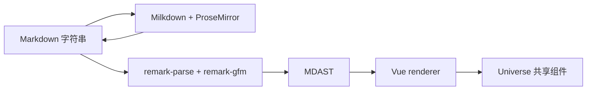

# Milkdown 与 remark 全量迁移

> 状态：已完成。编辑器已迁移到 Milkdown，阅读侧已改用 remark/MDAST，生产依赖和源码不再使用 `md-editor-v3` 与 `markdown-it`。

## 背景

现有写作组件使用 `md-editor-v3`，阅读侧由 `markdown-it` 解析后映射到 Vue 与 `Universe*` 组件。前期调研已经验证 Milkdown Kit、CommonMark、GFM、中文输入、撤销重做和 Markdown 序列化的可行性。用户在 2026-07-18 确认进入生产迁移，并要求编辑和阅读统一使用 remark 语法体系，仓库不再依赖 `markdown-it`。

这次迁移同时改变编辑器和阅读解析器，必须保留现有上传、草稿、长度提示、URL 安全、图片计数和 UBB 内嵌 Markdown 行为。两条链路共享语法边界，但不共享 UI 状态：Milkdown 负责编辑态的 ProseMirror document，阅读侧直接遍历 MDAST 并复用 `Universe*` 组件。

## 目标

- 使用 `@milkdown/kit` 按需组装 CommonMark、GFM、history、listener 和 upload，不引入 Crepe 完整入口。
- 保持 `MarkdownEditor` 的 `v-model`、禁用态、字数限制、图片上传、附件上传和错误提示契约。
- 使用 `remark-parse` 与 `remark-gfm` 生成 MDAST，替换阅读侧 token renderer。
- 保留链接和图片 URL 校验，原始 HTML 只作为文本显示。
- 覆盖标题、段落、强调、删除线、引用、列表、任务列表、表格、代码、链接、引用链接、图片、换行和原始 HTML。
- 删除 `md-editor-v3`、`markdown-it`、`@types/markdown-it` 及其锁文件依赖。
- 更新前端规范、依赖说明、架构说明和长期 ADR。

## 非目标

- 不改变后端 Markdown 字符串和 `contentType` 契约。
- 不把编辑器改造成完整文档协作系统，不加入评论、多人协作或版本历史。
- 不同时重写 UBB parser；UBB 内嵌 Markdown 继续调用统一的 Markdown renderer。
- 不为了还原 Crepe 的完整工具栏引入大体积 UI、CodeMirror 语言包或 KaTeX 编辑组件。

## 方案

编辑器直接在 Vue 生命周期中创建和销毁 Milkdown `Editor`，避免 `@milkdown/vue` 对 Crepe 的直接依赖。`listener.markdownUpdated` 负责向外同步 Markdown；父组件异步恢复草稿或切换内容时，通过 `replaceAll` 更新编辑器，并避免回写循环。图片拖放和粘贴使用 upload plugin，显式上传按钮调用同一上传函数后插入图片节点。附件仍插入普通 Markdown 链接。

阅读侧建立纯函数 `parseMarkdown`，由统一 processor 解析 CommonMark 和 GFM。renderer 按 MDAST 节点类型递归生成 Vue 节点，引用链接先从 root 收集 definition，再解析 `linkReference` 和 `imageReference`。HTML 节点输出原文文本，不经过 `v-html` 或 rehype raw parser。

## 实施步骤

### 阶段一：固定依赖与长期边界

- [x] 加入 Milkdown Kit、remark、GFM、unified 和 MDAST 类型依赖。
- [x] 新增 Markdown 技术栈 ADR，更新 `docs/frontend.md` 与 `docs/dependency.md`。
- [x] 建立依赖检查，确认业务依赖和锁文件不再包含 `markdown-it` 与 `md-editor-v3`。

### 阶段二：迁移阅读侧

- [x] 新增 remark processor 和 MDAST renderer。
- [x] 覆盖原有 Markdown 测试，并补齐 GFM、引用链接、任务列表和 HTML 降级测试。
- [x] 删除 markdown-it parser、token renderer 和类型依赖。

### 阶段三：迁移编辑器

- [x] 使用 Milkdown Kit 实现编辑器挂载、销毁、双向同步和禁用态。
- [x] 接入图片按钮、拖放、粘贴上传和附件插入。
- [x] 保留上传错误、字数提示、主题模式和表单禁用行为。
- [x] 验证创建主题、回复和编辑帖子三个入口。

### 阶段四：质量与浏览器验收

- [x] 运行 `vp check`、website 测试、构建和 `vp run ready`。
- [x] 检查构建产物，确认编辑器仍在写作路由懒加载，主阅读入口不携带 Milkdown。
- [x] 用浏览器验证中文输入、撤销重做、标题、列表、表格、代码块、链接、图片、附件和草稿恢复。
- [x] 核对仓库依赖和源码，不再存在生产用 `markdown-it` 或 `md-editor-v3`。

## 验收标准

- Markdown 阅读输出保持现有安全策略和共享组件行为，新增 GFM 节点可正常显示。
- 三个写作入口都能编辑和提交 Markdown，图片与附件上传契约保持不变。
- 父组件恢复草稿或重置正文后，Milkdown 内容与 `modelValue` 一致，不产生循环更新。
- 禁用态不能修改文档或触发上传，字数超限提示仍按原字符串长度计算。
- `apps/website/package.json`、workspace catalog 和锁文件没有 `markdown-it`、`@types/markdown-it` 或 `md-editor-v3`。
- `vp run ready` 通过，浏览器验收无阻塞问题。

## 进展与调整

- 2026-07-18：确认使用 `@milkdown/kit@7.21.3`，不使用依赖 Crepe 的 `@milkdown/vue`；Vue 组件直接管理 Editor 生命周期。
- 2026-07-18：确认阅读侧使用 `remark-parse@11`、`remark-gfm@4` 和 `unified@11`，直接渲染 MDAST，不把不受信任的原始 HTML 转成 DOM。
- 2026-07-18：浏览器验收发现原生 `window.prompt` 不适合作为链接输入交互，已改为编辑器内的可访问表单。
- 2026-07-18：三个写作入口继续复用同一个 `MarkdownEditor` 契约，提交 mutation 和后端 `contentType=1` 契约未改。验收未创建真实论坛内容。

## 决策记录

- 2026-07-18：编辑器和阅读侧统一采用 remark 语法体系，删除 markdown-it。
- 2026-07-18：Milkdown 只按需引入 Kit 能力，不采用 Crepe 完整入口。
- 2026-07-18：阅读 renderer 直接消费 MDAST 并复用 Universe 组件，不先生成 HTML 字符串。

## 验证结果

- `rg` 检查确认应用、公共包、workspace catalog 和锁文件中没有旧编辑器或旧解析器依赖。
- 富内容测试覆盖 GFM、引用链接、脚注、任务列表、原始 HTML 降级和危险 URL。
- 浏览器在隔离的开发验收页验证中文输入、撤销重做、外部草稿恢复、标题、列表、表格、代码块、链接、图片、附件、字数统计和禁用态。验收页随后删除，没有进入提交。
- 构建产物中 Milkdown 位于写作路由懒加载 chunk，阅读入口继续使用独立的 remark 解析链路。
- `vp run ready` 通过。

## 遗留项

没有阻塞遗留。未来升级 Milkdown 或 remark 时，按 ADR 0003 重新检查 Markdown 往返、MDAST 节点覆盖和写作路由体积。
