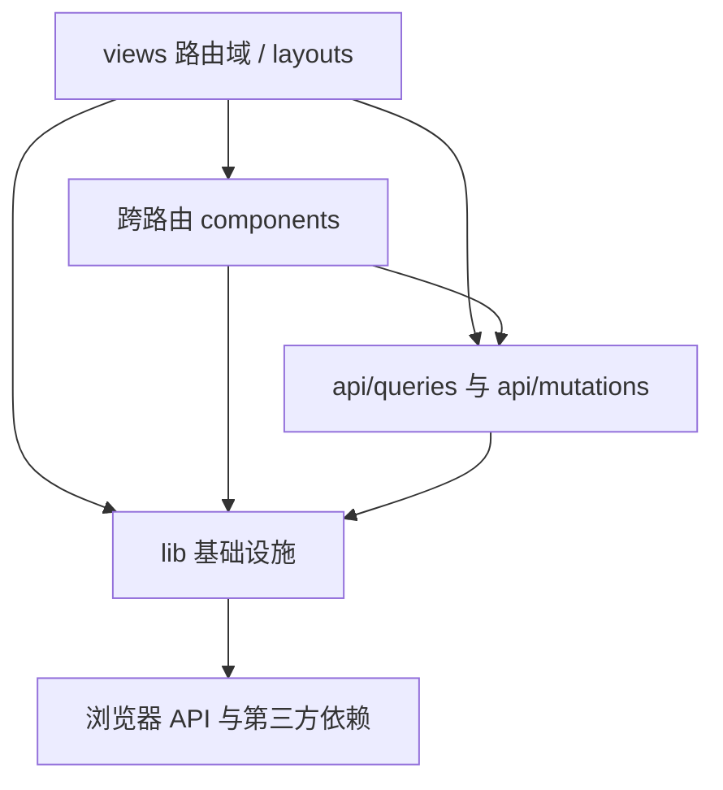

# 网站业务逻辑所有权迁移

> 状态：已完成。业务代码、测试入口、工程文档、完整质量门禁和登录态只读浏览器回归均已验收。

## 背景

CSS 所有权迁移已经把页面和组件样式从 `styles/global.css` 收回对应 SFC。迁移计划当时明确排除了 `apps/website/src/lib/`，要求领域逻辑另开计划处理。

当前 `lib/` 有 26 个文件，共 2113 行。按现有职责划分，其中 9 个文件、771 行属于认证、请求、错误、日志、查询客户端和路由参数等基础设施；另外 17 个文件、1342 行按首页、版面、主题、消息、用户中心和管理功能命名，实际承载页面状态解析、展示模型、表单校验、请求变量、组件配置和本地偏好。

这批业务文件不是一次提交产生的。2026-07-17 的高保真恢复新增了 11 个，较早的阅读、发现、写作、消息和用户中心迁移已经留下 6 个。只清理高保真提交会保留同类问题，因此本计划按当前职责统一处理，不按提交日期分两套标准。

调研基线为 `fa6f573`。当前直接消费关系如下：

| 类型       | 文件                                                                                                                                       | 行数 | 调研结论                                                             |
| ---------- | ------------------------------------------------------------------------------------------------------------------------------------------ | ---: | -------------------------------------------------------------------- |
| 基础设施   | `api-error.ts`、`auth.ts`、`http.ts`、`logger.ts`、`login-redirect.ts`、`oauth.ts`、`query-client.ts`、`route-params.ts`、`token-store.ts` |  771 | 继续留在 `lib/`，其中 `route-params.ts` 做一次小范围去重和死代码清理 |
| 单一所有者 | `annual-review.ts`、`avatar-frame.ts`、`board-view.ts`、`full-page-status.ts`、`topic-view.ts`                                             |  301 | 迁到对应 View 或组件旁边，不引入新的公共层                           |
| 领域内复用 | `board-list.ts`、`drafts.ts`、`home.ts`、`message-realtime.ts`、`message-settings.ts`                                                      |  245 | 迁到现有领域目录，复用关系稳定的部分保留独立模块                     |
| 混合职责   | `discovery.ts`、`interactions.ts`、`messages.ts`、`moderation.ts`、`site-manage.ts`、`user-center.ts`、`user-management.ts`                |  796 | 拆分后分别归还 View、组件、查询或 mutation，不保留同名替代文件       |

17 个业务模块中，15 个已有直接单元测试。`message-realtime.ts` 和 `message-settings.ts` 没有直接覆盖。现有测试可以保护大部分路径迁移，但混合职责拆分和两个未覆盖模块仍需要补充针对性回归。

`views/` 目前共有 34 个路由 SFC，其中 20 个直接放在根目录，10 个根目录 View 超过 400 行。`messages/` 和 `user-center/` 已经按路由族分组，版面、主题、发现和写作仍把路由页与页面私有组件分散在 `views/` 根目录和顶层 `components/`。本计划同时收敛这些目录边界，避免把 `lib/` 的扁平问题转移到 `views/`。

## 目标

- `lib/` 只保留跨页面基础设施，不再出现按页面或业务功能命名的模块。
- 单一 View 或组件消费的逻辑放到所有者旁边；多个同域消费者共享的逻辑放在已有领域目录。
- 按路由族组织 `views/`。只被一个路由族使用的 SFC 和辅助模块下沉到该目录，顶层 `components/` 只保留跨路由稳定复用的组件。
- API 请求变量和缓存同步由 `api/queries/`、`api/mutations/` 持有，API 层不依赖 `views/` 或 `components/`。
- 拆散 `discovery.ts`、`interactions.ts`、`messages.ts`、`user-center.ts` 等混合文件，删除只为减少重复 import 而存在的宽泛模块。
- 第一轮迁移保持路由、请求、query key、存储 key、文案、样式和交互行为不变。
- 完成所有权迁移后，再做已在本计划中列明的小范围合并和重构，不顺手扩展功能。

## 非目标

- 不修改 CSS，不进行 UnoCSS 转换，也不调整现有视觉样式。
- 不修改 `@cc98/api` 公共 schema、operation registry 或真实接口协议。
- 不新建顶层 `features/`、`domains/`、`shared/` 或 `utils/` 目录。现有目录足以表达本轮所有权，新增通用层只会把问题换个名字。
- 不为每个路由机械建立单文件目录。只有同一路由族包含多个 View，或单个 View 已经拥有多个私有组件和辅助模块时才建立目录。
- 不把所有纯函数都内联到 Vue SFC。大型 View、复杂分支和已有单元测试的逻辑可以保留为同目录 TS 文件。
- 不为旧 `lib` 路径保留转发导出。每个迁移切片同时更新生产代码和测试，避免兼容层长期残留。
- 不调整 Header 的 `UiBadge` 通知样式和未读展示行为。

## 所有权规则

### 单一消费者就近放置

只有一个 View 或组件使用的逻辑，优先成为同目录 sibling module。逻辑很短、没有独立分支测试价值时可以直接内联；大型数据表、路由状态解析和复杂校验继续放在 TS 文件中，避免把已经很大的 SFC 继续撑大。

### 路由族持有页面私有组件

同一路由族包含多个 View，或一个 View 已经拥有多个私有 SFC 和辅助模块时，在 `views/<domain>/` 下建立目录。路由入口放在域目录根部，页面私有组件放入 `components/` 子目录，辅助模块使用 `navigation.ts`、`form.ts`、`time.ts` 等职责名称，不创建宽泛的 `helpers.ts` 或 `utils.ts`。

当前确认需要建立或保留的路由族包括 `annual-review/`、`board/`、`discovery/`、`messages/`、`site-manage/`、`topic/`、`user-center/`、`user-manage/` 和 `writing/`。`PageState`、`Pagination`、`FullPageStatus`、`MarkdownEditor`、`HomeAdvertisement`、用户头像组件、`ui/` 和 `rich-content/` 等跨路由组件继续留在顶层 `components/`。

组件是否下沉按实际消费关系判断，不按未来可能复用判断。通用语义稳定、即使当前消费者较少也明显属于基础 UI 原语的组件可以继续留在顶层。路由域之间不互相 import 页面私有模块。

### 复用按业务语义判断

多个文件调用同一个函数不等于它应该进入通用 `lib/`。只有调用方属于同一业务语义，且函数表达的是稳定概念时才保留独立模块。首页栏目模型、消息偏好、用户中心导航和发现列表格式化符合这个条件。

跨业务域但只剩一行表达式的逻辑通常直接留在消费者中。`totalUnreadCount` 不再为复用次数单独建立业务工具文件。权限判断是例外，即使实现很短，也要保留单一入口，避免 Router guard 和界面入口出现不同条件。

### 请求契约由 API 层持有

mutation 的变量类型属于 mutation 的调用契约。版务、用户管理和站点管理的 request 类型迁入对应 mutation 模块，表单校验留在组件或 View 旁边。这样 API 层不需要反向 import UI 目录，UI 也不再通过 `lib/` 间接定义请求形状。

### 基础设施依赖保持单向

迁移后依赖方向保持如下：

`lib/` 不 import `api/`、`views/`、`components/` 或 `stores/`。`api/` 不 import `views/`、`components/` 或 `stores/`。同域辅助模块不能成为新的跨域总入口，路由域之间也不通过彼此的私有目录复用逻辑。

## 文件迁移与重构清单

### 保留在 `lib/`

| 文件                                    | 处理                                                                                                                                                           |
| --------------------------------------- | -------------------------------------------------------------------------------------------------------------------------------------------------------------- |
| `api-error.ts`                          | 保留。它统一处理 Fetch、Zod 和未知错误，是跨页面错误基础设施。                                                                                                 |
| `auth.ts`、`oauth.ts`、`token-store.ts` | 保留认证协议、存储和编排边界。                                                                                                                                 |
| `http.ts`                               | 保留请求客户端和 token 注入。                                                                                                                                  |
| `logger.ts`                             | 保留唯一日志入口。                                                                                                                                             |
| `query-client.ts`                       | 保留 Vue Query 全局配置和错误记录。                                                                                                                            |
| `login-redirect.ts`                     | 保留登录来源页的安全存储和恢复。                                                                                                                               |
| `route-params.ts`                       | 保留跨页面路由参数、页码和楼层定位基础能力；合并当前 `user-center.ts` 中被多域使用的 `pageCount`，删除没有生产消费方的 `resolveBoardPage` 和 `boardPagePath`。 |

目标状态下 `lib/` 只包含以上 9 个文件。实施中若发现某个文件需要 import 业务 API 或 UI 模块，应停止该切片并重新判断所有权，不以完成数量为目标硬搬。

### 直接迁移到所有者旁边

| 当前文件              | 目标位置                                  | 处理方式                                                                                                                                |
| --------------------- | ----------------------------------------- | --------------------------------------------------------------------------------------------------------------------------------------- |
| `annual-review.ts`    | `views/annual-review/pages.ts`            | `AnnualReviewView.vue` 同步迁入该路由域。保留年度页面序列、时段、胜率和成就解析，不内联这 54 行分支逻辑。                               |
| `avatar-frame.ts`     | `components/user/avatar-frame.ts`         | 头像框映射由 `FramedAvatar.vue` 持有。数据表保留独立文件，外部消费者只使用组件。                                                        |
| `board-view.ts`       | `views/board/navigation.ts`               | `BoardView.vue` 和 `BoardListView.vue` 迁入 `views/board/`，视图模式、标签和路径由该路由域持有。                                        |
| `full-page-status.ts` | `components/full-page-status.ts`          | 状态配置和类型与 `FullPageStatus.vue` 同目录，`StatusView.vue` 只消费公开类型。                                                         |
| `topic-view.ts`       | `views/topic/navigation.ts`               | `TopicView.vue` 迁入 `views/topic/`，主题筛选模式、查询参数和用户 ID 收集先原样迁移；用户 ID 收集在发现列表重构时再判断是否合并。       |
| `drafts.ts`           | `stores/drafts.ts`                        | 发主题、编辑和主题回复共享同一草稿协议，属于浏览器持久化状态。存储 key 和读写行为保持不变，不要求本轮改写成 Pinia。                     |
| `home.ts`             | `components/home/model.ts`                | 首页栏目可见性、链接和资源地址归一化由首页组件域持有。Board 与 Topic 已直接复用 `HomeAdvertisement`，继续消费同一模型是明确的领域复用。 |
| `message-realtime.ts` | `components/messages/message-realtime.ts` | 新建 `components/messages/`，同时把 `MessageRealtimeController.vue` 移入该目录，让连接生命周期和服务实现成为同一个所有权单元。          |
| `message-settings.ts` | `stores/message-settings.ts`              | 消息设置页写入、主题页读取，属于浏览器持久化偏好。存储 key `noticeSetting` 和默认值不变，不要求本轮改写成 Pinia。                       |

`board-list.ts` 拆成两个所有者。图标 URL、失败回退和 `` 行为收敛到 `components/board/BoardIcon.vue`，供版面页和 `MyBoardsView.vue` 复用；分组锚点和紧凑分区判断迁到 `views/board/list.ts`，只服务版面列表结构。`BoardHeader.vue`、`BoardEventList.vue`、`BoardBatchModerationDialog.vue`、`TopicList.vue`、`TopicListItem.vue`、`BoardListGroup.vue`、`BoardListItem.vue` 和 `TopicStateIcon.vue` 迁入 `views/board/components/`。

### 拆分 `discovery.ts`

`discovery.ts` 同时包含热门周期、新帖视图、关注路由、搜索参数、用户路径、列表去重和时间格式。目标是删除该文件，不创建另一个同规模的 `views/discovery.ts`。

| 现有职责                         | 目标所有者                                                 |
| -------------------------------- | ---------------------------------------------------------- |
| `HotPeriod`、`FocusMode`         | `api/discovery.ts`，供 query key、查询实现和 UI 共同消费   |
| 热门标题和路由 meta 校验         | `views/discovery/hot-topics.ts`                            |
| 新帖视图模式、偏好值和 URL       | `views/discovery/new-topics.ts`                            |
| 关注模式、版面参数和 URL         | `views/discovery/focus.ts`                                 |
| 搜索关键词、版面参数和搜索路由   | `router/links.ts`，供 Header、搜索 View 和 Router 共同消费 |
| 用户 ID 和用户名路由             | `router/links.ts`，供公开用户页和主题列表复用              |
| 主题去重、版面 ID 和用户 ID 收集 | `views/discovery/topics.ts`                                |
| 相对时间和绝对时间格式           | `views/discovery/time.ts`                                  |

`HotTopicsView.vue`、`NewTopicsView.vue`、`FocusView.vue`、`RecommendedTopicsView.vue`、`SearchTopicsView.vue` 和 `SearchBoardsView.vue` 迁入 `views/discovery/`。`NewTopicCard.vue`、`NewTopicClassicItem.vue`、`RecommendedTopicItem.vue` 和 `SearchEmptyState.vue` 迁入 `views/discovery/components/`。`api/queries/keys.ts` 只消费发现契约，不作为业务类型的公共入口。

### 拆分 `interactions.ts`

这个文件没有稳定的统一语义，实施后直接删除：

| 现有职责                 | 目标所有者                                                        |
| ------------------------ | ----------------------------------------------------------------- |
| `nextLikeState`          | `api/mutations/post.ts`，它只服务点赞 mutation 的乐观缓存         |
| `availableRatingReasons` | 内联到 `PostRatingDialog.vue` 的 computed，筛选表达式不再单独抽象 |
| `validateCreateVote`     | `views/writing/create-topic.ts`，服务发主题表单                   |
| `createVotePayload`      | `views/topic/topic-vote.ts`，服务页面私有的 `TopicVotePanel.vue`  |
| 附件 Markdown 转义和拼接 | `components/markdown-editor.ts`，服务 `MarkdownEditor.vue`        |

`CreateTopicView.vue` 和 `EditPostView.vue` 迁入 `views/writing/`。`PostItem.vue`、`PostActions.vue`、`PostRatingDialog.vue`、`TopicFavoriteAction.vue`、`TopicVotePanel.vue` 和当前 `components/topic/` 下的 SFC 迁入 `views/topic/components/`。`MarkdownEditor.vue` 同时服务写作页、主题回复和私信，继续留在顶层 `components/`。

### 拆分消息逻辑

`messages.ts` 按两个路由页面拆分：通知描述、计数和跳转放入 `views/messages/notifications.ts`；私信分页合并和已读同步放入 `views/messages/private-messages.ts`。Header 的未读总数直接在 computed 中相加，不保留只有一行的共享函数。

实时连接迁入 `components/messages/`，消息设置迁入 `stores/message-settings.ts`。`message-realtime.ts` 在迁移后抽出可独立测试的 query 失效函数，保持 SignalR 地址、事件名、重连间隔和失败降级不变。

### 拆分用户中心逻辑

`user-center.ts` 由多个互不相关的辅助函数组成，实施后删除：

| 现有职责                         | 目标所有者                                                       |
| -------------------------------- | ---------------------------------------------------------------- |
| 用户中心页码、查询参数和路径生成 | `views/user-center/navigation.ts`                                |
| 收藏分组、排序和关键词归一化     | `views/user-center/favorites.ts`                                 |
| 生日拆分、合并和资料校验         | `views/user-center/settings.ts`                                  |
| 帖子摘要生成                     | `components/post-summary.ts`，供我的发言和私信预览复用           |
| `pageCount`                      | 合并到 `lib/route-params.ts`，它已经被用户中心和消息分页共同使用 |
| `orderByIds`                     | 内联到 `FollowersView.vue`，当前只有一个生产消费者               |

`parseUserCenterPage` 和 `userCenterPagePath` 有多个用户中心 View 消费，保留独立导航模块符合稳定复用条件。收藏和资料设置只在各自页面使用，不合并成新的用户中心总工具文件。

### 拆分版务、站点管理和用户管理

`moderation.ts` 的 mutation request 类型迁入 `api/mutations/moderation.ts` 并由该模块导出。主题、楼层和批量管理的校验分别迁到 `views/topic/components/` 和 `views/board/components/` 中对应 Dialog 的 sibling module。`isBoardManager`、主题作者权限和楼层管理权限放入 `components/moderation/access.ts`，供 Board 与 Topic 页面复用。`flattenModerationBoards` 和表单展示条件留在主题管理 Dialog 旁边。

`site-manage.ts` 拆成四部分：`SiteManageColumnKind` 和栏目 API 路径迁入 `api/site-manage.ts`，供 query key、查询、mutation 和 UI 共同消费；栏目查询由 `api/queries/site-manage.ts` 持有；保存输入和 payload 由 `api/mutations/site-manage.ts` 持有；栏目表单定义、草稿归一化和校验放入 `views/site-manage/form.ts`。`SiteManageView.vue` 同步迁入该路由域。`isSiteAdministrator` 迁入 `stores/user.ts`，Router guard、Header、用户页和站点管理页继续使用同一个权限入口。

`user-management.ts` 的 mutation request 类型迁入 `api/mutations/user-management.ts`，处罚和内容天数校验迁入 `views/user-manage/form.ts`。`UserManageView.vue` 同步迁入该路由域并继续负责表单状态，API 模块只接收已经成形的请求变量。

## 实施顺序

### 阶段 0：固定基线和约束

- [x] 记录 `lib/` 文件清单、行数、生产消费方和测试消费方，作为迁移前快照。
- [x] 确认 Header 使用 `UiBadge` 的通知样式仍在基线中，最终状态纳入浏览器证据。
- [x] 确认本轮不修改 CSS、路由路径、query key、存储 key 和接口请求。
- [x] 执行一次 `vp run ready`，排除迁移前已有失败。
- [x] 执行 `vp exec knip --include files,exports,types`，确认未使用文件、导出和类型均纳入基线。

### 阶段 1：建立路由域目录

- [x] 建立 `annual-review/`、`board/`、`discovery/`、`site-manage/`、`topic/`、`user-manage/` 和 `writing/` 路由域，保留现有 `messages/` 与 `user-center/`。
- [x] 更新 Router 的动态 import，并确认路由 path、name、meta 和 props 不变。
- [x] 将只被单一路由族消费的 SFC 迁入对应 `components/` 子目录。
- [x] 顶层 `components/` 只保留跨路由组件和基础 UI 原语，不新增 barrel export。
- [x] 按新所有者更新测试 import，并拆分发现与消息领域的混合测试；仍保护完整外部工作流的综合测试保留原入口。

目录调整按路由域分切片提交。每个切片只做文件移动和 import 更新，不同时修改模板、样式或业务逻辑。

### 阶段 2：迁移单一所有者和稳定领域模块

- [x] 迁移年度总结、头像框、版面、主题和完整状态页辅助模块。
- [x] 迁移首页模型、写作草稿、消息设置和实时消息模块。
- [x] 迁移版面列表 helper，并在独立重构步骤引入 `BoardIcon.vue` 合并重复回退行为。
- [x] 同步更新测试 import，不修改断言语义。
- [x] 运行网站增量检查和相关 Vitest。

这一阶段只做路径和所有权调整。`BoardIcon.vue` 的组件合并单独提交，避免纯迁移 diff 和模板重构混在一起。

### 阶段 3：拆分发现与路由逻辑

- [x] 把发现判别类型收回 API 域契约。
- [x] 建立发现列表的 ID 收集、去重和时间格式化模块。
- [x] 将热门、新帖和关注状态解析迁到 `views/discovery/`，搜索参数归入共享路由契约。
- [x] 将稳定的搜索和用户路由生成迁入 `router/links.ts`。
- [x] 删除 `lib/discovery.ts`，拆分 `discovery.test.ts` 并保持覆盖范围。

### 阶段 4：拆分写作、互动和消息逻辑

- [x] 将点赞乐观状态迁入 post mutation。
- [x] 将投票、评分和附件逻辑归还对应 View 或组件。
- [x] 删除 `lib/interactions.ts`。
- [x] 拆分通知和私信 helper，删除 `lib/messages.ts`。
- [x] 为消息设置存储边界和实时 query 失效补单元测试。
- [x] 验证 Header 未读徽标、通知跳转、私信入口和主题页楼层跳转；只读回归不主动触发已读写操作。

### 阶段 5：拆分用户中心和管理领域

- [x] 拆分用户中心导航、收藏、资料设置和帖子摘要，删除 `lib/user-center.ts`。
- [x] 将 `pageCount` 合并到 `route-params.ts`，内联单消费者的 `orderByIds`。
- [x] 拆分版务 request、权限和表单校验，删除 `lib/moderation.ts`。
- [x] 拆分站点管理 query、mutation 和表单模型，删除 `lib/site-manage.ts`。
- [x] 拆分用户管理 mutation request 和表单校验，删除 `lib/user-management.ts`。
- [x] 检查 `api/` 不 import `views/`、`components/` 或 `stores/`。

### 阶段 6：清理基础设施边界并更新文档

- [x] 删除 `route-params.ts` 中没有生产消费者的 `resolveBoardPage` 和 `boardPagePath`，更新对应测试。
- [x] 确认 `lib/` 只剩目标 9 个文件，没有业务 re-export 或兼容 shim。
- [x] 执行 `vp exec knip --include files,exports,types`，检查未使用文件、导出和类型。
- [x] 使用 `rg` 检查旧模块名、旧 import 和跨层反向依赖。
- [x] 更新 `docs/frontend.md` 的目录表、`lib/` 依赖图和同域辅助模块规则。
- [x] 实施中没有引入新顶层层级或新的长期依赖方向，本轮不写 ADR。

## 提交切片

建议按下面的边界提交，每个提交都保持可构建、可测试：

1. `refactor(website): 按路由域整理页面目录`
2. `refactor(website): 迁移单一所有者辅助模块`
3. `refactor(board): 收敛版面图标与列表逻辑`
4. `refactor(discovery): 拆分发现与搜索辅助逻辑`
5. `refactor(writing): 收敛写作与互动逻辑`
6. `refactor(message): 收敛消息领域逻辑`
7. `refactor(user): 收敛用户中心与管理逻辑`
8. `refactor(moderation): 收敛版务与站点管理逻辑`
9. `docs(frontend): 更新前端目录边界`

提交数量可以在实施时合并，但不把纯路径迁移、组件模板重构和文档更新揉成一个无法审查的 diff。当前工作区已有的其他计划改动不进入这些提交。

## 验证

### 静态和单元测试

- 每个领域切片完成后运行 `vp check` 和对应 Vitest。
- 所有切片完成后运行 `vp run ready`。
- `vp exec knip --include files,exports,types` 不报告未使用文件、导出或类型。
- `rg` 确认不存在被删除的 `src/lib/<business-module>` import。
- `find apps/website/src/lib -maxdepth 1 -type f` 结果与目标 9 个文件一致。
- `rg` 确认 `apps/website/src/api` 不 import `views/`、`components/` 或 `stores/`。
- `rg` 确认不同 `views/<domain>/` 之间不 import 对方的页面私有模块。
- 现有 15 个业务模块测试按新所有者迁移或拆分，消息设置和实时 query 失效补覆盖。

测试继续保护路由序列化、分页边界、草稿 key、投票校验、通知跳转、管理校验和首页栏目过滤等外部行为。单纯路径变化不新增重复测试。

### 浏览器回归

本轮没有视觉调整，不重跑 CSS 迁移时的完整截图矩阵。对发生组件合并或状态逻辑拆分的页面做定向回归：

- Header：`UiBadge` 未读样式、通知下拉、用户与站点管理入口。
- 首页、版面、主题：广告过滤与轮播、版面图标失败回退、版面和主题筛选 URL。
- 写作：发主题投票校验、附件插入、主题页草稿和编辑页草稿恢复。
- 消息：通知文案和跳转、私信分页合并、已读同步、消息设置影响最新回复跳转。
- 用户中心：分页 URL、收藏筛选、资料生日校验和帖子摘要。
- 管理页面：主题、楼层、版面批量、用户和站点栏目表单校验。
- 状态页与年度总结：条件页面和按钮入口正常。

截图和录屏写入 `.artifacts/browser/2026-07-18-website-lib-ownership-migration/`，不提交仓库。

## 完成标准

- `apps/website/src/lib/` 只剩 9 个基础设施文件。
- 17 个业务模块均已迁移或拆分，旧文件全部删除。
- 路由页和页面私有组件按域归位，顶层 `views/` 与 `components/` 不再承担业务文件堆放职责。
- 没有新增顶层通用目录，也没有 API 到 UI 的反向依赖或路由域之间的私有模块依赖。
- 路由、query key、存储 key、接口请求、样式和用户可见行为保持不变。
- Header 的 `UiBadge` 通知样式保留。
- `docs/frontend.md` 与实现一致。
- `vp run ready` 和定向浏览器回归通过。

## 风险与回滚

最大的风险来自混合职责文件拆分，不是文件移动本身。`discovery.ts`、`moderation.ts` 和 `site-manage.ts` 同时被 API 与 UI 消费，若一次性改完再测试，很难从失败中定位是哪一层的所有权调整造成问题。

每个阶段按领域原子迁移，不保留旧路径转发。某个切片失败时直接回退该切片，前面已经通过验证的领域不受影响。涉及模板合并的 `BoardIcon.vue` 和涉及可测试性调整的实时消息失效函数使用独立提交，必要时可以单独回退，不撤销纯路径迁移。

## 进展与调整

- [x] 2026-07-18：核对 `ARCHITECTURE.md`、`docs/frontend.md`、质量规范、CSS 所有权计划和高保真迁移历史。
- [x] 2026-07-18：统计 26 个 `lib` 文件的行数、直接消费方、测试覆盖和首次提交来源。
- [x] 2026-07-18：确认高保真阶段新增 11 个业务模块，早期迁移另有 6 个同类模块，范围按当前职责统一处理。
- [x] 2026-07-18：形成迁移、合并和拆分方案。
- [x] 2026-07-18：完成用户评审，补充路由域分组、页面私有组件归属、持久化状态和 API 类型边界。
- [x] 2026-07-18：把 Knip 未使用文件检查加入 `vp run ready`，清理 3 个没有生产入口的遗留 SFC。
- [x] 2026-07-18：完成路由域分组、页面私有组件下沉和 17 个业务模块的迁移或拆分，`lib/` 收敛到目标 9 个文件。
- [x] 2026-07-18：拆分发现、通知、私信、实时消息和消息设置测试；网站测试共 28 个文件、279 个用例，通过 `vp run website#test`。
- [x] 2026-07-18：搜索参数规范化同时被 Header、Router 和搜索页使用，实际归入 `router/links.ts`，没有建立计划中的 `views/discovery/search.ts`。
- [x] 2026-07-18：`vp check` 与 `vp exec knip --include files,exports,types` 已通过一次，最终完整门禁和浏览器回归仍待执行。
- [x] 2026-07-18：最终 `vp run ready` 通过，网站 28 个测试文件、279 个用例全部通过，生产构建成功。
- [x] 2026-07-18：完成登录态只读浏览器回归，覆盖 Header、首页、版面、主题、发现、写作表单、消息、用户中心、权限状态页和年度总结，没有发现迁移引入的问题。
- [x] 2026-07-18：完成最终质量门禁、浏览器回归和计划归档。

## 验证结果

- `vp check`：通过，422 个文件格式正确，276 个文件无 lint、类型或其他静态检查错误。
- `vp exec knip --include files,exports,types`：通过，没有未使用文件、导出或类型。
- `vp run ready`：通过，所有 workspace 构建和测试完成。网站测试为 28 个文件、279 个用例，生产构建成功。
- 依赖边界检查：旧业务 `lib` import 为 0，`api/` 没有反向 import `views/`、`components/` 或 `stores/`，不同 `views/<domain>/` 之间没有私有模块依赖。
- `lib/` 文件检查：只剩目标 9 个基础设施文件。
- 浏览器回归：使用登录态会话访问 `http://cc98.localhost:1355`，执行 GET 型导航、搜索、筛选和分页，没有主动提交表单或触发互动 mutation。截图与报告位于 `.artifacts/browser/2026-07-18-website-lib-ownership-migration/`。

## 结果与遗留项

17 个业务模块已经迁移或拆分，旧路径全部删除。路由页和页面私有组件按域归位，顶层 `components/` 保留跨路由稳定复用的组件。`docs/frontend.md` 已同步新的目录边界和依赖方向。

本计划没有遗留的必要交付物。后续若继续拆分综合工作流测试或细化单个路由域，应作为独立维护任务推进，不影响本次迁移验收。

## 决策记录

- 2026-07-18：不新增顶层 feature 或 shared 层，优先使用现有目录和 sibling module。
- 2026-07-18：按路由族建立 `views/<domain>/`，页面私有 SFC 下沉到域内 `components/`，跨路由组件继续留在顶层。
- 2026-07-18：第一轮先迁移所有权，组件合并和混合职责拆分使用独立步骤。
- 2026-07-18：API mutation 自己持有变量契约，表单校验由对应 UI 所有者持有。
- 2026-07-18：发现和站点管理的共享判别类型由 API 域契约持有，不放入 query key 文件。
- 2026-07-18：草稿和消息设置属于浏览器持久化状态，迁入 `stores/`，本轮不强制改写成 Pinia。
- 2026-07-18：不为旧 `lib` 路径保留 re-export，避免迁移完成后仍有两套入口。
- 2026-07-18：`route-params.ts` 继续属于基础设施，只合并已经跨域复用的分页能力并清理无生产消费的导出。
- 2026-07-18：搜索参数规范化属于共享路由契约，与搜索路径一起放入 `router/links.ts`，避免 Router 或顶层 Header 反向依赖页面私有模块。
- 2026-07-18：测试按受保护的外部行为划分。发现和消息的旧综合模块随职责拆分；写作、用户中心和版务的综合工作流测试保留文件入口，只更新到新的所有者路径。
