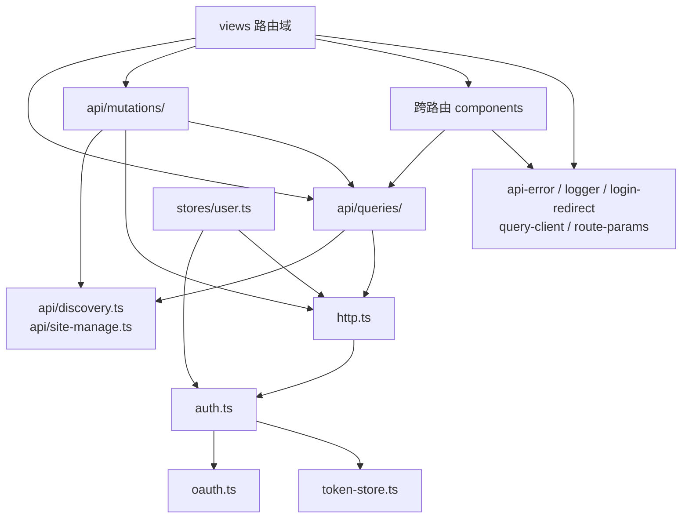

# 前端工程规范

## 目录布局

| 目录           | 职责                                                                                                                  |
| -------------- | --------------------------------------------------------------------------------------------------------------------- |
| `api/`         | 按领域组织 vue-query queryOptions、mutation 和跨查询共享的 API 域契约，schema 直接来自 `@cc98/api`                    |
| `lib/`         | 跨页面基础设施，只包含请求、认证、错误、日志、查询客户端、登录跳转和通用路由参数                                      |
| `stores/`      | 客户端状态与浏览器持久化状态，包括 user、theme、skins、drafts 和 message-settings                                     |
| `router/`      | Vue Router 路由表，以及被多个路由域和顶层组件共同使用的稳定链接构造                                                   |
| `layouts/`     | 页面壳（DefaultLayout）                                                                                               |
| `components/`  | 跨路由稳定复用的组件和基础 UI 原语；单一路由族私有的业务组件不放在这里                                                |
| `views/`       | 路由入口。复杂路由族使用 `views/<domain>/`，页面私有组件放入同域 `components/`，辅助逻辑使用职责明确的 sibling module |
| `composables/` | 组合式函数（占位，尚未使用）                                                                                          |
| `styles/`      | 全局 CSS + CSS 变量（light/dark）                                                                                     |
| `assets/`      | 由 Vue、TypeScript 或 CSS 引用的模块资源，按业务所有者分目录，由 Vite 处理路径和构建指纹                              |

公共包已经导出的函数、类型和常量由应用直接从包入口导入。不要在应用内增加只做重命名或重新导出的转发文件；只有需要组合逻辑、转换参数或封装副作用时才新增模块。

## 静态资源

普通图片放在 `src/assets/`，按业务域命名目录，例如 `board-icons/`、`themes/` 和 `user/avatar-frames/`。Vue 和 TypeScript 使用静态 import；CSS 使用相对路径。文件进入 Vite 依赖图后，生产构建会生成带指纹的 URL，移动或删除资源也能在检查或构建阶段暴露断链。

可枚举的动态资源不能在页面中拼接任意路径。版面图标、皮肤预览等资源族使用范围明确的 `import.meta.glob` 或显式 import 建立注册表，再由所属组件或模块提供名称到 URL 的映射。注册表保持精确匹配，并提供明确的缺失资源处理方式。

`public/` 只保留必须使用固定 URL 的资源，包括浏览器约定的站点根文件，以及会被 API、用户数据或历史内容持久化的兼容地址。当前仅有 `favicon.ico` 和 `/static/images/default_avatar_boy.png`。新增文件前必须说明固定 URL 契约；没有这类契约时，应放入 `src/assets/`。

目录使用英文 kebab-case，并以业务所有者命名，不建立宽泛的 `images/` 或 `misc/`。只有文件名本身参与运行时映射时才保留中文，例如版面名称和头像框名称。

`lib/` 与业务层的依赖方向保持单向：

- `lib/` 固定保留 `api-error.ts`、`auth.ts`、`http.ts`、`logger.ts`、`login-redirect.ts`、`oauth.ts`、`query-client.ts`、`route-params.ts` 和 `token-store.ts`
- `token-store.ts`：纯存储 + 过期判定，不依赖任何内部模块
- `oauth.ts`：OAuth 协议（password/refresh grant），仅依赖 zod
- `auth.ts`：认证编排（登录、懒刷新、登出），依赖 oauth + token-store
- `http.ts`：业务请求客户端（ofetch），依赖 auth 注入 token
- `api/discovery.ts` 和 `api/site-manage.ts`：查询、缓存键、mutation 和 UI 共同使用的窄 API 域契约，不依赖 UI 目录
- `api/queries/`：vue-query queryOptions。`core.ts` 负责站点配置与阅读，`discovery.ts` 负责发现入口，`user.ts` 负责公开用户，`me.ts` 负责当前用户，统一从 `index.ts` 导出
- `api/mutations/`：用户中心等写操作与缓存同步，依赖 http 和 query key

## 路由域与组件所有权

`annual-review/`、`board/`、`discovery/`、`messages/`、`site-manage/`、`topic/`、`user-center/`、`user-manage/` 和 `writing/` 按路由族组织。路由入口放在域目录根部，只被该路由族使用的 SFC 放入域内 `components/`。导航解析、表单校验和展示模型使用 `navigation.ts`、`form.ts`、`time.ts` 等职责名称，不新建宽泛的 `helpers.ts` 或 `utils.ts`。

顶层 `components/` 只保留跨路由稳定复用的组件，例如 `AppHeader`、`Pagination`、`PageState`、`MarkdownEditor`、版面图标、消息实时连接、用户头像、`ui/` 和 `rich-content/`。是否留在顶层按现有消费关系和稳定语义判断，不按未来可能复用判断。不同 `views/<domain>/` 之间不能 import 对方的页面私有模块；需要跨域复用时，应把稳定契约上移到 `api/`、`router/`、`stores/` 或顶层 `components/`。

## 日志与错误诊断

业务模块通过 `createLogger(scope)` 创建日志实例，不直接 import Pino。日志消息描述发生了什么，结构化字段提供定位问题所需的上下文。捕获到的异常统一放在 `err` 字段，不只记录 `error.message`。

查询和写操作由 vue-query 的全局缓存记录失败信息。查询日志包含 query key 和重试次数；Vue 运行时、路由、浏览器全局错误和未处理的 Promise 拒绝由应用入口兜底。业务代码只在需要补充领域上下文或错误已经被消费时主动记录，重复传递的同一 Error 对象不会反复输出。

浏览器日志会输出一段可直接搜索、复制的文本，并附带一个可展开的结构化对象。Zod 错误使用内置格式化能力显示字段路径、期望类型和实际类型，同时保留原始 issues。

## 组件（Reka UI 与 components/ui）

基础约定：计划编写任何组件前，先检查 Reka UI 是否有对应的无头组件，积极复用，不重复造轮子。

- `components/ui/` 下放基于 Reka UI 二次封装的基础组件，业务组件依赖这些封装而非直接用 reka-ui 或原生元素
- Reka UI 没提供的（Button / Input）用 `Primitive` + cva 从零封装，变体走 UnoCSS 语义 class

## 样式所有权

`styles/global.css` 只存放主题 token、文档级基础样式、reset 和跨页面稳定原语；`styles/skins.css` 只负责皮肤变量覆盖。Header、页面、业务组件和响应式规则不进入全局样式文件。

组件和页面专属样式放在对应 Vue SFC 的 `<style scoped>` 中。选择器涉及子组件内部节点时，优先把规则下移到子组件；父组件确实需要控制插槽、富内容或第三方组件后代时，使用作用范围明确的 `:deep()`。页面级网格和多个子组件之间的排列由 View 或 Layout 持有。

UnoCSS 负责语义 token、简单原子样式和基础组件变体。组件专属的复杂网格、后代关系、伪元素、状态组合和响应式规则继续使用 scoped CSS。只有单个元素上的简单静态声明适合直接改成 utility；多处样式相似时，先确认是否存在稳定的组件语义，不为减少几行 CSS 随意新增 shortcut。

## 富内容渲染

`components/rich-content/ContentRenderer.vue` 是页面入口，只接收原文、内容类型和渲染选项。

- `ubb/` 调用 `@cc98/ubb` 生成的 AST，通过显式注册表分派标签。遍历状态由 `UbbRenderer` 在每次渲染时创建。
- `markdown/` 使用 `remark-parse` 与 `remark-gfm` 生成 MDAST，再逐个节点转换成 Vue 节点。原始 HTML 按文本显示，不进入 DOM。
- `universe/` 放 UBB 和 Markdown 共用的图片、链接、代码块、引用、媒体和公式组件，不读取源格式 AST。
- `security.ts` 是链接、图片和媒体 URL 的统一安全入口，语法适配层负责决定校验失败后的降级形式。

写作组件使用 Crepe Builder 按需组合 Milkdown 能力。常驻工具栏、选区菜单、斜杠菜单、链接浮层、表格、基础 CodeMirror 与 LaTeX 交互由 Crepe feature 提供；CodeMirror 不加载完整语言数据包，AI 和会改写图片 alt 语义的 ImageBlock 不进入当前组合。Milkdown 管理编辑态 ProseMirror document，并通过 listener 向表单同步 Markdown 字符串；父组件恢复草稿或重置正文时，通过编辑器 action 更新内容。图片拖放、粘贴和按钮上传走同一上传回调，附件仍插入普通 Markdown 链接。编辑器依赖必须留在写作路由懒加载 chunk，阅读入口不导入 Milkdown 或 Crepe。

静态标签和正则标签族由 `packages/ubb` 导出稳定契约。网站不能复制解析器正则，新增解析标签时必须同步注册 renderer，并由完整性测试兜底。

## TypeScript 工具链

仓库暂时分层使用 TypeScript：

- `apps/website` 固定使用 TypeScript 6。Vue SFC 编译器解析 `defineProps` 等宏引用的外部类型时，仍依赖 TypeScript 7 已移除的编程接口。
- `packages/api`、`packages/ubb` 和 `packages/utils` 通过 workspace catalog 使用 TypeScript 7。Vite+ 0.2.6 已包含 tsdown 0.22.13，构建配置仍根据运行平台显式解析 TypeScript 7 原生包中的 `tsc` 可执行文件，确保声明构建使用 workspace 选定的版本。声明构建只过滤 tsdown 固定的 TypeScript 7 实验性提示，其他 warning 保持可见。

Vite+ 的 tsdown 条件已经满足。等 Vue SFC 工具链支持 TypeScript 7 后，再统一升级网站；届时删除 DTS 中显式配置的 `tsgo` 路径，并确认 `vp run ready` 全量通过。
