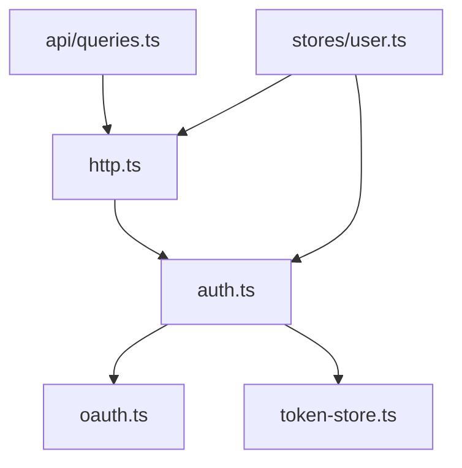

# 前端工程规范

## 目录布局

| 目录           | 职责                                                               |
| -------------- | ------------------------------------------------------------------ |
| `api/`         | Zod schema（`schemas.ts`）+ vue-query queryOptions（`queries.ts`） |
| `lib/`         | 基础设施：http、auth、oauth、token-store、logger、query-client     |
| `stores/`      | Pinia：user（登录态）、theme（主题）                               |
| `router/`      | Vue Router 路由表                                                  |
| `layouts/`     | 页面壳（DefaultLayout）                                            |
| `components/`  | 通用组件（AppHeader / AppFooter / media/）                         |
| `views/`       | 路由级页面（HomeView / TopicView / ...）                           |
| `composables/` | 组合式函数（占位，尚未使用）                                       |
| `styles/`      | 全局 CSS + CSS 变量（light/dark）                                  |

`lib/` 内部依赖方向（单向无环）：

- `token-store.ts`：纯存储 + 过期判定，不依赖任何内部模块
- `oauth.ts`：OAuth 协议（password/refresh grant），仅依赖 zod
- `auth.ts`：认证编排（登录、懒刷新、登出），依赖 oauth + token-store
- `http.ts`：业务请求客户端（ofetch），依赖 auth 注入 token
- `api/queries.ts`：vue-query queryOptions，依赖 http

## 组件（Reka UI 与 components/ui）

基础约定：计划编写任何组件前，先检查 Reka UI 是否有对应的无头组件，积极复用，不重复造轮子。

- `components/ui/` 下放基于 Reka UI 二次封装的基础组件，业务组件依赖这些封装而非直接用 reka-ui 或原生元素
- Reka UI 没提供的（Button / Input）用 `Primitive` + cva 从零封装，变体走 UnoCSS 语义 class
