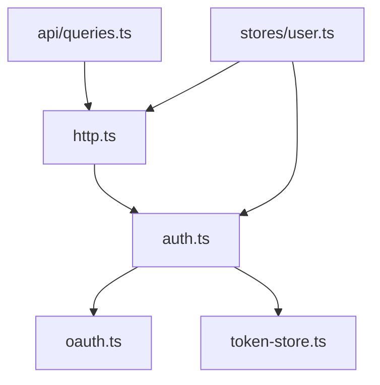

# 前端工程规范

## 目录布局

| 目录           | 职责                                                               |
| -------------- | ------------------------------------------------------------------ |
| `api/`         | Zod schema（`schemas.ts`）+ vue-query queryOptions（`queries.ts`） |
| `lib/`         | 基础设施：http、auth、oauth、token-store、logger、query-client     |
| `stores/`      | Pinia：user（登录态）、theme（主题）                               |
| `router/`      | Vue Router 路由表                                                  |
| `layouts/`     | 页面壳（DefaultLayout）                                            |
| `components/`  | 通用组件（AppHeader / AppFooter / media/）                         |
| `views/`       | 路由级页面（HomeView / TopicView / ...）                           |
| `composables/` | 组合式函数（占位，尚未使用）                                       |
| `styles/`      | 全局 CSS + CSS 变量（light/dark）                                  |

`lib/` 内部依赖方向（单向无环）：

- `token-store.ts`：纯存储 + 过期判定，不依赖任何内部模块
- `oauth.ts`：OAuth 协议（password/refresh grant），仅依赖 zod
- `auth.ts`：认证编排（登录、懒刷新、登出），依赖 oauth + token-store
- `http.ts`：业务请求客户端（ofetch），依赖 auth 注入 token
- `api/queries.ts`：vue-query queryOptions，依赖 http

## 入口与启动

入口 `main.ts`，启动顺序：createApp → pinia（+ persistedstate）→ router → vue-query → vue-virtual-scroller → theme store apply → mount。

## 路由表

| 路径                           | 名称       | 页面          |
| ------------------------------ | ---------- | ------------- |
| `/`                            | home       | HomeView      |
| `/topic/:topicId/:page?`       | topic      | TopicView     |
| `/list/:boardId/:type?/:page?` | board      | BoardView     |
| `/boardlist`                   | board-list | BoardListView |
| `/logon`                       | logon      | LogOnView     |
| `/:pathMatch(.*)*`             | not-found  | NotFoundView  |

## 横切关注点

走单一显式入口，引入时在此登记：

| 关注点 | 入口            | 说明                                                                                                       |
| ------ | --------------- | ---------------------------------------------------------------------------------------------------------- |
| 日志   | `lib/logger.ts` | pino browser 输出到 console，后续远端上报在此扩展                                                          |
| 认证   | `lib/auth.ts`   | OAuth2 token 懒刷新 + 登录态存储；`lib/http.ts` 通过它注入 Authorization 头，401 时调 `clearAuth` 清登录态 |

## 模块

bundler 模块解析。导入带 `.ts` 扩展名（`allowImportingTsExtensions: true`）。`.vue` 文件经 `vue-shims.d.ts` 声明模块。

## 状态与渲染

- 客户端状态（登录态、UI 状态、主题）走 Pinia。store 在 `src/stores/`。
- 服务端状态（帖子、楼层、版面、配置）走 @tanstack/vue-query。query/mutation 在 `src/api/queries.ts`，query key 在同文件集中管理。
- 两者不混：不要把 API 响应塞进 Pinia，也不要在 vue-query 里存 UI 状态。
- 持久化：登录态、主题等用 pinia-plugin-persistedstate；token 由 `lib/token-store.ts` 存储、`lib/auth.ts` 统一编排，不双写。

## 样式

- UnoCSS 原子类为主，配置在 `uno.config.ts`。
- 设计 token（色板、间距）走 CSS 变量，定义在 `src/styles/global.css`，UnoCSS theme 映射到这些变量（`text-cc98-text` → `var(--cc98-color-text)`）。
- 暗色/节日主题：改 `<html data-theme data-theme-season>` 属性，不重新加载样式，不在组件里硬编码颜色。
- 无头组件（Reka UI）通过 `data-state` 等 attribute 写样式，用 UnoCSS 的 attributify 语法（`data-[state=open]:...`）。

## API 边界

- 所有外部数据进 `api/queries.ts` 时用 Zod schema parse（`api/schemas.ts`），parse 失败直接报错，不部分降级。
- HTTP 经 `lib/http.ts` 的 `apiFetch`（ofetch 实例），token 由 `lib/auth.ts` 注入（懒刷新），401 时调 `clearAuth` 清登录态。登录/登出统一走 `lib/auth.ts`。
- 不在组件里直接发请求，一律走 `api/queries.ts` 的 queryOptions；登录动作走 `stores/user.ts`，它委托 `lib/auth.ts`。

## 性能

- 路由级懒加载（`() => import(...)`）
- 重依赖（KaTeX、APlayer/DPlayer、md-editor-v3）按需 import，不进主 bundle
- 长列表（楼层、主题列表）用 vue-virtual-scroller
- 热点组件（楼层渲染、Markdown 渲染）后续迁 Vapor Mode

## 组件（Reka UI 与 components/ui）

基础约定：做任何组件前，先检查 Reka UI 是否有对应的无头组件，能复用就复用，不重复造轮子。

Reka UI 是无头交互组件库，覆盖的是有复杂交互语义和状态机的组件（Dialog / Popover / Select / Combobox / DropdownMenu / Tabs / Toast / Tooltip / ScrollArea 等），**不提供基础表单元素**（Input / Button / Label 中只有 Label）。这与 Radix UI 一致。需要用 Reka UI 时，从 `reka-ui` 按需 import（如 `import { DialogContent } from "reka-ui"`）。

`src/components/ui/` 尚未建立。规划方向（shadcn 式约定，待建立时执行）：

- `components/ui/` 下放基于 Reka UI 二次封装的基础组件，业务组件依赖这些封装而非直接用 reka-ui 或原生元素
- Reka UI 没提供的（Button / Input）用 `Primitive` + cva 从零封装，变体走 UnoCSS 语义 class
- 建立时机：等进入需要 Dialog / Popover / Select 的阶段（发帖弹窗、用户菜单、版面筛选），连同 Button / Input / Label 一起规划，避免为单一场景做零散封装

当前登录表单（`views/LogOnView.vue`）用原生 input / button / label，待 `components/ui` 建立后替换。决策记录见 `docs/exec-plans/2026-07-09-login-migration.md`。
