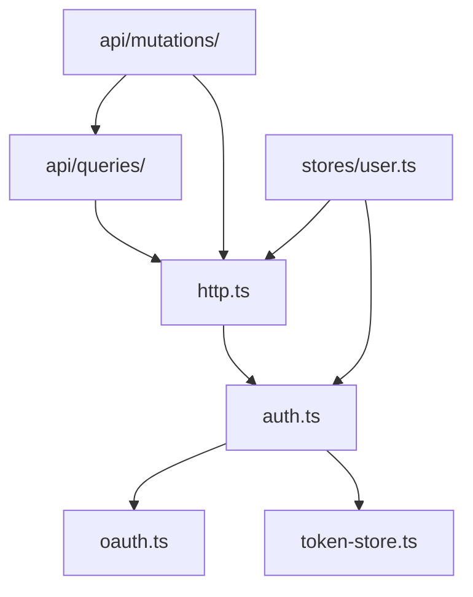

# 前端工程规范

## 目录布局

| 目录           | 职责                                                                                    |
| -------------- | --------------------------------------------------------------------------------------- |
| `api/`         | 按领域组织 vue-query queryOptions 与 mutation，schema 直接来自 `@cc98/api`              |
| `lib/`         | 基础设施：http、auth、oauth、token-store、logger、query-client、discovery、route-params |
| `stores/`      | Pinia：user（登录态）、theme（主题）                                                    |
| `router/`      | Vue Router 路由表                                                                       |
| `layouts/`     | 页面壳（DefaultLayout）                                                                 |
| `components/`  | 通用组件（AppHeader / TopicList / Pagination / PageState / LoadMore / rich-content/）   |
| `views/`       | 路由级页面（HomeView / BoardView / 发现类列表页 / TopicView / ...）                     |
| `composables/` | 组合式函数（占位，尚未使用）                                                            |
| `styles/`      | 全局 CSS + CSS 变量（light/dark）                                                       |

`lib/` 内部依赖方向（单向无环）：

- `token-store.ts`：纯存储 + 过期判定，不依赖任何内部模块
- `oauth.ts`：OAuth 协议（password/refresh grant），仅依赖 zod
- `auth.ts`：认证编排（登录、懒刷新、登出），依赖 oauth + token-store
- `http.ts`：业务请求客户端（ofetch），依赖 auth 注入 token
- `api/queries/`：vue-query queryOptions。`core.ts` 负责站点配置与阅读，`discovery.ts` 负责发现入口，`user.ts` 负责公开用户，`me.ts` 负责当前用户，统一从 `index.ts` 导出
- `api/mutations/`：用户中心等写操作与缓存同步，依赖 http 和 query key

## 组件（Reka UI 与 components/ui）

基础约定：计划编写任何组件前，先检查 Reka UI 是否有对应的无头组件，积极复用，不重复造轮子。

- `components/ui/` 下放基于 Reka UI 二次封装的基础组件，业务组件依赖这些封装而非直接用 reka-ui 或原生元素
- Reka UI 没提供的（Button / Input）用 `Primitive` + cva 从零封装，变体走 UnoCSS 语义 class

## 富内容渲染

`components/rich-content/ContentRenderer.vue` 是页面入口，只接收原文、内容类型和渲染选项。

- `ubb/` 调用 `@cc98/ubb` 生成的 AST，通过显式注册表分派标签。遍历状态由 `UbbRenderer` 在每次渲染时创建。
- `markdown/` 使用关闭原始 HTML 的 `markdown-it`，逐个 token 转成 Vue 节点。
- `universe/` 放 UBB 和 Markdown 共用的图片、链接、代码块、引用、媒体和公式组件，不读取源格式 AST。
- `security.ts` 是链接、图片和媒体 URL 的统一安全入口，语法适配层负责决定校验失败后的降级形式。

静态标签和正则标签族由 `packages/ubb` 导出稳定契约。网站不能复制解析器正则，新增解析标签时必须同步注册 renderer，并由完整性测试兜底。
