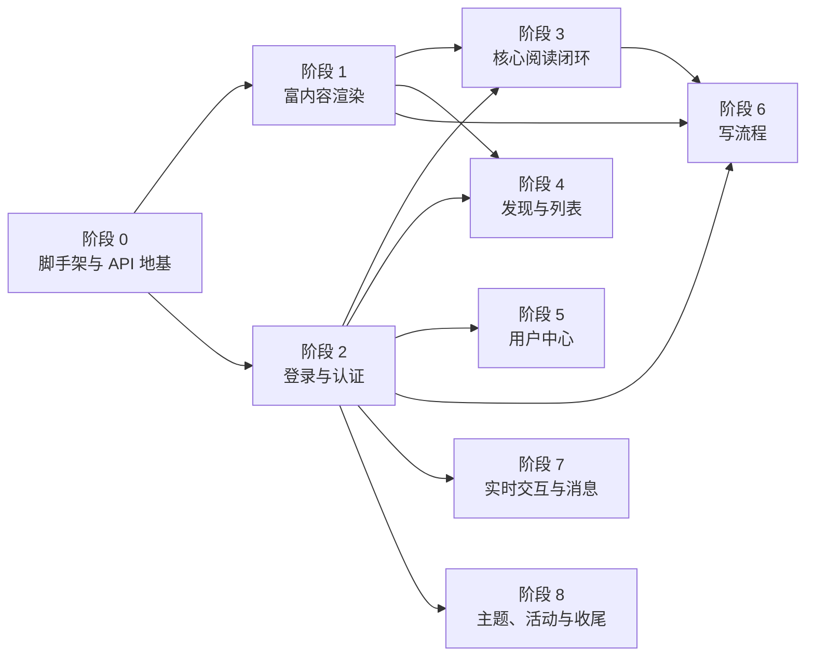

# CC98 前端迁移路线图

> 本文件仅由 agent 进行维护

本路线图记录 CC98 新前端的阶段目标、依赖关系和完成状态。具体实现方案在阶段启动时写入 `docs/exec-plans/`；已经确认并长期生效的技术取舍写入 `docs/adr/`。

最后更新：2026-07-11。

## 目标与边界

新项目使用 Vue 3 和 Vite+ monorepo 复刻同级 `forum` 中的 CC98 论坛前端，继续使用现有后端 API。

迁移遵循以下边界：

- 不修改后端
- 不直接迁移旧 React 组件，只参考其行为、数据契约和交互
- 新内容统一写入 Markdown；编辑历史 UBB 内容时先转换为 Markdown
- 不建设新的 UBB 编辑器，也不支持 Markdown 转 UBB
- 移动端适配不在本轮迁移范围内，后续单独规划

技术选型见 `docs/adr/0001-tech-stack.md`，项目分层见 `ARCHITECTURE.md`。

## 当前状态

阶段 0、阶段 1 和阶段 2 已完成，当前进入阶段 3「核心阅读闭环」。

目前 `TopicView` 已能请求并渲染真实帖子内容，但仍缺少主题信息、翻页和完整楼层 UI；`BoardView` 仍是占位页面。下一步应先为阶段 3 编写执行计划，再补齐版面主题列表、主题详情查询和翻页能力。

## 阶段依赖

## 阶段总览

| 阶段 | 名称              | 状态   | 依赖    | 完成定义摘要                         |
| ---- | ----------------- | ------ | ------- | ------------------------------------ |
| 0    | 脚手架与 API 地基 | 完成   | -       | 基础页面、路由、API 层和状态管理可用 |
| 1    | 富内容渲染        | 完成   | 0       | 历史 UBB 和 Markdown 帖子可安全渲染  |
| 2    | 登录与认证        | 完成   | 0       | 登录、续期、登出和鉴权请求可用       |
| 3    | 核心阅读闭环      | 进行中 | 1、2    | 可进入版面和主题并完整翻页阅读       |
| 4    | 发现与列表        | 未开始 | 1、2    | 热门、新帖、推荐和搜索页面可用       |
| 5    | 用户中心          | 未开始 | 2       | 个人内容和关系数据可查看、管理       |
| 6    | 写流程            | 未开始 | 1、2、3 | 发帖、回帖、编辑和楼层互动可用       |
| 7    | 实时交互与消息    | 未开始 | 2       | 私信、通知、关注和签到可用           |
| 8    | 主题、活动与收尾  | 未开始 | 2       | 边缘功能迁移完成并通过整体回归       |

## 阶段说明

### 阶段 0：脚手架与 API 地基

建立 Vite+ monorepo、Vue 应用、基础路由、布局、主题状态、登录状态、Zod schema、vue-query 查询层和 ofetch HTTP 客户端。首页、版面总览和 404 页面接入真实 API。

完成定义：应用可以启动和构建；基础页面可访问；公开 API 数据经过 schema 校验后进入页面。

### 阶段 1：富内容渲染

完成 `packages/ubb` 解析器和网站富内容渲染层。`ContentRenderer` 根据 `Post.contentType` 选择 UBB 或 Markdown 渲染，共享链接、图片、代码块、引用、公式和媒体 UI，并集中执行 URL 与资源安全策略。

完成定义：解析器已知标签均有明确处理；历史 UBB 和 Markdown 帖子可以安全渲染；真实旧帖抽样验证通过；`vp run ready` 通过。

相关执行计划：

- `docs/exec-plans/2026-07-08-ubb-migration.md`
- `docs/exec-plans/2026-07-08-ubb-test-and-logger-foundation.md`
- `docs/exec-plans/2026-07-10-ubb-vue-renderer.md`

### 阶段 2：登录与认证

完成 OAuth password grant 登录、access token 与 refresh token 保存、过期续期、并发刷新去重、鉴权请求注入和登出清理。头部展示当前用户名并提供登录、退出入口。

未读消息数量归入阶段 7。受限页面的登录跳转和来源页恢复在阶段 3 接入真实阅读路径时补齐，不作为认证基础设施的完成条件。

完成定义：用户可以登录和退出；access token 过期后可以续期；鉴权失效会清理本地登录态；认证核心行为有自动测试覆盖；`vp run ready` 通过。

相关执行计划：`docs/exec-plans/2026-07-09-login-migration.md`。

### 阶段 3：核心阅读闭环

完成版面主题列表和帖子楼层页面。需要补齐 `/board/{id}`、`/board/{id}/topic`、`/topic/{id}`、`/topic/{id}/post` 查询，建立主题列表项、楼层 UI 和共享翻页组件，并处理无权限、未登录、404 和服务端错误。

楼层先使用普通分页列表。只有真实页面出现明确的渲染性能问题时，才引入虚拟滚动，避免增加楼层锚点、图片高度变化和媒体组件生命周期的复杂度。

完成定义：用户可以从首页进入版面，再进入主题；版面和主题均能正确翻页；主题标题、作者、回复信息和楼层内容完整显示；历史 UBB 与新 Markdown 帖子阅读正常；受限内容会引导登录并能返回原页面。

### 阶段 4：发现与列表

迁移热门、新帖、推荐、搜索和用户主页等发现类页面，复用阶段 3 的主题列表项、加载状态、错误状态和翻页组件。

完成定义：匿名和登录状态下允许访问的发现类入口均可用，筛选条件与 URL 同步，列表可以翻页并进入对应主题或用户页面。

### 阶段 5：用户中心

迁移我的主题、回帖、收藏及收藏分组、关注、浏览历史和自定义版面。该阶段以 `/me/*` API 为主，所有入口都需要登录。

完成定义：登录用户可以查看和管理自己的主要个人数据；直接访问受限页面时能够完成登录跳转和来源页恢复。

### 阶段 6：写流程

迁移发主题、回帖、编辑历史帖子、点赞、收藏、评分、投票和文件上传。编辑器使用 Markdown，新内容写入 `contentType=1`；编辑历史 UBB 内容时使用 `ubbToMarkdown` 转换后继续编辑。

写操作在专用测试版面和测试账号中验证，执行前重新核对 OpenAPI 与线上接口行为，不把旧项目中的失效路径直接迁入新代码。

完成定义：用户可以发主题、回帖和编辑帖子；图片与附件上传正常；主要楼层互动可用；失败状态不会造成重复提交或内容丢失。

### 阶段 7：实时交互与消息

迁移私信、@ 通知、回复通知、系统通知、关注和签到，并使用 SignalR 接收实时未读更新。头部未读数量和消息入口在本阶段完成。

完成定义：私信可以收发；通知列表和未读数量一致；实时事件到达后页面状态正确更新；签到和关注操作可用。

### 阶段 8：主题、活动与收尾

迁移节日主题、年度总结、版主管理、首页后续版本、错误页和 IP 查询等边缘功能，并完成全站回归、无障碍检查和体验收尾。

完成定义：计划范围内的旧前端入口均已迁移或明确废弃；主要阅读和写入路径通过浏览器回归；剩余差异有文档记录。

## 风险与待确认事项

- 论坛主体版面的匿名访问策略可能变化，受限内容必须按真实 401 和权限字段处理
- 写操作的 OpenAPI 描述与线上行为可能存在偏差，阶段 6 开始前需要重新探测
- 历史 UBB 内容存在大量方言和异常嵌套，新增兼容规则应先补解析或渲染测试
- 旧项目包含长期累积的边缘功能，迁移前需要区分仍在使用的能力和可直接废弃的历史入口

## 维护规则

- 本文件只维护阶段目标、依赖、状态和完成定义，不记录具体代码步骤
- 阶段开始前在 `docs/exec-plans/` 新建执行计划，并从本文件链接过去
- 阶段完成后更新状态和当前进展，不在这里复制执行计划的实现记录
- 形成长期架构决策时新增 ADR，并同步更新相关准则文档
- 高频任务拆分和人员协作放在 issue 或项目管理工具中，不把每日待办写入路线图

## 相关资料

- `ARCHITECTURE.md`：项目架构和依赖边界
- `docs/frontend.md`：前端工程规范
- `docs/security.md`：认证和富内容安全约束
- `docs/quality.md`：测试、检查和浏览器验证要求
- `docs/exec-plans/`：各阶段的实施方案和验证记录
- `docs/adr/`：长期技术决策
- `../forum/`：旧 React 前端，仅用于行为和接口对照
