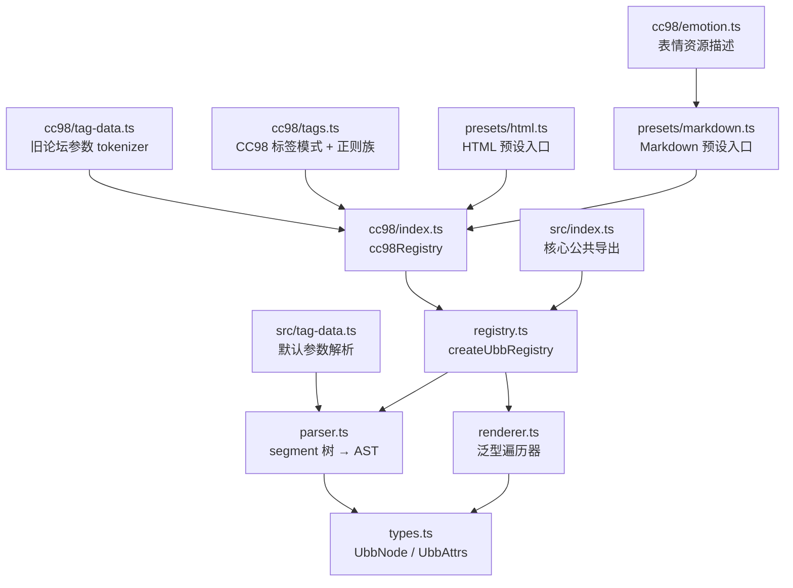
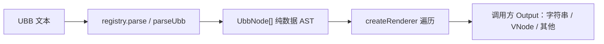

# @cc98/ubb 架构

框架无关的 UBB 解析与输出工具。注册器指定标签和标签头参数解析方式，泛型 renderer 把 AST 转成调用方选择的输出类型。CC98 规则及其 HTML、Markdown 输出是显式预设。只读解析，不做编辑器。

## 模块布局

## 数据流

- `parseUbb` 不预装标签。`registry.parse` 使用注册器的精确标签、动态标签 resolver 和 `parseTag`；CC98 预设提供旧论坛参数 tokenizer、静态表与正则族。解析后的 AST 不含渲染信息。
- 遍历器按节点分派：文本节点走 `text()`，标签节点查 `handlers[tag]`，未命中走 `fallback`。handler 收到同一组参数：`node`、`attrs`、惰性 `children`、纯文本 `text`、`context`、子树 `render(nodes)`。
- 公开的 `render(source)` 与 `renderNodes(nodes)` 在根输出完成后执行 `finalize`；子树 `render(nodes)` 不重复执行。
- 根入口 `@cc98/ubb` 只导出通用解析与泛型 renderer API；`@cc98/ubb/cc98` 提供 CC98 解析规则和表情资源；字符串预设分别从 `@cc98/ubb/presets/html` 和 `@cc98/ubb/presets/markdown` 导入。
