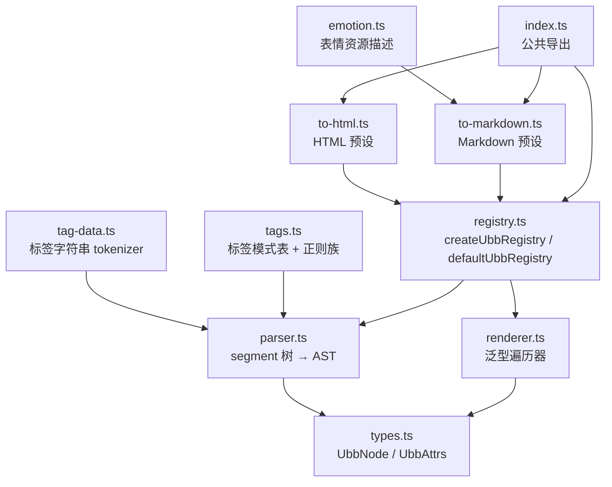
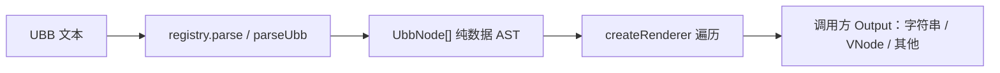

# @cc98/ubb 架构

框架无关的 CC98 UBB 解析与输出工具。注册器定义标签方言，泛型 renderer 把 AST 转成调用方选择的输出类型，包内提供 HTML 与 Markdown 字符串预设。只读解析，不做编辑器。

## 模块布局

## 数据流

- `parseUbb` 用静态表加正则族把文本解析成纯数据 AST，不含渲染信息。
- 遍历器按节点分派：文本节点走 `text()`，标签节点查 `handlers[tag]`，未命中走 `fallback`。handler 收到同一组参数：`node`、`attrs`、惰性 `children`、纯文本 `text`、`context`、子树 `render(nodes)`。
- 公开的 `render(source)` 与 `renderNodes(nodes)` 在根输出完成后执行 `finalize`；子树 `render(nodes)` 不重复执行。

## 关键设计

### 解析与输出分离

registry 管「标签存在吗、怎么解析」，renderer 管「输出成什么」。HTML、Markdown 与网站的 Vue VNode 输出共用同一注册器和遍历器，新增输出类型不必重复声明 TagMode。

### 四种标签模式

- `recursive`：内部继续解析 UBB。
- `text`：内部保持纯文本。
- `empty`：自闭合，不读取 children。
- `autoclose`：结束标签可省略；未关闭时子段提升到父级，保留站内链接语义。

### 不可变注册

`createUbbRegistry().register(name, mode)` 每次返回新实例，重复注册抛错。默认注册器 `defaultUbbRegistry` 覆盖全部 CC98 静态标签，并通过 fallback resolver 识别正则标签族。

### 惰性输出

handler 的 `children` 与 `text` 是首次读取才计算的缓存 getter。不读子树的 handler（权限提示、表情、降级）不付出渲染成本，也避免重复渲染副作用。

### 安全模型

默认 HTML 预设转义文本与属性，URL 协议白名单只放行 http/https/mailto 与相对路径，危险协议替换为 `#`。自定义 handler 属于受信任代码，预设不约束其输出；网站的 URL 过滤、图片计数、媒体开关在 `apps/website` 集中处理。

### 容错

未闭合标签、孤立结束标签、未知标签、标签参数异常均降级为纯文本，行为与旧论坛 `Forum/Ubb/Core.tsx` 一致。解析不抛错，遍历器对未知标签默认保留已渲染的 children。

## 边界

- `src/` 不依赖 Vue；`vue` 是 peerDependency，仅为 VNode 输出消费方（如 `apps/website` 的 `createRenderer<VNodeChild[], UbbRenderContext>`）声明。
- 正则标签族目前只由默认注册器的 fallback resolver 识别；自定义正则族注册尚未开放。
- 编辑器使用 Milkdown，编辑与阅读共享 remark 体系，与本包无关。
- `apps/*` 只依赖本包公共导出（`dist/`），不直接 import 内部源码路径。

## 演进历史

- 2026-07-08：从旧站 `Core.tsx` 移植解析与导出，见 [ubb-migration](../../docs/exec-plans/completed/2026-07-08-ubb-migration.md)。
- 2026-08-10：标签注册器与泛型 renderer 重构，HTML/Markdown 变为字符串预设，见 [ubb-generic-renderer](../../docs/exec-plans/completed/2026-08-10-ubb-generic-renderer.md)。
- 2026-08-11：网站 Vue renderer 迁移到泛型 renderer，见 [website-ubb-vnode-renderer](../../docs/exec-plans/completed/2026-08-11-website-ubb-vnode-renderer.md)。
