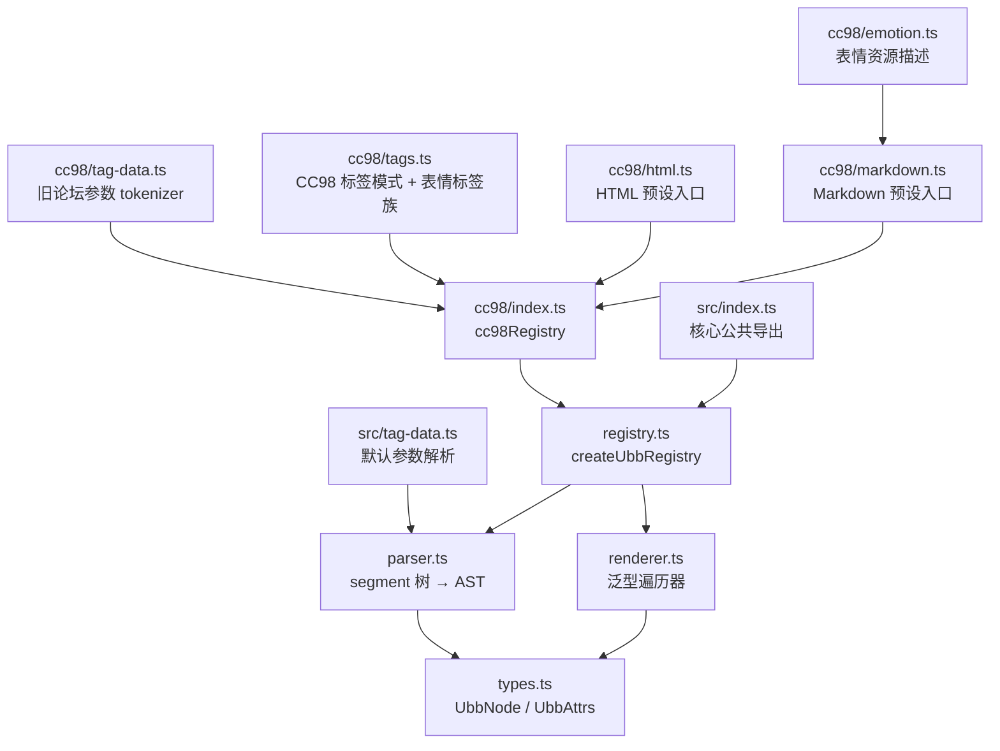
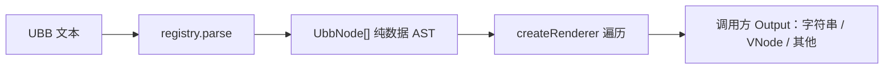

# @cc98/ubb 架构

框架无关的 UBB 解析与输出工具。注册器指定标签和标签头参数解析方式，泛型 renderer 把 AST 转成调用方选择的输出类型。CC98 规则及其 HTML、Markdown 输出是显式预设。只读解析，不做编辑器。

## 模块布局

```mermaid
graph TD
  types["types.ts<br/>UbbNode / UbbAttrs"]
  tagData["src/tag-data.ts<br/>默认参数解析"]
  cc98Data["cc98/tag-data.ts<br/>旧论坛参数 tokenizer"]
  tags["cc98/tags.ts<br/>CC98 标签模式 + 表情标签族"]
  parser["parser.ts<br/>segment 树 → AST"]
  registry["registry.ts<br/>createUbbRegistry"]
  renderer["renderer.ts<br/>泛型遍历器"]
  emotion["cc98/emotion.ts<br/>表情资源描述"]
  toHtml["cc98/html.ts<br/>HTML 预设入口"]
  toMarkdown["cc98/markdown.ts<br/>Markdown 预设入口"]
  index["src/index.ts<br/>核心公共导出"]

  tagData --> parser
  cc98Data --> cc98["cc98/index.ts<br/>cc98Registry"]
  tags --> cc98
  cc98 --> registry
  parser --> types
  registry --> parser
  registry --> renderer
  renderer --> types
  emotion --> toMarkdown
  toHtml --> cc98
  toMarkdown --> cc98
  index --> registry
```

## 数据流

```mermaid
flowchart LR
  src["UBB 文本"] --> parse["registry.parse"]
  parse --> ast["UbbNode[] 纯数据 AST"]
  ast --> render["createRenderer 遍历"]
  render --> out["调用方 Output：字符串 / VNode / 其他"]
```

- 根入口不导出底层 `parseUbb`，解析只能经过注册器。`registry.parse` 使用注册器的精确标签、标签族和 `parseTag`：精确标签优先，未命中时按登记顺序匹配标签族。CC98 预设提供旧论坛参数 tokenizer、静态表与表情标签族。解析后的 AST 不含渲染信息，标签节点带开始、结束标签原文 `raw`，命中标签族的节点带 `family`。
- 遍历器按节点分派：文本节点走 `renderText()`，标签节点按 `family ?? tag` 查 handler，未命中走 `fallback`。handler 收到同一组参数：`node`、`attrs`、惰性渲染结果 `content`、纯文本 `textContent`、`context`、子树 `renderNodes(nodes)`。
- 公开的 `render(source)` 与 `renderNodes(nodes)` 在根输出完成后执行 `finalize`；handler 内的 `renderNodes(nodes)` 不重复执行。
- 根入口 `@cc98/ubb` 只导出通用解析与泛型 renderer API；`@cc98/ubb/cc98` 提供 CC98 解析规则和表情资源；字符串预设分别从 `@cc98/ubb/cc98/html` 和 `@cc98/ubb/cc98/markdown` 导入。
